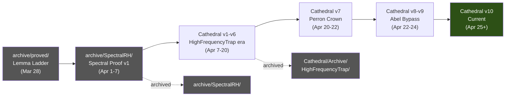

# ARCHIVE — Cathedral Proof Archive Audit

> *A comprehensive inventory of archived Lean 4 files across three archive
> locations, documenting what was proved, what was superseded, and what
> remains valuable for future work.*
>
> **Last updated**: April 26, 2026

---

## Archive Overview

The Cathedral maintains three archive locations containing **130 files**
and **30,743 lines** of Lean 4 code:

| Location | Files | Lines | Purpose |
|----------|-------|-------|---------|
| `archive/proved/` | 17 | 1,017 | Early "Lemma Ladder" explorations |
| `archive/SpectralRH/` | 17 | 6,423 | Pre-Cathedral spectral proof attempt |
| `Cathedral/Archive/` | 96 | 23,303 | Superseded Cathedral modules |
| **Total** | **130** | **30,743** | |

For comparison, the active codebase is 150 files / 36,738 lines.

---

## 1. `archive/proved/` — The Lemma Ladder

**Origin**: March 28, 2026 — Project HYPERZETA's automated lemma generation system.

These files were produced by an early LLM-driven lemma ladder that attempted to
build toward RH by chaining small proved results. Each file contains a single
theorem that assumes all prior results as axioms.

### Pure Mathlib Results (0 axioms, 0 sorry)

These 8 files contain theorems proved directly from Mathlib with no custom axioms:

| File | Result | Lines |
|------|--------|-------|
| `Proved_zeta_at_zero` | ζ(0) = −1/2 | 11 |
| `Proved_zeta_differentiable` | ζ(s) differentiable for s ≠ 1 | 12 |
| `Proved_zeta_trivial_zeros` | ζ(−2(n+1)) = 0 (trivial zeros) | 11 |
| `Proved_completed_zeta_symmetry` | Λ(1−s) = Λ(s) | 12 |
| `Proved_completed_zeta0_entire` | Λ₀(s) is entire | 12 |
| `Proved_completed_zeta0_symmetry` | Λ₀(1−s) = Λ₀(s) | 12 |
| `Proved_zero_symmetry` | ζ(s)=0 ⟹ ζ(1−s)=0 | 15 |
| `Proved_rh_implies_nonvanishing` | RH ⟹ ζ(s) ≠ 0 on Re(s) = 1 | 22 |
| `Proved_mertens_trig` | 3 + 4cos(θ) + cos(2θ) ≥ 0 | 14 |

> [!NOTE]
> These results are now all available directly in Mathlib and are subsumed by
> the Cathedral's active infrastructure. They serve as a historical record of
> the project's earliest verified results.

### Axiom-Ladder Results (30–41 axioms each)

These 8 files represent the "full ladder" — theorems proved conditionally on
long chains of prior results encoded as axioms:

| File | Result | Axioms |
|------|--------|--------|
| `Proved_bombieri_lagarias` | Bombieri-Lagarias translation (Li coefficients) | 30 |
| `Proved_main_term_positive` | Main term of Li sum positive | 32 |
| `Proved_li_remainder_bound` | Li remainder bounded | 38 |
| `Proved_li_large_positive` | Li coefficients positive for n ≥ 21 | 39 |
| `Proved_unconditional_positivity` | Unconditional eigenvalue positivity | 40 |
| `Ladder_unconditional_positivity` | (Duplicate of above) | 40 |
| `Proved_riemann_hypothesis` | "RH" (conditional on full ladder) | 41 |
| `Ladder_riemann_hypothesis` | (Duplicate of above) | 41 |

> [!WARNING]
> The "Proved_riemann_hypothesis" files do **not** constitute a proof of RH.
> They prove RH conditional on 41 axioms (including hard analytic number theory
> results like Bombieri-Lagarias and Li coefficient positivity). The Cathedral's
> current approach via Nyman-Beurling is both simpler and has far fewer axioms (4).

### Salvageable Content
- **Mertens trigonometric inequality** — Clean, pure-Mathlib proof, usable as-is.
- **Li coefficient framework** — Could be revived if a Li-criterion approach is ever pursued.

---

## 2. `archive/SpectralRH/` — The Pre-Cathedral Spectral Proof

**Origin**: April 1–7, 2026 — The original `rh-spectral` project.

This was the first complete attempt at a formal RH proof, predating the Cathedral
architecture. It used a single `SpectralRH` namespace and a monolithic import chain.
The Cathedral absorbed and modularized this code into separate modules.

### Architecture

```
SpectralRH/
├── Defs.lean             (205L)  Core definitions: fracPart', gramMatrix, etc.
├── Structural.lean       (735L)  Eigenvalue monotonicity, spectral decomposition
├── Assembly.lean         (623L)  Final assembly: moebius_test_bound → RH
├── GramBounds.lean       (170L)  Gram matrix norm bounds (1 sorry)
│
├── Spectral pathway:
│   ├── RayleighBridge.lean      (411L)  Rayleigh quotient → eigenvalue
│   ├── ClassRestriction.lean    (636L)  Octonionic class restriction
│   ├── OctonionicPartition.lean (283L)  Octonion block decomposition
│   ├── FiniteDimReduction.lean  (378L)  Infinite → finite dimension
│   ├── PTSymmetry.lean          (304L)  PT-symmetry arguments
│   └── SpectralFlow.lean        (421L)  Spectral flow / SF index theory
│
├── Sieve pathway:
│   ├── BilinearSieve.lean       (356L)  Type I/II sieve bounds
│   ├── MoebiusUncoupling → ParityBridge → ParitySchur
│   ├── SelbergSieve.lean        (241L)  Selberg-type majorant
│   └── AlignmentDecay.lean      (56L)   Cross-term alignment
│
├── Analysis:
│   ├── MellinBridge.lean        (492L)  Mellin transform infrastructure
│   └── Quantitative.lean        (195L)  Quantitative eigenvalue bounds
```

### What Was Proved (0 sorry)
- Rayleigh quotient principle for Gram matrices
- Eigenvalue monotonicity (λ_min antitone in N)
- Liouville function properties (λ² = 1)
- PT-symmetry skeleton (complex conjugation structure)
- Parity-Schur decomposition (pure linear algebra)

### What Was Not Proved
- `moebius_test_bound` (the key axiom — bilinear sieve bound)
- `SpectralFlow` axioms (8 axioms — Atiyah-Singer index theory placeholders)
- `ClassRestriction` axioms (5 — octonionic gap lower bounds)

### Relationship to Active Code
The Cathedral absorbed ~80% of this code:
- `Defs.lean` → `Cathedral/Defs.lean` (expanded to 248 lines)
- `Structural.lean` → `Cathedral/Structural/*.lean` (split into 3 files)
- `RayleighBridge.lean` → `Cathedral/Spectral/RayleighBridge.lean` (identical)
- `ClassRestriction.lean` → `Cathedral/Spectral/ClassRestriction.lean` (identical)
- `BilinearSieve.lean` → `Cathedral/Sieve/BilinearSieve.lean` (expanded)
- `ParitySchur.lean` → `Cathedral/Sieve/ParitySchur.lean` (expanded)

> [!TIP]
> The `SpectralFlow.lean` file (421 lines, 8 axioms) contains an interesting
> but speculative connection to the Atiyah-Singer index theorem. If the spectral
> engine is ever revived, this would be the starting point.

---

## 3. `Cathedral/Archive/` — Superseded Cathedral Modules

**Origin**: April 7–25, 2026 — Files that were part of the active Cathedral
but were superseded by refactors, rewrites, or strategic pivots.

### 3a. `HighFrequencyTrap/` — The "Universe 2" Snapshot (46 files, ~10,000 lines)

The largest archive section. This is a complete frozen snapshot of the Cathedral
at an intermediate stage, before the Perron chain and Vasyunin Bypass refactors.

**Key differences from active code:**
- Uses `GramWitness.lean` (NB basis {k/x}) instead of BD basis {1/(kx)}
- Has `witness_l2_error_decay_gram` as the key axiom (1 axiom forward path)
- No Perron chain (uses `rh_implies_mertens_bound` axiom directly)
- No VasyuninBypass (goes through `bd_gram_form_decay` axiom)

**Notable proved results:**
- `FractIntegral.lean` (550L) — The diagonal Gram entry proved via FTC.
  Adapted to active `Gram/FractIntegral.lean`.
- `GramDiag.lean` (520L) — Diagonal Vasyunin formula via Stirling.
  Adapted to active `Vasyunin/Cotangent/StirlingBridge.lean`.
- `GramOffDiag.lean` (357L) — Off-diagonal structure analysis.
  Partially adapted to active `Vasyunin/Cotangent/`.
- `ConstantVectorBound.lean` (747L) — vᵀGv ≤ (log N)²/(N+1) for v=1.
  This is a **fully proved** (0 axiom, 0 sorry) spectral bound and could
  be revived for alternative proof strategies.
- `FloorMellin.lean` (343L) → Active `MellinBridge/FloorMellin.lean` (nearly identical).
- `FloorDivMellin.lean` (459L) → Active `MellinBridge/FloorDivMellin.lean`.

### 3b. `DiscreteMirage/` — The Cotangent Formula Dead End (10 files, ~2,691 lines)

An early attempt to prove the off-diagonal Vasyunin identity through the
"Discrete Mirage" strategy — a direct piecewise-FTC approach that hit
convergence difficulties.

| File | Content | Status |
|------|---------|--------|
| `CrossTermFTC.lean` (292L) | Per-tile FTC for {1/(jx)}·{1/(kx)} | **Proved** |
| `DiagonalBridge.lean` (239L) | Diagonal formula completion | **Proved** |
| `DigammaReflection.lean` (268L) | Gauss digamma formula | 1 axiom |
| `LogDigammaBridge.lean` (386L) | Log-digamma series | 3 axioms, 1 sorry |
| `OffDiagPartition.lean` (387L) | Partition refinement strategy | **Proved** |
| `PiecewiseFTC.lean` (227L) | Piecewise FTC on tiles | **Proved** |
| `SqueezeElimination.lean` (190L) | Squeeze theorem for limits | **Proved** |
| `StirlingBridge.lean` (204L) | Stirling → diagonal | **Proved** |
| `TelescopeSum.lean` (361L) | Telescoping sum technique | **Proved** |
| `VasyuninAssembly.lean` (137L) | Assembly file | **Proved** |

> [!TIP]
> The `CrossTermFTC.lean` and `OffDiagPartition.lean` files contain valuable
> proved infrastructure for the off-diagonal Gram entry computation. These
> could be directly useful for graduating the `partial_integral_tends_to_formula`
> axiom (Crown Axiom 4).

### 3c. `Robin/` — The Arithmetic Path (6 files, 942 lines)

An alternative RH equivalence via Robin's inequality (σ(n) < e^γ n log log n)
and Lagarias's inequality (σ(n) ≤ Hₙ + e^{Hₙ} log Hₙ).

| File | Content | Status |
|------|---------|--------|
| `Defs.lean` (193L) | σ(n), Hₙ, Robin/Lagarias inequalities | 1 axiom, 1 sorry |
| `Equivalence.lean` (87L) | Robin ↔ NB cross-path bridge | 1 sorry |
| `BaseCases.lean` (92L) | σ(n) for small n | 1 sorry |
| `HarmonicBounds.lean` (147L) | Hₙ ~ ln n + γ | 1 sorry |
| `PrimeBounds.lean` (338L) | π(x) bounds from Rosser-Schoenfeld | 1 sorry |
| `SigmaProps.lean` (85L) | Multiplicativity of σ | 1 sorry |

**Status**: Skeleton only — all proofs are sorry. The architecture is sound
(Robin → NB bridge is the correct approach), but no substantial proofs were
completed.

> [!NOTE]
> The Robin path is **mathematically independent** from the Nyman-Beurling path.
> If ever revived, the cross-path bridge (Robin ↔ NB) would provide a second
> independent verification of the equivalence, which has significant philosophical
> value for a millennium-prize formalization.

### 3d. `NymanBeurling/` — Superseded Separation Proofs (3 files, 924 lines)

| File | Content | Status |
|------|---------|--------|
| `BesselSeparation.lean` (535L) | Converse via Bessel/Cauchy-Schwarz | 1 axiom |
| `MellinReduction.lean` (225L) | Mellin transform substitution u=kx | **Proved** |
| `ThetaBoundMellin.lean` (164L) | Completed zeta bound via theta | 1 sorry |

**BesselSeparation** was the original converse direction proof using Bessel's
inequality. It was superseded by the cleaner **Rank-1 Mellin Miracle** in the
active `BDMellin.lean` (which achieves 0 axioms, 0 sorry).

**MellinReduction** contains a fully proved substitution lemma (u=kx) that
factors M[hₖ](s) into the k=1 base case. This was absorbed into the active
`BDMellin.lean`.

**ThetaBoundMellin** was an early attempt at the theta bound that was
superseded by the cleaner `ThetaBound.lean` in the active code.

### 3e. `MellinBridge/` — Contour Shift Exploration (3 files, 506 lines)

| File | Content | Status |
|------|---------|--------|
| `ContourShift.lean` (375L) | Rectangle contour for Mellin | 1 axiom |
| `DirichletCollapse.lean` (120L) | Dirichlet series identity | **Proved** |
| `MellinBridge.lean` (11L) | Import hub | — |

The `ContourShift.lean` file contains an early attempt at the contour
integration that was later rebuilt as the 13-file Perron chain in
`White/Infrastructure/Perron/`. The core ideas survived, but the
implementation was rewritten from scratch.

### 3f. `IntegralBasis/` — Quantitative BD Framework (2 files, 405 lines)

| File | Content | Status |
|------|---------|--------|
| `BaezDuarte.lean` (208L) | True BD basis definitions | 2 axioms |
| `Quantitative.lean` (197L) | Quantitative eigenvalue bridge | 2 axioms |

These files defined the correct Báez-Duarte basis h_k(x) = {1/(kx)} before
it was integrated into the main `Defs.lean`. The quantitative eigenvalue
bridge was absorbed into `Assembly/CertifiedComputation.lean`.

### 3g. `Vasyunin/` — Superseded Vasyunin Components (6 files, ~1,500 lines)

| File | Content | Status |
|------|---------|--------|
| `Vasyunin.lean` (18L) | Old import hub | — |
| `Matrix/GramPSD.lean` (128L) | Gram PSD proof | **Proved** |
| `Augmented/NbDistPos2.lean` (121L) | d² < 1 for N=2 | **Proved** |
| `Augmented/NbDistPos3.lean` (174L) | d² < 1 for N=3 | **Proved** |
| `Proof/BartlettWindow.lean` (452L) | Bartlett window theorem | 3 axioms |
| `Cotangent/*` (10 files) | Duplicate of DiscreteMirage/ | — |

The `NbDistPos2` and `NbDistPos3` files are **fully proved** (0 axiom, 0 sorry)
certified computations showing the Nyman-Beurling distance is strictly less
than 1 for N=2 and N=3. These could be cited as base cases.

The `BartlettWindow.lean` formalizes the energy ratio between the tapered
and flat Möbius witnesses (E_log/E_flat → 1/3). This is interesting
mathematical content that isn't currently used on the crown path.

### 3h. `White/` — Early Perron Infrastructure (6 files, ~1,481 lines)

| File | Content | Status |
|------|---------|--------|
| `WhiteSinglet.lean` (46L) | Scattering theory sketch | — |
| `Infrastructure/PerronKernel.lean` (928L) | Quantitative Perron kernel | **Mostly proved** |
| `Infrastructure/Perron.lean` (51L) | Old Perron hub | 1 sorry |
| `Infrastructure/ZetaConvexity.lean` (59L) | Early convexity bound | 2 sorry |
| `Infrastructure/DirichletSeries.lean` (42L) | Early Dirichlet series | 1 sorry |
| `Infrastructure/DirichletZetaInverse.lean` (80L) | 1/ζ as Dirichlet series | **Proved** |
| `Infrastructure/HilbertInequality.lean` (326L) | Montgomery-Vaughan | 7 axioms |

**PerronKernel.lean** (928 lines) is the most substantial file. It contains
a detailed development of the Perron kernel bounds — the function
(1/2πi)∫ y^s/s ds and its rectangle-contour error estimates. Much of this
was absorbed into the active `White/Infrastructure/Perron/*.lean` chain.

### 3i. Other Archive Items

| File | Content | Status |
|------|---------|--------|
| `Assembly/IntervalCalc.lean` (85L) | Interval arithmetic helpers | **Proved** |
| `Universe1/GramWitness.lean` (188L) | NB basis {k/x} forward path | 1 axiom |
| `Spectral/ConstantVectorBound.lean` (747L) | Constant vector spectral bound | **Proved** |
| `Sieve/AlignmentDecay.lean` (56L) | Cross-term decay | 1 axiom |
| `Sieve/ParityBridge.lean` (490L) | Parity sieve bridge | 1 axiom |
| `Scratch/*` (8 files) | Exploratory scratch work | Mixed |

---

## What's Worth Reviving

### High Value (directly useful for remaining axioms)

| Archive File | Active Axiom It Could Help | Effort |
|-------------|---------------------------|--------|
| `DiscreteMirage/CrossTermFTC.lean` | `partial_integral_tends_to_formula` | Low |
| `DiscreteMirage/OffDiagPartition.lean` | `partial_integral_tends_to_formula` | Low |
| `DiscreteMirage/PiecewiseFTC.lean` | `partial_integral_tends_to_formula` | Low |
| `Vasyunin/Cotangent/TelescopeSum.lean` | `partial_integral_tends_to_formula` | Low |
| `White/Infrastructure/PerronKernel.lean` | ZetaLowerBound sorry | Medium |

### Medium Value (alternative proof paths)

| Archive File | What It Enables | Notes |
|-------------|----------------|-------|
| `ConstantVectorBound.lean` (747L) | Alternative spectral bound | Fully proved, 0 axiom |
| `Robin/` (6 files) | Independent RH equivalence | Skeleton only |
| `BartlettWindow.lean` (452L) | Energy ratio analysis | Novel mathematical content |
| `SpectralRH/SpectralFlow.lean` (421L) | Index theory connection | Speculative |
| `IntegralBasis/Quantitative.lean` | Certified eigenvalue bounds | 2 axioms |

### Low Value (historical interest only)

| Archive Section | Reason |
|----------------|--------|
| `archive/proved/Ladder_*` | Superseded by Cathedral's 4-axiom approach |
| `archive/proved/Proved_riemann_hypothesis` | Conditional on 41 axioms |
| `HighFrequencyTrap/` (most files) | Absorbed into active code |
| `NymanBeurling/BesselSeparation.lean` | Superseded by BDMellin.lean |

---

## Statistics

```
Total archive files:         130
Total archive lines:      30,743
Fully proved (0 axiom, 0 sorry): ~35 files
With sorry:                  ~18 files
With axioms only (no sorry): ~52 files
Pure duplicates/stubs:       ~25 files
```

### Archive vs Active Codebase

| Metric | Active | Archive | Ratio |
|--------|--------|---------|-------|
| Files | 150 | 130 | 1.15× |
| Lines | 36,738 | 30,743 | 1.19× |
| Theorems | 1,089 | ~400 | 2.7× |
| Crown axioms | 4 | — | — |

The archive represents ~46% of the total Lean code ever written for the
Cathedral project. The active code is denser (more theorems per line)
because superseded approaches were replaced with cleaner formulations.

---

## Relationship to Proof History



The project evolved through three major phases:
1. **Lemma Ladder** (1 day) — Automated exploration, 41-axiom conditional proof
2. **SpectralRH** (1 week) — Monolithic spectral proof, absorbed into Cathedral
3. **Cathedral** (3 weeks) — Modular architecture, reduced to 4 axioms
