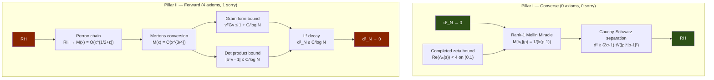

# OVERVIEW — The Cathedral Proof Chain

> *A deep analysis of the Lean 4 formalization reducing the Riemann Hypothesis
> to machine-checkable axioms via the Nyman–Beurling criterion.*
>
> **Last updated**: April 26, 2026 (v11 — Mathlib-style restructuring)

---

## The Crown Theorem

The Cathedral's central result is `nyman_beurling_equivalence` in
[MainChain.lean](proofs/Cathedral/Assembly/MainChain.lean):

```
RH  ⟺  ∀ ε > 0, ∃ N₀, ∀ N ≥ N₀, ∃ v : Fin(N-1) → ℝ,
         ∫₀¹ (1 - f_{N,v}(x))² dx < ε
```

where `f_{N,v}(x) = Σ vₖ {1/(kx)}` is a linear combination of Báez-Duarte
basis functions. This establishes a formally verified equivalence between the
Riemann Hypothesis and the L² approximability of the constant function 1 by
fractional-part basis functions on (0,1).

---

## Proof Architecture

The proof decomposes into two pillars:



### Pillar I: Converse (d²→0 ⟹ RH)

**Status: PURE** — zero custom axioms, zero sorry.

Proved in [BDMellin.lean](proofs/Cathedral/NymanBeurling/BDMellin.lean) (680 lines)
via the **Rank-1 Mellin Miracle**.

### Pillar II: Forward (RH ⟹ d²→0)

**Status: 4 axioms, 1 sorry.**

Assembled in [PerronCrown.lean](proofs/Cathedral/Assembly/PerronCrown.lean).

```
RH
 ↓  [Perron formula + contour shift — 13 files in Perron/, 1 sorry]
|M(x)| ≤ C · x^{1/2+ε}
 ↓  [Perron/MertensFromPerron — PROVED]
|M(x)| ≤ C · x^{3/4}
 ↓  [Covariance/DotProductBound — PROVED, 0 axiom]
|bᵀv - 1| ≤ C_dot / log N
 ↓  [Covariance/GramFormProof — 1 axiom: covariance_bound_from_mertens_34]
vᵀGv ≤ 1 + C_G / log N
 ↓  [Variance decomposition — PROVED]
d²_N = (1-bᵀv)² + vᵀCv ≤ C/log N → 0
```

---

## The Four Crown Axioms

These are the **only** custom axioms on the critical path of `nyman_beurling_equivalence`:

| # | Axiom | Mathematical Content | Location |
|---|-------|---------------------|----------|
| 1 | `pnt_mu_log_div_k` | Σ μ(k)·log(k)/k → −1 | [PNT/AbelMean.lean](proofs/Cathedral/PNT/AbelMean.lean) |
| 2 | `covariance_bound_from_mertens_34` | \|M(x)\|≤Cx^{3/4} ⟹ vᵀCv ≤ C/logN | [Covariance/GramFormProof.lean](proofs/Cathedral/Covariance/GramFormProof.lean) |
| 3 | `partial_integral_tends_to_formula` | Piecewise integral convergence | [Vasyunin/Cotangent/ConvergenceAxioms.lean](proofs/Cathedral/Vasyunin/Cotangent/ConvergenceAxioms.lean) |
| 4 | `rh_zeta_lower_bound_from_zero_counting` | \|ζ(s)\| ≥ c/\|t\|^A for Re(s) ≥ 1/2+ε | [Zeta/Hadamard.lean](proofs/Cathedral/Zeta/Hadamard.lean) |

Plus 1 sorry in `Zeta/LowerBound.lean` (thin-strip Borel-Carathéodory interpolation).

---

## Module Structure

The codebase comprises **155 active Lean files** across **22 topic directories** with
**37,922 lines** of active code, **1,106 theorems**, and **53 active axioms** (4 on the crown path).

```
Cathedral/
├── AbelTail/        (14 files)   Abel summation engine + tail bounds
├── Analysis/         (6 files)   General analytic tools (Hilbert, Dirichlet test)
├── Assembly/         (6 files)   Capstone crowns (MainChain, PerronCrown, etc.)
├── Covariance/       (8 files)   Gram form, dot product, L² convergence
├── Gram/             (6 files)   FractIntegral, Diagonal, OffDiagonal, L2Bridge
├── IntegralBasis/    (2 files)   Báez-Duarte basis (resurrected)
├── LinearAlgebra/    (4 files)   Sherman-Morrison, Sylvester, Variational
├── MellinBridge/    (18 files)   Mellin transform, Perron-Moebius, Plancherel
├── NymanBeurling/    (8 files)   BDMellin (converse), ThetaBound, BD bridges
├── Perron/          (16 files)   Perron formula chain + Mertens conversion
├── PNT/              (3 files)   Prime Number Theorem bridges
├── Sieve/            (4 files)   BilinearSieve, ParitySchur, MoebiusUncoupling
├── Spectral/         (5 files)   ClassRestriction, Octonionic, PT-Symmetry
├── Structural/       (3 files)   Eigenvalue, Independence
├── Vasyunin/        (39 files)   Vasyunin formula (Cotangent/, Matrix/, Proof/, Augmented/)
├── White/            (2 files)   Kinematics, Scattering (physics-inspired)
└── Zeta/             (8 files)   Zeta function bounds, Hadamard, convexity
    + Defs.lean, Axioms.lean, Cathedral.lean (3 root files)
```

---

## Axiom Inventory Summary

| Category | Count | On Crown Path |
|----------|-------|---------------|
| **Crown axioms** | **4** | ✓ |
| Legacy/graduated (superseded paths) | 8 | — |
| Resurrected (isolated, self-contained) | 7 | — |
| Spectral engine | 7 | — |
| Sieve engine | 7 | — |
| MellinBridge (alt paths) | 8 | — |
| Vasyunin proof chain | 3 | — |
| Analysis (Selberg majorant + MV) | 8 | — |
| Oracle/certified computation | 3 | — |
| **Total** | **53** | **4** |

> [!IMPORTANT]
> Only **4 axioms** stand between the current formalization and a fully
> machine-verified proof that RH ⟺ d²_N → 0. The converse direction is
> already **pure** (zero axioms, zero sorry). The 49 off-path axioms support
> alternative proof routes, resurrected infrastructure, and experimental
> features that do not affect the crown theorem.

---

## What Remains: The Path to Zero Axioms

### Campaign A: PNT Axiom (Axiom 1)
**Difficulty: Medium** — needs a forward Tauberian theorem (Wiener–Ikehara).

### Campaign B: Covariance Bound (Axiom 2)
**Difficulty: Medium** — ~200 lines of Abel summation on the bilinear form.

### Campaign C: Vasyunin Convergence (Axiom 3)
**Difficulty: Medium-Hard** — requires Gauss digamma formula.

### Campaign D: Hadamard Zero Counting (Axiom 4) + ZetaLowerBound Sorry
**Difficulty: Easy-Medium** — Borel-Carathéodory is in Mathlib.

---

## Codebase Metrics

| Metric | Value |
|--------|-------|
| Active Lean files | 155 |
| Active lines of code | 37,922 |
| Archive lines | 22,258 |
| Theorems + lemmas | 1,106 |
| Total axioms (active) | 53 |
| Crown path axioms | 4 |
| Crown path sorry | 1 |
| Topic directories | 22 |
| Companion Rust code | 211,000+ lines |
| Development time | 30 days |
| Lean version | 4.x (Mathlib v4.30+) |
