# OVERVIEW — The Cathedral Proof Chain

> *A machine-verified reduction of the Riemann Hypothesis to two classical
> axioms of analytic number theory, via the Nyman–Beurling–Báez-Duarte
> equivalence in Lean 4.*
>
> **Last updated**: April 26, 2026 (v11 — The Mellin Crown)
>
> **Last audited**: April 26, 2026 — comprehensive codebase audit

---

## The Crown Theorem

The Cathedral's central result is `nyman_beurling_equivalence` in
[MainChain.lean](proofs/Cathedral/Assembly/MainChain.lean):

```
RH  ⟺  ∀ ε > 0, ∃ N₀, ∀ N ≥ N₀, ∃ v : Fin(N-1) → ℝ,
         ∫₀¹ (1 - f_{N,v}(x))² dx < ε
```

where `f_{N,v}(x) = Σ vₖ {1/(kx)}` is a linear combination of Báez-Duarte
basis functions. This establishes a formally verified equivalence between the
Riemann Hypothesis and the L² approximability of the constant function 1 by
fractional-part basis functions on (0,1).

**Crown status: 0 sorry, 2 axioms.**

---

## Proof Architecture

The proof decomposes into two pillars:

```mermaid
graph TD
    subgraph "Pillar I — Converse (0 axioms, 0 sorry)"
        C1["d²_N → 0"]
        C2["Rank-1 Mellin Miracle<br/>M[hₖ](ρ) = 1/(k(ρ-1))"]
        C3["Cauchy-Schwarz separation<br/>d² ≥ (2σ-1)·t²/(|ρ|⁴|ρ-1|²)"]
        C5["RH"]
        C1 --> C2 --> C3 --> C5
    end

    subgraph "Pillar II — Forward (2 axioms, 0 sorry)"
        F1["RH"]
        F2["critical_line_mellin_variance<br/>(1/2π)∫|M(1/2+it)|² ≤ C/logN"]
        F3["parseval_bridge_white<br/>PROVED (0 axiom, 0 sorry)"]
        F4["∫₀¹(1-f_N)² = Mellin L² ≤ C/logN"]
        F5["log_grows_unboundedly<br/>PROVED (standard calculus)"]
        F6["d²_N → 0"]
        F1 --> F2 --> F3 --> F4 --> F5 --> F6
    end

    style C1 fill:#2d5016,color:white
    style C5 fill:#2d5016,color:white
    style F1 fill:#1a4a8a,color:white
    style F6 fill:#1a4a8a,color:white
    style F3 fill:#2d5016,color:white
    style F5 fill:#2d5016,color:white
```



### Pillar I: Converse (d²→0 ⟹ RH)

**Status: PURE** — zero custom axioms, zero sorry.

Proved in [BDMellin.lean](proofs/Cathedral/NymanBeurling/BDMellin.lean) (680 lines)
via the **Rank-1 Mellin Miracle**: the Mellin transform of the BD basis
function h_k(x) = {1/(kx)} at a ζ-zero ρ yields a rank-1 tensor, enabling
Cauchy-Schwarz separation.

### Pillar II: Forward (RH ⟹ d²→0) — The Mellin Crown

**Status: 2 axioms, 0 sorry.**

Assembled in [MellinCrown.lean](proofs/Cathedral/Assembly/MellinCrown.lean).

```
RH
 ↓  [critical_line_mellin_variance — AXIOM]
(1/2π)∫|M_{r_N}(1/2+it)|² dt ≤ C/logN
 ↓  [parseval_bridge_white — PROVED, 0 axiom, 0 sorry]
∫₀¹ (1 - f_N(x))² dx = Mellin L² ≤ C/logN
 ↓  [log_grows_unboundedly — PROVED]
C/logN < ε  for N sufficiently large
 ↓
d²_N → 0
```

The forward direction uses the **Mellin/Plancherel isometry** to stay in the
frequency domain throughout, preserving the phase cancellation that real-variable
methods (absolute value bounds, bilinear expansions) destroy. This is the
mathematically native coordinate system of the Riemann Hypothesis.

---

## The Two Crown Axioms

These are the **only** custom axioms on the critical path of `nyman_beurling_equivalence`:

| # | Axiom | Mathematical Content | Location |
|---|-------|---------------------|----------|
| 1 | `critical_line_mellin_variance` | RH → (1/2π)∫\|M(1/2+it)\|² ≤ C/logN | [MellinCrown.lean](proofs/Cathedral/Assembly/MellinCrown.lean) |
| 2 | `rh_zeta_lower_bound_from_zero_counting` | RH → \|ζ(s)\| ≥ c/\|t\|^A for Re(s) ≥ 1/2+ε | [Zeta/Hadamard.lean](proofs/Cathedral/Zeta/Hadamard.lean) |

Plus Lean kernel axioms: `propext`, `Classical.choice`, `Quot.sound`.

> [!IMPORTANT]
> Both axioms are **classical, established results** of 20th-century analytic
> number theory (Hardy-Littlewood, Hadamard). They are axioms only because
> Mathlib lacks the prerequisite infrastructure. The gap is a **software
> engineering** problem, not a mathematical one.

### Numerical Validation

The `experiments/mellin-certificate/` Rust experiment (256-bit MPFR) independently
validates Axiom 1 via three-channel Parseval bridge comparison:

| N | L²(direct) | L²(log-space) | Parseval error | Mellin·logN |
|---|-----------|--------------|----------------|-------------|
| 100 | 0.13124 | 0.13119 | 3.8×10⁻⁴ | 0.604 |
| 1000 | 0.06032 | 0.06032 | 7.2×10⁻⁶ | 0.417 |
| 2000 | 0.05012 | 0.05012 | 6.6×10⁻⁶ | 0.381 |

Best estimate: **C ≈ 0.38** (still decreasing — true rate may be O(1/log²N)).

---

## Module Structure

The codebase comprises **161 active Lean files** across **22 topic directories** with
**39,375 lines** of active code, **~1,335 theorems/lemmas**, and **55 active axioms**
(2 on the crown path).

```
Cathedral/
├── Assembly/         (7 files)   Crown assemblies (MainChain, MellinCrown, etc.)
├── White/            (2 files)   Parseval bridge (Kinematics, Scattering)
├── NymanBeurling/    (8 files)   BDMellin (converse), Separation, BD bridges
├── MellinBridge/    (18 files)   Mellin transform, Plancherel, floor transforms
├── Zeta/             (8 files)   Zeta function bounds, Hadamard, convexity
├── Perron/          (16 files)   Perron formula chain + Mertens conversion
├── PNT/              (3 files)   Prime Number Theorem bridges
├── Vasyunin/        (39 files)   Vasyunin formula (Cotangent/, Matrix/, Proof/, Augmented/)
├── Covariance/       (8 files)   Gram form, dot product, L² convergence
├── Gram/             (6 files)   FractIntegral, Diagonal, OffDiagonal
├── AbelTail/        (14 files)   Abel summation engine + tail bounds
├── Sieve/            (4 files)   BilinearSieve, ParitySchur, MoebiusUncoupling
├── Spectral/         (5 files)   ClassRestriction, Octonionic, PT-Symmetry
├── Analysis/         (6 files)   Hilbert inequality, Montgomery-Vaughan
├── LinearAlgebra/    (4 files)   Sherman-Morrison, Sylvester, Variational
├── IntegralBasis/    (2 files)   Báez-Duarte basis quantitative bounds
├── Structural/       (3 files)   Eigenvalue, Independence
└── Scratch/          (5 files)   Exploratory test files
    + Defs.lean, Axioms.lean, _vasyunin_audit.lean (root files)
```

### Crown Path Files (0 sorry, 2 axioms)

These are the only files that contribute to `nyman_beurling_equivalence`:

| File | Role | Sorry | Axioms |
|------|------|-------|--------|
| `Assembly/MainChain.lean` | Capstone | 0 | — |
| `Assembly/MellinCrown.lean` | Forward direction | 0 | 1 |
| `White/Scattering.lean` | Parseval bridge | 0 | 0 |
| `White/Kinematics.lean` | Parseval bridge | 0 | 0 |
| `NymanBeurling/BDMellin.lean` | Converse direction | 0 | 0 |
| `MellinBridge/Separation.lean` | Zeta separation | 0 | 0 |
| `Zeta/Hadamard.lean` | Zeta lower bound | 0 | 1 |
| `Defs.lean` | Core definitions | 0 | 0 |

---

## Axiom Inventory Summary

| Category | Count | On Crown Path |
|----------|-------|---------------|
| **Crown axioms** | **2** | ✓ |
| Spectral engine | 7 | — |
| Sieve engine | 8 | — |
| MellinBridge (alt paths) | 9 | — |
| Vasyunin proof chain | 8 | — |
| Analysis (Selberg, MV) | 8 | — |
| IntegralBasis | 4 | — |
| Oracle/certified computation | 3 | — |
| Covariance | 2 | — |
| PNT bridges | 2 | — |
| Structural / NymanBeurling | 2 | — |
| **Total** | **55** | **2** |

> [!IMPORTANT]
> Only **2 axioms** stand between the current formalization and a fully
> machine-verified proof that RH ⟺ d²_N → 0. The converse direction is
> **pure** (zero axioms, zero sorry). The 53 off-path axioms support
> alternative proof routes and experimental features that do not affect
> the crown theorem.

---

## Sorry Inventory

8 `sorry` placeholders exist in the active tree, **all off-crown**:

| File | Count | Context |
|------|-------|---------|
| `PNT/LogBridge.lean` | 1 | Log-weight PNT bridge (off-crown since v11) |
| `PNT/Bridge.lean` | 2 | PNT wiring to Perron chain (off-crown since v11) |
| `Scratch/AbelTailProof.lean` | 5 | Exploratory Abel tail proof (scratch) |

> [!NOTE]
> Zero sorry on the crown path. The PNT sorry are remnants of the Perron Crown
> (v7–v10) forward chain, now superseded by the Mellin Crown. The Scratch sorry
> are in exploratory files.

---

## What Remains: The Path to Zero Axioms

### Campaign A: Mellin Variance (Axiom 1)
**Difficulty: Very Hard** — requires Hardy-Littlewood mean value theorem
∫₀ᵀ |1/ζ(1/2+it)|² dt = O(T), which is beyond Mathlib v4.28.0.
Numerically validated: C ≈ 0.38.

### Campaign B: Hadamard Zero Counting (Axiom 2)
**Difficulty: Hard** — requires Hadamard product formula + Riemann-von Mangoldt
zero density. `Zeta/LowerBound.lean` has 445 lines of partial infrastructure.

---

## Architecture History

| Version | Date | Crown Axioms | Architecture |
|---------|------|-------------|--------------|
| v1 | Mar 2026 | 6 | Initial Nyman-Beurling formalization |
| v3 | Apr 15 | 4 | Vasyunin identity graduated |
| v5 | Apr 18 | 1 | Great Purge (OneCrown) |
| v7 | Apr 25 | 4 | Perron Crown (real-variable chain) |
| v10 | Apr 25 | 4 | Gram Form graduation |
| **v11** | **Apr 26** | **2** | **Mellin Crown (frequency domain)** |

v11 rewired the forward direction through the Mellin/Plancherel isometry,
bypassing the real-variable Perron chain which hit the "1D Shattering Trap"
(phase cancellation lost by absolute values in bilinear expansions).

---

## Codebase Metrics

| Metric | Value |
|--------|-------|
| Active Lean files | 161 |
| Active lines of code | 39,375 |
| Archive files | 128 |
| Archive lines | 29,784 |
| Theorems + lemmas | ~1,335 |
| Total axioms (active) | 55 |
| Crown path axioms | **2** |
| Crown path sorry | **0** |
| Off-crown sorry | 8 |
| Topic directories | 22 |
| Experiments (Rust/MPFR) | 27 |
| Development time | 30 days |
| Lean version | 4.28.0 (Mathlib v4.28.0) |
