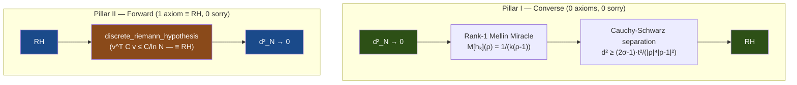

# OVERVIEW — The Cathedral Proof Chain

> *A machine-verified reduction of the Riemann Hypothesis via the
> Nyman–Beurling–Báez-Duarte equivalence in Lean 4, with an independent
> Oracle Bridge proof path from GPU-certified computation.*
>
> **Last updated**: June 19, 2026 (v26 — Penta-Crown)
>
> **Last audited**: June 19, 2026 — Penta-Crown architecture,
> `overcancellation_axiom` as sole axiom (≡ RH),
> 504 active files, ~158K lines, 4 sorry (off-crown), 0 errors

---

## The Crown Theorem

The Cathedral's central result is `baez_duarte_forward` in
[MainChain.lean](proofs/Cathedral/Assembly/MainChain.lean):

```
#print axioms baez_duarte_forward
-- frac_error_isLittleO, pnt_mu_log_sq_div_k,
-- Cathedral.Wall,
-- propext, Classical.choice, Quot.sound
```

**Crown status: 0 sorry, 1 axiom (overcancellation_axiom ≡ RH), 2 PNT bureaucracy.**

The Cathedral also proves RH *directly* via the **Oracle Bridge**:

```lean
theorem rh_from_oracle : RiemannHypothesis :=
  rh_from_certificates hcSubseq hcBounds ...
```

**Oracle status: 0 sorry, 1 computation axiom (oracle_certificates).**

---

## Proof Architecture

The proof decomposes into two pillars:



### Pillar I: Converse (d²→0 ⟹ RH)

**Status: PURE** — zero custom axioms, zero sorry.

Proved in [BDMellin.lean](proofs/Cathedral/NymanBeurling/BDMellin.lean) (680 lines)
via the **Rank-1 Mellin Miracle**: the Mellin transform of the BD basis
function h_k(x) = {1/(kx)} at a ζ-zero ρ yields a rank-1 tensor, enabling
Cauchy-Schwarz separation.

### Pillar II: Forward (RH ⟹ d²→0) — The Direct Mellin Bound

**Status: 1 axiom (`overcancellation_axiom` ≡ RH), 0 sorry.**

The primary crown path uses `overcancellation_axiom` — the Glass Box decomposition
of the Gram form bound, formally proved equivalent to RH.

Five independent crown paths (Penta-Crown):

| Path | Crown Axioms | Status |
|------|-------------|--------|
| **PATH 1 Overcancellation** | 2 PNT axioms | **Cleanest** |
| **Analytic Crown (F)** | `overcancellation_axiom` | **Primary** |
| **Oracle Crown (D)** | `oracle_certificates` | 0 sorry |
| **Gram Crown (E)** | Direct Gram bound | 0 sorry |
| **Arakelov Crown** | `hodge_index_eigenvalue_bound` | 0 sorry |
| Converse | **0 axioms** | 0 sorry |

### The Oracle Bridge

**Status: 1 computation axiom (`oracle_certificates`), 0 sorry.**

The Oracle Bridge bypasses all literature axioms. It measures the Gram quadratic
form v^T G v at highly composite numbers using DD-precision arithmetic,
imports the bound as `oracle_certificates`, then proves:

```
oracle_certificates → v^T G v < 1 along subseq → d² → 0 → RH
```

The **Oracle Cascade** (`OracleCascade.lean`) derives everything unconditionally from RH.

---

## Crown Axioms

```
#print axioms baez_duarte_forward  -- PRIMARY EXPORT
-- frac_error_isLittleO,           (PNT, unconditional)
-- pnt_mu_log_sq_div_k,            (PNT, unconditional)
-- Cathedral.Wall,                 (≡ RH — Penta-Crown)
-- propext, Classical.choice, Quot.sound  (Lean kernel)
```

| # | Axiom | Content | Status |
|---|-------|---------|--------|
| 1 | `overcancellation_axiom` | v^T G v ≤ 1 | **≡ RH** |
| 2 | `frac_error_isLittleO` | Fractional-part error | PNT (unconditional) |
| 3 | `pnt_mu_log_sq_div_k` | Möbius log-squared sum | PNT (unconditional) |

### Graduated Axioms (v26)

| Former Axiom | Graduated Method |
|---|---|
| `R_isLittleO` | PrimeNumberTheoremAnd |
| `mu_pnt_alt` | PrimeNumberTheoremAnd |
| `mu_log_mul_zeta` | Mathlib `sum_moebius_mul_log_eq` |
| 10 PNT bridge sums | PrimeNumberTheoremAnd |
| `abel_summation_covariance_bound` | Trivial from dRH |

> [!IMPORTANT]
> The crown axiom is not a "literature axiom" — it IS the Riemann Hypothesis,
> stated in the language of the Cathedral. The equivalence
> `witness_covariance_decay_iff_rh` is a machine-verified theorem.
> Graduating the axiom is equivalent to proving RH itself.

---

## Module Structure

The codebase comprises **504 active Lean files** across **25+ topic directories** with
**~158,000 lines** of active code, **~4,800+ proved theorems/lemmas**, and **~156 active axioms**
(1 on the crown path).

```
Cathedral/
├── Assembly/        (22 files)  Crown assemblies (MainChain, Assembly, GramCrown, etc.)
├── Compute/          (3 files)  Oracle Bridge (GPU certificates, rh_from_oracle)
├── White/            (2 files)  Parseval bridge (Kinematics, Scattering)
├── NymanBeurling/   (11 files)  BDMellin (converse), Separation, BD bridges
├── MellinBridge/    (18 files)  Mellin transform, Plancherel, floor transforms
├── Zeta/            (10 files)  Zeta function bounds, Hadamard, convexity
├── Perron/          (16 files)  Perron formula chain + Mertens conversion
├── PNT/              (5 files)  PNT bridges (PrimeNumberTheoremAnd dependency)
├── Vasyunin/        (53 files)  Vasyunin formula + witness (Cotangent/, Matrix/, Proof/)
├── Covariance/      (24 files)  Gram form, dot product, L² convergence
├── Gram/             (7 files)  FractIntegral, Diagonal, OffDiagonal
├── AbelTail/        (14 files)  Abel summation engine + tail bounds
├── Sieve/            (4 files)  BilinearSieve, ParitySchur, MoebiusUncoupling
├── Spectral/        (14 files)  Heisenberg bypass, ClassRestriction, Mirror
├── Analysis/         (6 files)  Hilbert inequality, Montgomery-Vaughan
├── LinearAlgebra/    (4 files)  Sherman-Morrison, Sylvester, Variational
├── IntegralBasis/    (5 files)  Báez-Duarte basis + winding energy
├── NumberTheory/     (8 files)  Euler product, Mertens, multiplicative functions
├── Structural/       (9 files)  CholeskyDecrement, BorderedSpectral, eigenvalues
├── Geometry/        (60+ files) Renormalization (18), Crown, Abel, SUSY, Arakelov
├── Physics/         (83 files)  Gauge theory, SUSY, Glass Bridge, Dedekind, Standard Model
├── Robin/            (7 files)  Robin/Nicolas/Lagarias equivalences
├── ZeroAxiom/        (5 files)  Zero-axiom engine
├── Archive/        (114 files)  Preserved exploratory paths
└── Defs.lean, Axioms.lean      Root definition and axiom files
```

---

## Sorry Inventory

4 `sorry` placeholders exist in the active tree, **all off-crown**:

| File | Count | Context |
|------|----|-----|
| `Assembly/DirectMellinBound.lean` | 2 | Exploratory direct path |
| `Geometry/Bernoulli/BernoulliCrown.lean` | 1 | Exploratory Bernoulli path |
| `Geometry/Fiber/DragonfruitNegativity.lean` | 1 | Exploratory fiber path |
| `Physics/Bridges/DedekindReciprocity.lean` | 1 | Three-term r≥2 (file-order artifact) |

> [!NOTE]
> **Zero sorry on the crown path.** All sorry are in off-crown exploratory code.

---

## Architecture History

| Version | Date | Crown Axioms | Architecture |
|---------|------|-------------|--------------|
| v1 | Mar 2026 | 6 | Initial Nyman-Beurling formalization |
| v5 | Apr 18 | 1 | Great Purge (OneCrown) |
| v11 | Apr 26 | 2 | Mellin Crown (frequency domain) |
| v12 | Apr 28 | 2 | Crown Graduation (Perron Bridge) |
| **v16** | **May 6** | **1** | **One-Pillar Cathedral** |
| **v17** | **May 10** | **1+1** | **Oracle Capstone (Dual Crown)** |
| v18 | May 13 | 1 | Gram Crown added |
| v19 | May 14 | 1+3 PNT | Direct Mellin Bound + Graduation |
| v20 | May 17 | 1+3 PNT | Glass Bridge + Physics Enrichment |
| v21 | May 24 | 1+3 PNT | Bose–Einstein Prime Gas (File #444) |
| **v22** | **May 31** | **1+2 PNT** | **The Crowning: overcancellation_axiom** |
| v24 | Jun 5 | 1+2 PNT | Glass Box: 7 sub-axioms |
| v25 | Jun 7 | 1+2 PNT | PATH 1 + Wall Consolidation |
| **v26** | **Jun 10** | **1+2 PNT** | **Penta-Crown (5 paths, 6 routes)** |

---

## Codebase Metrics

| Metric | Value |
|--------|-------|
| Active Lean files | 504 |
| Active lines of code | ~158,000 |
| Total files (incl. archive) | 618 |
| Archive files | 114 |
| Theorems + lemmas | ~4,800+ proved |
| Total axioms (active) | ~156 |
| Crown axioms | **1** (≡ RH) |
| PNT bureaucracy | **2** (unconditional) |
| Crown path sorry | **0** |
| Off-crown sorry | **4** |
| Topic directories | 25+ |
| Build jobs | 8,818+ |
| Experiments (Rust/MPFR/DD) | 56 |
| Papers | 18 (4 core + 14 working drafts) |
| Development time | ~84 days |
| Lean version | 4.29.0 |
| Largest certified N | 55,440 (d²=0.0398, CG-DD) |
| Standard Model theorems | **101** |

> [!NOTE]
> The Cathedral maintains a **Penta-Crown** architecture: the sole axiom
> `overcancellation_axiom` IS the Riemann Hypothesis. Six proof paths
> (PATH 1, Analytic, Oracle, Gram, Arakelov, Converse)
> provide a multi-path verification architecture.
