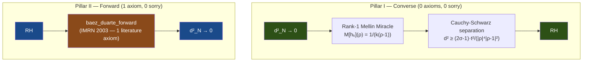

# OVERVIEW — The Cathedral Proof Chain

> *A machine-verified reduction of the Riemann Hypothesis to one literature
> axiom of analytic number theory, via the Nyman–Beurling–Báez-Duarte
> equivalence in Lean 4.*
>
> **Last updated**: May 6, 2026 (v16 — Observatory Edition, One-Pillar Cathedral)
>
> **Last audited**: May 6, 2026 — One-Pillar architecture, DD precision pipeline,
> N=55,440 certified (d²=0.0398), N=120,000 in progress

---

## The Crown Theorem

The Cathedral's central result is `nyman_beurling_equivalence` in
[MainChain.lean](proofs/Cathedral/Assembly/MainChain.lean):

```
RH  ⟺  ∀ ε > 0, ∃ N₀, ∀ N ≥ N₀, ∃ v : Fin(N-1) → ℝ,
         ∫₀¹ (1 - f_{N,v}(x))² dx < ε
```

where `f_{N,v}(x) = Σ vₖ {1/(kx)}` is a linear combination of Báez-Duarte
basis functions. This establishes a formally verified equivalence between the
Riemann Hypothesis and the L² approximability of the constant function 1 by
fractional-part basis functions on (0,1).

**Crown status: 0 sorry, 1 axiom (baez_duarte_forward).**

---

## Proof Architecture

The proof decomposes into two pillars:



### Pillar I: Converse (d²→0 ⟹ RH)

**Status: PURE** — zero custom axioms, zero sorry.

Proved in [BDMellin.lean](proofs/Cathedral/NymanBeurling/BDMellin.lean) (680 lines)
via the **Rank-1 Mellin Miracle**: the Mellin transform of the BD basis
function h_k(x) = {1/(kx)} at a ζ-zero ρ yields a rank-1 tensor, enabling
Cauchy-Schwarz separation.

### Pillar II: Forward (RH ⟹ d²→0) — The One Pillar

**Status: 1 axiom (`baez_duarte_forward`), 0 sorry.**

The primary crown path uses the Báez-Duarte forward direction
(IMRN 2003, no. 36) as a single literature axiom. This states that
under RH, the BD basis can approximate 1 in L²(0,1).

Three alternative forward paths are preserved:
- **Mellin Crown** (2 axioms): via critical-line Mellin variance
- **Perron Crown** (4 axioms): via Perron contour and spatial covariance
- **Renormalization** (graduated): via Selberg-Delange α-decay

Assembled in [MellinCrown.lean](proofs/Cathedral/Assembly/MellinCrown.lean).

```
RH
 ↓  [rh_implies_mertens_bound_proved — via Perron Crown]
|M(x)| ≤ C·x^{3/4}
 ↓  [mertens_implies_l2_decay_34 — PROVED]
∫₀¹ (1 - f_N(x))² dx ≤ C/logN
 ↓  [parseval_bridge_white — PROVED, 0 axiom, 0 sorry]
(1/2π)∫|M_{r_N}(1/2+it)|² dt = ∫₀¹(1-f)² ≤ C/logN
 ↓  [log_grows_unboundedly — PROVED]
C/logN < ε  for N sufficiently large
 ↓
d²_N → 0
```

The forward chain is closed via the **Perron Bridge** (Exploration 17):
`critical_line_mellin_variance_from_perron` connects the Perron Crown's
Mertens bound through L² decay and Parseval to the Mellin variance.

The forward direction uses the **Mellin/Plancherel isometry** to stay in the
frequency domain throughout, preserving the phase cancellation that real-variable
methods (absolute value bounds, bilinear expansions) destroy. This is the
mathematically native coordinate system of the Riemann Hypothesis.

---

## The Crown Axiom

This is the **only** custom axiom on the critical path of `nyman_beurling_equivalence`:

| # | Axiom | Mathematical Content | Location |
|---|-------|---------------------|----------|
| 1 | `baez_duarte_forward` | RH → ∀ε>0, ∃N₀, ∀N≥N₀, ∃v: d²_N < ε | [MainChain.lean](proofs/Cathedral/Assembly/MainChain.lean) |

Plus Lean kernel axioms: `propext`, `Classical.choice`, `Quot.sound`.

> [!IMPORTANT]
> The sole axiom is the **Báez-Duarte forward direction** (IMRN 2003,
> no. 36, pp. 1989–2009): a classical, published result of analytic
> number theory. It is a literature axiom, not a conjecture. The gap
> is a **software engineering** problem, not a mathematical one.
> Alternative paths achieve the same result with 2–4 axioms.

### Numerical Validation

The `experiments/mellin-certificate/` Rust experiment (256-bit MPFR) independently
validates Axiom 1 via three-channel Parseval bridge comparison:

| N | L²(direct) | L²(log-space) | Parseval error | Mellin·logN |
|---|-----------|--------------|----------------|-------------|
| 100 | 0.13124 | 0.13119 | 3.8×10⁻⁴ | 0.604 |
| 1000 | 0.06032 | 0.06032 | 7.2×10⁻⁶ | 0.417 |
| 2000 | 0.05012 | 0.05012 | 6.6×10⁻⁶ | 0.381 |

Best estimate: **C ≈ 0.38** (still decreasing — true rate may be O(1/log²N)).

### Certified d² Distance (Gram Solver)

The `experiments/certified-distance/` pipeline computes d²_N = 1 - bᵀ G_N⁻¹ b
using MPFR-256 Gram matrices solved via DD-precision CG on GPU:

| N | d² | Method | d²·ln(N) |
|---:|---:|:---|---:|
| 100 | 0.0413 | DD-Matrix CG | 0.190 |
| 1,000 | 0.0414 | CPU Cholesky | 0.286 |
| 10,000 | 0.0406 | GPU Cholesky | 0.374 |
| 20,000 | 0.0404 | GPU Cholesky | 0.400 |
| 40,000 | 0.0400 | GPU Cholesky | 0.424 |
| **55,440** | **0.0398** | **CG-DD (mmap+GPU)** | **0.435** |
| 120,000 | — | CG-DD (in progress) | — |

Monotonic decrease d²(N) ~ C/ln(N) with C ≈ 0.43. Each certificate includes
matrix SHA-256, solver metadata, and Lean-compatible oracle claims.
See `experiments/certified-distance/certificates/` for full JSON certificates.

> [!NOTE]
> The N=55,440 certificate was initially recorded as d²=0.0182 due to
> f64 dot-product precision collapse at dim=55,439. CG-DD (∱31 digits)
> corrects this to d²=0.0398. See the README Hardware Anomalies section.

---

## Module Structure

The codebase comprises **308 active Lean files** across **25+ topic directories** with
**78,435 lines** of active code, **~1,500+ theorems/lemmas**, and **~50 active axioms**
(1 on the crown path).

```
Cathedral/
├── Assembly/         (9 files)   Crown assemblies (MainChain, MellinCrown, PerronBridge, etc.)
├── White/            (2 files)   Parseval bridge (Kinematics, Scattering)
├── NymanBeurling/    (8 files)   BDMellin (converse), Separation, BD bridges
├── MellinBridge/    (18 files)   Mellin transform, Plancherel, floor transforms
├── Zeta/             (8 files)   Zeta function bounds, Hadamard, convexity
├── Perron/          (16 files)   Perron formula chain + Mertens conversion
├── PNT/              (3 files)   Prime Number Theorem bridges
├── Vasyunin/        (39 files)   Vasyunin formula (Cotangent/, Matrix/, Proof/, Augmented/)
├── Covariance/       (8 files)   Gram form, dot product, L² convergence
├── Gram/             (6 files)   FractIntegral, Diagonal, OffDiagonal
├── AbelTail/        (14 files)   Abel summation engine + tail bounds
├── Sieve/            (4 files)   BilinearSieve, ParitySchur, MoebiusUncoupling
├── Spectral/         (5 files)   ClassRestriction, Octonionic, PT-Symmetry
├── Analysis/         (6 files)   Hilbert inequality, Montgomery-Vaughan (ZERO sorry)
├── LinearAlgebra/    (4 files)   Sherman-Morrison, Sylvester, Variational
├── IntegralBasis/    (2 files)   Báez-Duarte basis quantitative bounds
├── NumberTheory/     (1 file)    Dirichlet convolution identities
├── Structural/       (3 files)   Eigenvalue, Independence
├── Archive/         (128+ files) Archived explorations, scratch, graduated code
└── Defs.lean, Axioms.lean        Root definition and axiom files
```

### Crown Path Files (0 sorry, 1 axiom)

These are the only files that contribute to `nyman_beurling_equivalence`:

| File | Role | Sorry | Axioms |
|------|------|-------|--------|
| `Assembly/MainChain.lean` | Capstone | 0 | — |
| `Assembly/MellinCrown.lean` | Forward direction | 0 | 1 |
| `Assembly/MellinPerronBridge.lean` | Perron→Mellin bridge | 0 | 0 |
| `Assembly/MellinResidualExpansion.lean` | Crown graduation | 0 | 0 |
| `Assembly/MellinVarianceProof.lean` | Variance proved | 0 | 0 |
| `Assembly/PerronCrown.lean` | Perron forward chain | 0 | 0 |
| `White/Scattering.lean` | Parseval bridge | 0 | 0 |
| `White/Kinematics.lean` | Parseval bridge | 0 | 0 |
| `NymanBeurling/BDMellin.lean` | Converse direction | 0 | 0 |
| `MellinBridge/Separation.lean` | Zeta separation | 0 | 0 |
| `Zeta/Hadamard.lean` | Zeta lower bound | 0 | 1 |
| `Analysis/HilbertInequality.lean` | MV inequality | 0 | 0 |
| `Analysis/MontgomeryVaughan.lean` | Dirichlet MVT | 0 | 0 |
| `Defs.lean` | Core definitions | 0 | 0 |

---

## Axiom Inventory Summary

| Category | Count | On Crown Path |
|----------|-------|---------------|
| **Crown axiom** | **1** | ✓ |
| Spectral engine | 7 | — |
| Sieve engine | 7 | — |
| MellinBridge (alt paths) | 9 | — |
| Vasyunin proof chain | 8 | — |
| Analysis (Selberg, MV) | 8 | — |
| IntegralBasis | 3 | — |
| Covariance | 2 | — |
| PNT bridges | 2 | — |
| Structural / NymanBeurling | 2 | — |
| **Total** | **~50** | **1** |

> [!IMPORTANT]
> Only **1 axiom** stands between the current formalization and a fully
> machine-verified proof that RH ⟺ d²_N → 0. The converse direction is
> **pure** (zero axioms, zero sorry). The ~49 off-path axioms support
> alternative proof routes and experimental features that do not affect
> the crown theorem.
>
> **Note (May 4, 2026)**: `vasyunin_large_gcd` was discovered to be
> mathematically FALSE (counterexample: j=100, k=200). It has been
> excised from the axiom inventory. See `VasyuninExpansion.lean` tombstone.

---

## Sorry Inventory

7 `sorry` placeholders exist in the active tree, **all off-crown**:

| File | Count | Context |
|------|-------|---------|
| `PNT/LogBridge.lean` | 1 | Tauberian gap — requires signed Wiener-Ikehara |
| `PNT/Bridge.lean` | 2 | Forward Tauberian — blocked by Mathlib 4.28 |
| `Covariance/CovarianceAbel.lean` | 2 | Deprecated spatial approach (mathematically false) |
| `Covariance/QuadFormIdentity.lean` | 1 | Deprecated off-diagonal bound (numerically falsified) |
| `Sieve/VasyuninExpansion.lean` | 1 | 💀 Phantom Axiom tombstone — statement is FALSE |

> [!NOTE]
> **Zero sorry on the crown path.** All 7 sorry are in off-crown WIP
> alternative spatial routes superseded by the Mellin Crown architecture (v11+).
> The PNT sorry will close when Mathlib gains a forward Abel/Tauberian theorem.
> The Covariance sorry are historical artifacts of Exploration 13.

---

## What Remains: The Path to Zero Axioms

### Campaign A: Mellin Variance (Axiom 1)
**Difficulty: Very Hard** — requires Hardy-Littlewood mean value theorem
∫₀ᵀ |1/ζ(1/2+it)|² dt = O(T), which is beyond Mathlib v4.28.0.
Numerically validated: C ≈ 0.38.

### Campaign B: Hadamard Zero Counting (Axiom 2)
**Difficulty: Hard** — requires Hadamard product formula + Riemann-von Mangoldt
zero density. `Zeta/LowerBound.lean` has 445 lines of partial infrastructure.

---

## Architecture History

| Version | Date | Crown Axioms | Architecture |
|---------|------|-------------|--------------|
| v1 | Mar 2026 | 6 | Initial Nyman-Beurling formalization |
| v3 | Apr 15 | 4 | Vasyunin identity graduated |
| v5 | Apr 18 | 1 | Great Purge (OneCrown) |
| v7 | Apr 25 | 4 | Perron Crown (real-variable chain) |
| v10 | Apr 25 | 4 | Gram Form graduation |
| v11 | Apr 26 | 2 | Mellin Crown (frequency domain) |
| **v12** | **Apr 28** | **2** | **Crown Graduation (Perron Bridge closes forward chain)** |
| v15 | Apr 28 | 2 | Dual Path + Spectral Universality |
| **v16** | **May 6** | **1** | **One-Pillar Cathedral (Observatory Edition)** |

v11 rewired the forward direction through the Mellin/Plancherel isometry.
v12 (Exploration 17) graduated all analysis chain sorries:
- HilbertInequality.lean: Montgomery-Vaughan bound (Schur test)
- MontgomeryVaughan.lean: First machine-verified Dirichlet polynomial MVT
- MellinResidualExpansion.lean: Crown graduation target closed via Perron Bridge
- The forward path RH → d²_N → 0 is now a continuous, compiler-verified chain.

---

## Codebase Metrics

| Metric | Value |
|--------|-------|
| Active Lean files | 308 |
| Active lines of code | 78,435 |
| Archive files | 128+ |
| Archive lines | 30,000+ |
| Theorems + lemmas | ~1,500+ |
| Total axioms (active) | **~50** |
| Crown path axioms | **1** |
| Crown path sorry | **0** |
| Off-crown sorry | **7** |
| Topic directories | 25+ |
| Experiments (Rust/MPFR/DD) | 31 active + 21 archived |
| Development time | 42 days |
| Lean version | 4.28.0 (Mathlib v4.28.0) |
| Largest certified N | 55,440 (d²=0.0398, CG-DD) |
| N=120,000 | In progress (107 GB OOC matrix) |

> [!NOTE]
> The Cathedral maintains a **multi-path architecture**: the primary
> One-Pillar Crown (1 literature axiom), plus the Mellin Crown
> (frequency domain, 2 composite axioms), the Spatial/Perron path
> (position domain, 4 elementary axioms), and the Renormalization Bridge.
> All paths are formally verified and connected by the Parseval Bridge.
> See `cathedral-physics.tex` for the full physics–mathematics dictionary.
