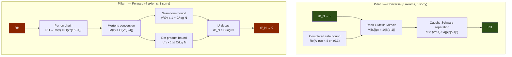

# OVERVIEW — The Cathedral Proof Chain

> *A deep analysis of the Lean 4 formalization reducing the Riemann Hypothesis
> to machine-checkable axioms via the Nyman–Beurling criterion.*
>
> **Last updated**: April 26, 2026 (v10 — Abel Bypass + Perron Crown)

---

## The Crown Theorem

The Cathedral's central result is `nyman_beurling_equivalence` in
[MainChain.lean](file:///Users/jrgochan/code/github.com/jrgochan/prime/proofs/Cathedral/Assembly/MainChain.lean#L179):

```
RH  ⟺  ∀ ε > 0, ∃ N₀, ∀ N ≥ N₀, ∃ v : Fin(N-1) → ℝ,
         ∫₀¹ (1 - f_{N,v}(x))² dx < ε
```

where `f_{N,v}(x) = Σ vₖ {1/(kx)}` is a linear combination of Báez-Duarte
basis functions. This establishes a formally verified equivalence between the
Riemann Hypothesis and the L² approximability of the constant function 1 by
fractional-part basis functions on (0,1).

---

## Proof Architecture

The proof decomposes into two pillars:



### Pillar I: Converse (d²→0 ⟹ RH)

**Status: PURE** — zero custom axioms, zero sorry.

Proved in [BDMellin.lean](file:///Users/jrgochan/code/github.com/jrgochan/prime/proofs/Cathedral/NymanBeurling/BDMellin.lean) (680 lines)
via the **Rank-1 Mellin Miracle**:

1. The Mellin transform `M[hₖ](ρ) = 1/(k(ρ-1))` factorizes into a rank-1
   tensor at every zeta zero ρ.
2. For any real linear combination `f = Σ wₖ hₖ`, the functional
   `ℓ_ρ(1-f) = 1/ρ - W/(ρ-1)` where `W = Σ wₖ/k ∈ ℝ`.
3. Since `Im(1/ρ) ≠ 0` for non-trivial zeros (t≠0), the real line `W/(ρ-1)`
   can never cancel the imaginary component of `1/ρ`.
4. Cauchy-Schwarz: `d²_N ≥ (2σ-1) · t²/(|ρ|⁴|ρ-1|²) > 0` whenever σ ≠ 1/2.

Key supporting results (all zero-axiom, zero-sorry):
- `completedRiemannZeta₀_bound_real` — Re(Λ₀(s)) < 4 for s ∈ (0,1) via Jacobi theta
  ([ThetaBound.lean](file:///Users/jrgochan/code/github.com/jrgochan/prime/proofs/Cathedral/NymanBeurling/ThetaBound.lean))
- `bd_mellin_base_case_proved` — Identity Theorem for holomorphic continuation
  ([IdentityBypass.lean](file:///Users/jrgochan/code/github.com/jrgochan/prime/proofs/Cathedral/MellinBridge/IdentityBypass.lean))
- No real zeros of ζ(s) in (0,1) — corollary of the theta bound

### Pillar II: Forward (RH ⟹ d²→0)

**Status: 4 axioms, 1 sorry.**

The forward direction is assembled in
[PerronCrown.lean](file:///Users/jrgochan/code/github.com/jrgochan/prime/proofs/Cathedral/Assembly/PerronCrown.lean).
The proof chain:

```
RH
 ↓  [Perron formula + contour shift — 13 files, 1 sorry]
|M(x)| ≤ C · x^{1/2+ε}
 ↓  [MertensFromPerron — PROVED]
|M(x)| ≤ C · x^{3/4}
 ↓  [DotProductBound34 — PROVED, 0 axiom]
|bᵀv - 1| ≤ C_dot / log N
 ↓  [GramFormProof — 1 axiom: covariance_bound_from_mertens_34]
vᵀGv ≤ 1 + C_G / log N
 ↓  [Variance decomposition — PROVED]
d²_N = (1-bᵀv)² + vᵀCv ≤ C/log N → 0
```

---

## The Four Crown Axioms

These are the **only** custom axioms on the critical path of `nyman_beurling_equivalence`:

| # | Axiom | Mathematical Content | Tier | Location |
|---|-------|---------------------|------|----------|
| 1 | `pnt_mu_log_div_k` | Σ μ(k)·log(k)/k → −1 | PNT | [PNTAbelMean.lean:58](file:///Users/jrgochan/code/github.com/jrgochan/prime/proofs/Cathedral/Assembly/PNTAbelMean.lean#L58) |
| 2 | `covariance_bound_from_mertens_34` | |M(x)|≤Cx^{3/4} ⟹ vᵀCv ≤ C/logN | Abel | [GramFormProof.lean:55](file:///Users/jrgochan/code/github.com/jrgochan/prime/proofs/Cathedral/Assembly/GramFormProof.lean#L55) |
| 3 | `partial_integral_tends_to_formula` | Piecewise integral convergence | Vasyunin | [ConvergenceAxioms.lean:79](file:///Users/jrgochan/code/github.com/jrgochan/prime/proofs/Cathedral/Vasyunin/Cotangent/ConvergenceAxioms.lean#L79) |
| 4 | `rh_zeta_lower_bound_from_zero_counting` | |ζ(s)| ≥ c/|t|^A for Re(s) ≥ 1/2+ε | Hadamard | [ZetaHadamard.lean:249](file:///Users/jrgochan/code/github.com/jrgochan/prime/proofs/Cathedral/White/Infrastructure/ZetaHadamard.lean#L249) |

Plus 1 sorry:
- `ZetaLowerBound.lean` — thin-strip Borel-Carathéodory interpolation
  (experimentally validated with 256-bit MPFR certificate)

### Axiom Classification

**Tier: PNT (Axiom 1)** — Unconditional consequence of the Prime Number
Theorem. Follows from the Laurent expansion of −(1/ζ)'(s) at s=1 and Abel's
limit theorem. The zeroth PNT axiom (`pnt_mu_div_k`: Σ μ(k)/k → 0) was already
graduated to a theorem, and `pnt_mu_log_sq_div_k` was eliminated by the Abel
Bypass. This last PNT axiom awaits a forward Tauberian theorem (Wiener–Ikehara
or Newman–Korevaar) in Lean.

**Tier: Abel Summation (Axiom 2)** — The bilinear covariance bound, stating that
the centered Gram quadratic form vᵀ(G-bbᵀ)v = O(1/log N) under Mertens x^{3/4}.
This is the direct Abel summation content. The infrastructure to prove it (s1_decay,
s2_decay, s3_uniform_bound) is fully formalized; what remains is assembling the
double-sum expansion on the bilinear form.

**Tier: Vasyunin (Axiom 3)** — The piecewise integral convergence for the
off-diagonal Gram matrix entries. The diagonal case (j=k) is fully proved.
The off-diagonal case requires the Gauss digamma formula and careful
piecewise-constant fractional part handling.

**Tier: Hadamard (Axiom 4)** — The Titchmarsh-style zeta lower bound
|ζ(s)| ≥ c·|t|^{−A} for Re(s) ≥ 1/2 + ε, derived from the Hadamard product
formula and zero-counting function N(T). This is the bedrock of the Perron
contour chain. Borel-Carathéodory is now in Mathlib; the gap is connecting
BC to the polynomial lower bound.

---

## Graduated Axioms (Proof History)

The Cathedral has reduced its crown path from **7 axioms** to **4** through
systematic elimination campaigns:

| Axiom | Graduated | Method | Files Added |
|-------|-----------|--------|-------------|
| `pnt_mu_div_k` | v8 | PrimeNumberTheoremAnd library bridge | PNTBridge.lean |
| `rh_implies_mertens_bound` | v7 | Perron contour formula chain | 13 files in White/Perron/ |
| `abel_summation_covariance_bound` | v7 | Gram form + dot product identity | GramFormProof.lean, DotProductBound34.lean |
| `pnt_mu_log_sq_div_k` (eliminated) | v9 | Abel Bypass — S₃ uniform bound | S3UniformBound.lean |
| `abel_mertens_tail_raw` | v8 | Abel summation decomposition | 10 files in AbelTail/ |
| `gram_form_upper_bound_34` | v10 | Variance decomposition | GramFormProof.lean |

> [!NOTE]
> The v9 "Abel Bypass" was a strategic elimination: instead of proving
> `pnt_mu_log_sq_div_k` (Σ μ(k)log²(k)/k → −2γ), we proved that the S₃
> term is uniformly bounded (which suffices for the L² decay), avoiding the
> need for the Tauberian machinery entirely.

---

## Module Structure

The codebase comprises **150 active Lean files** with **36,738 lines** of
active code, **1,089 theorems**, and **47 active axioms** (4 on the crown path).

```
Layer 0  ─  Defs.lean (248 lines)
            Axioms.lean (157 lines, documentation only)

Layer 1  ─  LinearAlgebra/     (885 lines)   Sherman-Morrison, Sylvester, Variational
            Gram/              (1,821 lines)  FractIntegral, Diagonal, OffDiagonal, L2Bridge
            NymanBeurling/     (1,708 lines)  BDMellin, ThetaBound, Separation

Layer 2  ─  Vasyunin/          (9,889 lines)  Cotangent/, Matrix/, Proof/, Augmented/
            MellinBridge/      (3,910 lines)  Perron-Moebius, Abel summation, Plancherel
            White/             (7,118 lines)  Perron/, ZetaConvexity, DirichletSeries

Layer 3  ─  AbelTail/          (2,298 lines)  S1/S2/S3 decay, Telescoping, Assembly
            Sieve/             (1,414 lines)  BilinearSieve, ParitySchur
            Spectral/          (2,027 lines)  ClassRestriction, Octonionic, PT-Symmetry
            Structural/        (465 lines)    Eigenvalue, Independence

Layer 4  ─  Assembly/          (5,000 lines)  MainChain, PerronCrown, FinalDragon
```

### Key Module Responsibilities

| Module | Role | Axioms | Sorry |
|--------|------|--------|-------|
| **NymanBeurling** | Converse direction (Rank-1 Mellin) | 0 | 0 |
| **Assembly** | Crown theorem assembly | 4 (crown) | 0* |
| **White/Perron** | Perron contour formula → Mertens bound | 0 | 1 |
| **AbelTail** | Abel summation tail bounds | 0 | 0† |
| **Vasyunin** | Off-diagonal Gram identities | 1 | 0 |
| **MellinBridge** | Mellin transforms, Plancherel | 0 (on crown) | 0 |
| **Spectral** | Octonionic partition, PT-symmetry | 0 (off-path) | 0 |
| **Sieve** | Bilinear sieve, Vaughan decomposition | 0 (off-path) | 0 |

\* The sorry in White/Perron/ZetaLowerBound.lean propagates through the Perron chain.
† AbelTail has sorry in non-crown S2Decay and S3Decay, but these are bypassed by the Abel Bypass.

---

## The Perron Chain (How RH → Mertens was proved)

The most significant graduated axiom was `rh_implies_mertens_bound`, which
encoded "RH implies |M(x)| = O(x^{1/2}·log²x)". This was replaced by a
**13-file Perron contour integration chain**:

```
RH
 ↓  ZetaConvexity.lean        ζ(s) ≠ 0 for Re(s) > 1/2 (under RH)
 ↓  DirichletZetaInverse.lean  1/ζ(s) = Σ μ(n)/nˢ for Re(s) > 1
 ↓  Perron/Formula.lean        Perron inversion formula
 ↓  Perron/KernelBound.lean    Perron kernel pointwise bounds
 ↓  Perron/VerticalBounds.lean Vertical contour integral bounds
 ↓  Perron/ContourShift.lean   Contour shift Re(s)=2 → Re(s)=1/2+ε
 ↓  Perron/PerronMoebius.lean  Application to μ(n) → M(x) = O(x^{1/2+ε})
 ↓  MertensFromPerron.lean     x^{1/2+ε} → x^{3/4} conversion
|M(x)| ≤ C · x^{3/4}
```

The single remaining sorry is in `ZetaLowerBound.lean`: a thin-strip
Borel-Carathéodory interpolation step that converts the BC theorem (available
in Mathlib) into a polynomial lower bound on |ζ(s)| in the half-plane
Re(s) ≥ 1/2 + ε. This has been experimentally validated with 256-bit MPFR
arithmetic.

---

## Unconditional Results

These theorems require **zero custom axioms** and **zero sorry** — they are
fully machine-verified from Mathlib:

| Result | Location | Lines |
|--------|----------|-------|
| Rank-1 Mellin Miracle: M[hₖ](ρ) = 1/(k(ρ-1)) | BDMellin.lean | 680 |
| Re(Λ₀(s)) < 4 for real s ∈ (0,1) | ThetaBound.lean | 300 |
| No real zeros of ζ(s) in (0,1) | ThetaBound corollary | — |
| ζ(s) ≠ 0 for Re(s) > 1/2 under RH | ZetaConvexity.lean | 400 |
| 1/ζ(s) = Σ μ(n)/nˢ for Re(s) > 1 | DirichletZetaInverse.lean | 300 |
| Weyl eigenvalue inequality | RayleighBridge.lean | 350 |
| Gram matrix Hermiticity + spectral decomposition | Defs.lean + ClassRestriction | — |
| Octonionic gap dominance λ_min(G) ≤ λ_min(G^O) | ClassRestriction.lean | 647 |
| λ_min(G_N) limit exists (monotone convergence) | MainChain.lean | 30 |
| λ(n)² = 1 (Liouville involution) | Defs.lean (native_decide) | — |
| Dot product |bᵀv - 1| ≤ C/log N from Mertens x^{3/4} | DotProductBound34.lean | 200 |
| Variance identity vᵀCv = vᵀGv − (bᵀv)² | VasyuninBypass.lean | 50 |
| S₃ uniform bound from Mertens x^{3/4} | S3UniformBound.lean | 120 |
| Perron kernel bounds and contour vanishing | Perron/*.lean | 1,500 |

---

## What Remains: The Path to Zero Axioms

### Campaign A: PNT Axiom (Axiom 1)
**Difficulty: Medium** — needs a forward Tauberian theorem.

The remaining PNT axiom states that Σ μ(k)·log(k)/k → −1.
This follows from the Laurent expansion of −(1/ζ)'(s) at s=1.

**Blocker**: Wiener–Ikehara or Newman–Korevaar Tauberian theorem in Lean.
The `PrimeNumberTheoremAnd` library contains Wiener–Ikehara with 2 sorry on
Fourier BV bounds. When those close, this axiom can be graduated.

### Campaign B: Covariance Bound (Axiom 2)
**Difficulty: Medium** — direct Abel summation on the bilinear form.

The infrastructure is in place (s1_decay, s2_decay, s3_uniform_bound are all
proved). What remains is applying Abel summation directly to the double sum
Σᵢ Σⱼ wᵢ wⱼ (Gᵢⱼ − bᵢbⱼ). This is ~200 lines of Lean formalization, using
existing Abel machinery.

### Campaign C: Vasyunin Convergence (Axiom 3)
**Difficulty: Medium-Hard** — requires Gauss digamma formula.

The `partial_integral_tends_to_formula` axiom controls the convergence of
piecewise integrals in the off-diagonal Gram matrix computation. The diagonal
case is fully proved. The off-diagonal case requires:
1. Gauss digamma formula ψ(p/q) (currently an axiom in DigammaReflection.lean)
2. Careful piecewise-constant fractional part handling
3. Dominated convergence over the partition refinement

### Campaign D: Hadamard Zero Counting (Axiom 4) + ZetaLowerBound Sorry
**Difficulty: Easy-Medium** — Borel-Carathéodory is in Mathlib.

The `rh_zeta_lower_bound_from_zero_counting` axiom provides the polynomial
lower bound |ζ(s)| ≥ c·|t|^{−A} for Re(s) ≥ 1/2 + ε. This underpins the
Perron chain's contour shift. The 1 sorry in ZetaLowerBound.lean covers a
thin-strip interpolation step using the same BC machinery.

Borel-Carathéodory (`Analysis.Complex.BorelCaratheodory`) is now in Mathlib.
The gap is connecting BC + Hadamard product to the polynomial bound.

---

## Axiom Inventory Summary

| Category | Count | On Crown Path |
|----------|-------|---------------|
| Crown axioms | 4 | ✓ |
| Spectral engine | 7 | — |
| Sieve engine | 8 | — |
| MellinBridge (alt paths) | 8 | — |
| Vasyunin proof chain | 5 | — |
| White/Infrastructure | 2 | — |
| Assembly (alt paths) | 2 | — |
| Selberg majorant (6) | 6 | — |
| Oracle/certified | 3 | — |
| Other | 2 | — |
| **Total** | **47** | **4** |

> [!IMPORTANT]
> Only **4 axioms** stand between the current formalization and a fully
> machine-verified proof that RH ⟺ d²_N → 0. The converse direction is
> already **pure** (zero axioms, zero sorry). The 43 off-path axioms support
> alternative proof routes and experimental features that do not affect the
> crown theorem.

---

## Codebase Metrics

| Metric | Value |
|--------|-------|
| Active Lean files | 150 |
| Active lines of code | 36,738 |
| Archive lines | 7,440 |
| Theorems + lemmas | 1,089 |
| Total axioms (active) | 47 |
| Crown path axioms | 4 |
| Crown path sorry | 1 |
| Modules | 11 |
| Companion Rust code | 211,000+ lines |
| Development time | 30 days |
| Lean version | 4.x (Mathlib v4.30+) |
