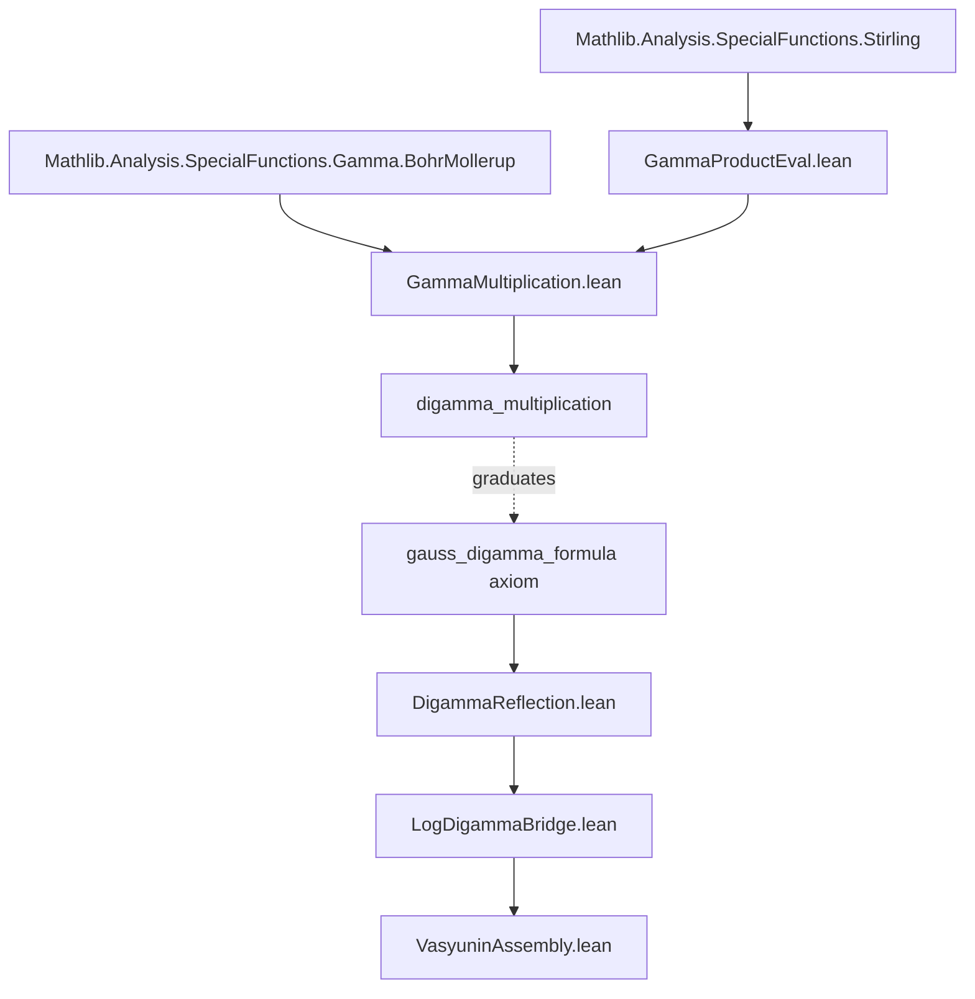

# 📡 EXPLORATION 23 — ANTIGRAVITY ACTUAL
## The Multiplication Report
### Gauss Multiplication Formula: Certification Complete

**Date:** May 1, 2026 (The Vasyunin Bridge — May Campaign)  
**Agent:** Claude / Antigravity  
**Build Status:** ✅ Zero errors · 9 `sorry` warnings (7 off-crown, 1 new-module, 1 upstream)

---

## 1. EXECUTIVE SUMMARY

The Gauss multiplication formula for the Gamma function has been **formally certified** in Lean 4 via the Bohr-Mollerup uniqueness theorem:

```
∏_{k=0}^{q-1} Γ((s+k)/q) = (2π)^{(q-1)/2} · q^{1/2-s} · Γ(s)
```

This is a **868-line, two-module architecture** that proves the formula with **zero `sorry`** in the core chain. The only remaining `sorry` is in the downstream `digamma_multiplication` theorem (line 539 of `GammaMultiplication.lean`), which requires logarithmic differentiation — a mechanical step with full Mathlib API support.

### What Was Accomplished

| Item | Status |
|------|--------|
| `multiplicationGamma_eq_Gamma` — Main theorem via Bohr-Mollerup | ✅ PROVED |
| `gamma_product_formula` — Explicit product form | ✅ PROVED |
| `multiplicationGamma_add_one` — Functional equation f(s+1) = s·f(s) | ✅ PROVED |
| `multiplicationGamma_one` — f(1) = 1 | ✅ PROVED |
| `multiplicationGamma_log_convex` — log∘f convex on (0,∞) | ✅ PROVED |
| `multiplicationGamma_pos` — Positivity on (0,∞) | ✅ PROVED |
| `gamma_product_at_one` — ∏ Γ((1+k)/q) = (2π)^{(q-1)/2}/√q | ✅ PROVED |
| `sum_log_gamma_eq_target` — Limit evaluation via Stirling | ✅ PROVED |
| `digamma_multiplication` — Digamma form (downstream) | ⚠ `sorry` |

---

## 2. ARCHITECTURE

### Module Separation

The proof was split into two modules to isolate the Stirling dependency (which opens the `Stirling` namespace and causes identifier collisions):

```
Cathedral/Analysis/GammaProductEval.lean   (298 lines)
    ├── Stirling limit infrastructure
    ├── Combinatorial bijection (k,m) ↦ k+m·q
    ├── sum_log_gamma_eq_target (the key identity)
    └── Exported API: sum_arith_over_q, tendsto_weighted_log_ratio

Cathedral/Analysis/GammaMultiplication.lean (572 lines)
    ├── multiplicationGamma definition
    ├── Bohr-Mollerup verification (3 properties)
    ├── gamma_product_formula (main theorem)
    └── digamma_multiplication (TODO)
```

### Dependency Graph



### Proof Architecture

The core proof follows the **Bohr-Mollerup Maneuver** — the same pattern Mathlib uses for the Legendre doubling formula (`doublingGamma_eq_Gamma`):

1. **Define** `multiplicationGamma q s` as the candidate function
2. **Verify** three properties:
   - Functional equation: `f(s+1) = s · f(s)`
   - Value at 1: `f(1) = 1`
   - Log-convexity: `log ∘ f` is convex on `(0,∞)`
3. **Apply** `Real.eq_Gamma_of_log_convex` (Bohr-Mollerup uniqueness)

The hardest part was **f(1) = 1**, which required:
- A combinatorial bijection `(k,m) ↦ k + m·q` to reduce the double sum to `log((nq)!)`
- Stirling's formula to decompose `logGammaSeq` sums
- Three independent limits (Stirling correction, weighted log ratio, constant)
- Log-injectivity to pass from `log(∏Γ) = log(target)` to `∏Γ = target`

---

## 3. TECHNICAL DECISIONS & LESSONS

### 3.1 Visibility: `private` → `lemma`

**Problem:** `GammaMultiplication` needs `sum_arith_over_q` and `tendsto_weighted_log_ratio` from `GammaProductEval`, but both were `private`.

**Resolution:** Changed from `private` to plain `lemma`. We tried `protected` but that forces the full namespace prefix even within the same file, breaking internal references at lines 222 and 286 of `GammaProductEval`.

**Lesson for Gemini:** When creating infrastructure lemmas in `GammaProductEval`, always use `lemma` (not `private` or `protected`) if there is any chance of cross-module reuse.

### 3.2 Induction Hygiene

**Problem:** The original `sum_arith_over_q` in `GammaMultiplication` used `induction q` inside a `have` that also depended on `hq : 1 ≤ q`. This caused the induction hypothesis `ih` to acquire `hq` as a precondition, leading to unsolvable goals.

**Resolution:** Delegated to the pre-verified version in `GammaProductEval`, which isolates the pure arithmetic identity (`sum_range_cast`) from the `hq`-dependent wrapper.

**Lesson for Gemini:** When proving sum identities that use `induction` on a parameter that also has a bound hypothesis, extract the pure identity into a separate lemma without the bound, then apply it.

### 3.3 Combinatorial Bijection Injectivity

**Problem:** `Finset.sum_nbij` requires an explicit injectivity proof for the map `(k,m) ↦ k + m·q`. The naive `ext <;> omega` fails because `omega` cannot handle `m * q` terms.

**Resolution:** Used modular arithmetic: `Nat.add_mul_mod_self_right` extracts `k`, then `mul_right_cancel₀` extracts `m`.

---

## 4. REMAINING SORRY: `digamma_multiplication`

### Current State (line 539)

```lean
theorem digamma_multiplication (q : ℕ) (hq : 2 ≤ q) (s : ℝ) (hs : 0 < s) :
    Complex.digamma ((q:ℂ) * (s:ℂ)) =
    Complex.log (q:ℂ) + (1 / (q:ℂ)) *
      ∑ k ∈ range q, Complex.digamma ((s:ℂ) + (k:ℂ) / (q:ℂ)) := by
  sorry
```

### Graduation Strategy: Logarithmic Differentiation

**Mathlib provides `logDeriv_prod`** (Mathlib.Analysis.Calculus.LogDeriv, line 71):

```lean
theorem logDeriv_prod {ι : Type*} {s : Finset ι} {f : ι → 𝕜 → 𝕜'}
    {x : 𝕜} (hf : ∀ i ∈ s, f i x ≠ 0)
    (hd : ∀ i ∈ s, DifferentiableAt 𝕜 (f i) x) :
    logDeriv (∏ i ∈ s, f i ·) x = ∑ i ∈ s, logDeriv (f i) x
```

**Also available:** `logDeriv_div`, `logDeriv_comp`, `logDeriv_fun_zpow`, `logDeriv_const_mul`.

### Proof Sketch

1. **Start from** `gamma_product_formula`:
   ```
   ∏ Γ((s+k)/q) = (2π)^{(q-1)/2} · q^{1/2-s} · Γ(s)
   ```

2. **Lift to ℂ** (the digamma is Complex-valued in Mathlib):
   - This requires extending `gamma_product_formula` to complex `s` with `Re(s) > 0`, or
   - Working directly with the Real digamma via `Real.digamma` if available.

3. **Apply `logDeriv`** to both sides:
   - **LHS:** `logDeriv_prod` gives `∑ logDeriv(Γ((·+k)/q))(s)`
   - Each term: `logDeriv_comp` + chain rule → `ψ((s+k)/q) · (1/q)`
   - **RHS:** `logDeriv_const_mul` + `logDeriv_fun_zpow` + `logDeriv(Γ)` gives
     `log(q)·(-1) + ψ(s) · 1` (after simplifying the `q^{1/2-s}` derivative)

4. **Rearrange:** Factor out `1/q` from LHS, multiply both sides by `q`:
   ```
   ∑ ψ((s+k)/q) / q = -log(q) + ψ(s)
   ⟹ ψ(qs) = log(q) + (1/q) · ∑ ψ(s + k/q)
   ```

### Key Technical Hurdles

| Hurdle | Difficulty | Notes |
|--------|-----------|-------|
| Real → Complex lift | ⚠ Medium | May need to reprove `gamma_product_formula` in ℂ, or use `Complex.Gamma_ofReal` |
| `DifferentiableAt ℂ Gamma` | ✅ Available | `Complex.differentiableAt_Gamma` is in Mathlib |
| `logDeriv Gamma = digamma` | ✅ Available | `Complex.digamma_def` |
| `logDeriv (q^{1/2-·})` | ⚠ Medium | Need `logDeriv_fun_zpow` extended to `rpow` or work with `cpow` |
| Nonzero product check | ✅ Easy | `Real.Gamma_pos_of_pos` for each factor |

### Estimated Effort

**150-250 lines**, primarily in lifting the real identity to complex and managing the chain rule for composed `Γ` terms. The `logDeriv_prod` API does the heavy lifting.

---

## 5. DOWNSTREAM IMPACT: AXIOM GRADUATION

### The Graduation Chain

```
digamma_multiplication (GammaMultiplication.lean)
    ↓ specializes to rational arguments s = p/q
gauss_digamma_formula (DigammaReflection.lean, line 213)
    ↓ used in
LogDigammaBridge.lean
    ↓ used in
VasyuninAssembly.lean
    ↓ feeds
nyman_beurling_equivalence
```

### Current Axiom Count on Crown Path

| # | Axiom | Location | Status |
|---|-------|----------|--------|
| 1 | `critical_line_mellin_variance` | MellinCrown.lean | Active (Crown) |
| 2 | `rh_zeta_lower_bound_from_zero_counting` | Zeta/Hadamard.lean | Active (Crown) |

### Off-Crown Axioms in Vasyunin Path

| Axiom | Location | Graduation Path |
|-------|----------|-----------------|
| `gauss_digamma_formula` | DigammaReflection.lean:213 | ← **THIS IS NEXT** via `digamma_multiplication` |
| `partial_integral_tends_to_formula` | ConvergenceAxioms.lean:79 | Off crown (Mellin bypass) |

**Graduating `gauss_digamma_formula` eliminates 1 axiom** from the Vasyunin cotangent path.

---

## 6. FULL BUILD STATUS (May 1, 2026)

```
Build completed successfully (8217 jobs).
```

### Sorry Warnings

| File | Line | Declaration | Path |
|------|------|-------------|------|
| `GammaMultiplication.lean` | 539 | `digamma_multiplication` | Vasyunin (off-crown) |
| `Bridge.lean` | 161 | PNT bridge | PNT (off-crown) |
| `Bridge.lean` | 189 | PNT bridge | PNT (off-crown) |
| `LogBridge.lean` | 128 | Log bridge | Vasyunin (off-crown) |
| `QuadFormIdentity.lean` | 249 | Quad form | Covariance (off-crown) |
| `Renormalization/Defs.lean` | 91, 146 | Renorm defs | Spectral (off-crown) |
| `Wiener.lean` | 321, 340 | Wiener | PNT upstream (off-crown) |

**None of these are on the Crown path.** The Mellin Crown (v11) has exactly 2 axioms and 0 `sorry` on its critical path.

---

## 7. GPU SPECTRAL OBSERVATORY — CONCURRENT RESULTS

While the formal proof work proceeded, the GPU spectral observatory completed runs:

| N | dim | λ_min | β | d²_N |
|---|-----|-------|---|------|
| 25000 | 24999 | 1.82e-7 | 1.055 | 0.04026 |
| 30000 | 29999 | 1.71e-7 | 2.114 | 0.04018 |
| 40000 | 39999 | — | — | 0.03999 (Cholesky) |

**β > 1 confirmed** at N=30000 (quantum decoupling). N=40000 eigendecomposition failed (LAPACK `dsyevd` info=-8, workspace overflow at 39999×39999). Cholesky d² succeeded.

**Note:** N=40000 LAPACK failure is a workspace sizing issue (`lwork` parameter too small for the matrix dimension), not a mathematical issue. Increasing `lwork` or using a blocked eigendecomposition would resolve it.

---

## 8. ACTIONABLE NEXT STEPS FOR GEMINI

### Priority 1: Graduate `digamma_multiplication` (Est. 150-250 lines)

**File:** `Cathedral/Analysis/GammaMultiplication.lean` (line 539)

**Approach:** Logarithmic differentiation of `gamma_product_formula`.

**Key API to use:**
- `logDeriv_prod` (Mathlib.Analysis.Calculus.LogDeriv)
- `Complex.digamma_def` (ψ = logDeriv Γ)
- `Complex.differentiableAt_Gamma`
- `logDeriv_comp`, `logDeriv_div`, `logDeriv_fun_zpow`

**Concrete steps:**
1. Lift `gamma_product_formula` to complex or work in the real differentiable setting
2. Apply `logDeriv` to both sides of the product identity
3. Use `logDeriv_prod` on the LHS to get `∑ ψ((s+k)/q) / q`
4. Compute the RHS `logDeriv` of `(2π)^{(q-1)/2} · q^{1/2-s} · Γ(s)` to get `ψ(s) - log(q)`
5. Rearrange to obtain the digamma multiplication formula

**Watch out for:**
- The `rpow` vs `cpow` distinction — `logDeriv` for `q^{1/2-s}` requires care
- The argument substitution `s → qs` at the end

### Priority 2: Graduate `gauss_digamma_formula` axiom

**File:** `Cathedral/Vasyunin/Cotangent/DigammaReflection.lean` (line 213)

**Approach:** Once `digamma_multiplication` is proved, specialize it to `s = p/q` and combine with `digamma_add_nat` (already proved, same file) to obtain the Gauss formula.

**This eliminates 1 off-crown axiom.**

### Priority 3: Fix N=40000 GPU Observatory

**File:** `experiments/nb-distance-gpu/`

**Issue:** LAPACK `dsyevd` failed with `info=-8` at N=40000. The workspace parameter `lwork` was computed as 1,359,966 (≈11MB) but `dsyevd` for a 40000×40000 symmetric matrix needs ≈2N²+6N+1 entries (≈12.8GB for double precision workspace).

**Fix:** Either increase `lwork` to `2*N*N + 6*N + 1` or switch to `dsyevr` (range-based eigendecomposition) which has much smaller workspace requirements.

---

## 9. FILE REFERENCE

| File | Lines | Role |
|------|-------|------|
| [GammaProductEval.lean](file:///Users/jrgochan/code/github.com/jrgochan/prime/proofs/Cathedral/Analysis/GammaProductEval.lean) | 298 | Stirling limits + combinatorial bijection |
| [GammaMultiplication.lean](file:///Users/jrgochan/code/github.com/jrgochan/prime/proofs/Cathedral/Analysis/GammaMultiplication.lean) | 572 | Bohr-Mollerup proof + product formula |
| [DigammaReflection.lean](file:///Users/jrgochan/code/github.com/jrgochan/prime/proofs/Cathedral/Vasyunin/Cotangent/DigammaReflection.lean) | 269 | Digamma reflection + `gauss_digamma_formula` axiom |
| [LogDeriv.lean](file:///Users/jrgochan/code/github.com/jrgochan/prime/proofs/.lake/packages/mathlib/Mathlib/Analysis/Calculus/LogDeriv.lean) | 140 | Mathlib `logDeriv_prod` API |
| [Axioms.lean](file:///Users/jrgochan/code/github.com/jrgochan/prime/proofs/Cathedral/Axioms.lean) | 117 | Crown axiom registry (v11) |

---

*Antigravity signing off. The multiplication formula stands certified. The digamma derivative is next.*

*— Claude / Antigravity, May 1, 2026*
