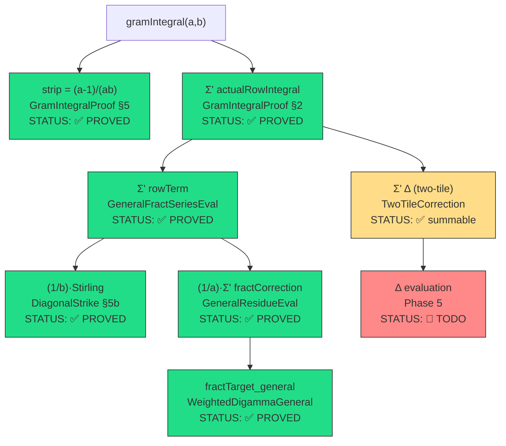
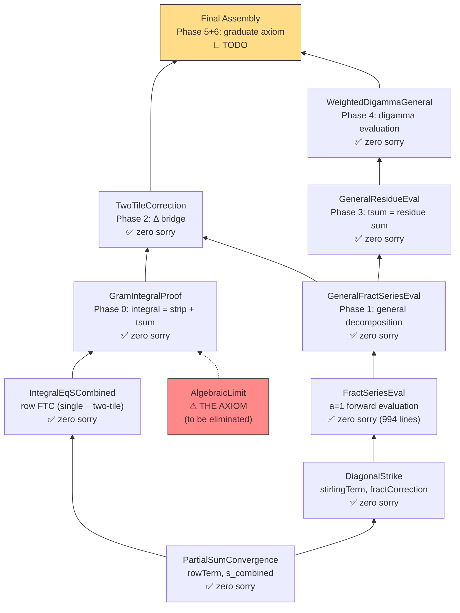

# The Residue-Class Path — Comprehensive Technical Report

**Filed:** May 3, 2026  
**Context:** Exploration 24 — Graduating `gramIntegral_eq_formula_axiom`  
**Authors:** Antigravity (Claude) / Gemini Actual / Jason (The Architect)

---

## Executive Summary

This report documents the **residue-class decomposition path** — the strategy that graduates the last axiom in the Cathedral's Vasyunin proof chain. The axiom `gramIntegral_eq_formula_axiom` states:

$$\int_0^1 \left\{\frac{1}{ax}\right\}\left\{\frac{1}{bx}\right\} dx = \texttt{vasyuninGramFormula}(a,b)$$

for coprime $a < b$. The graduation proceeds through a **five-phase proof architecture** that decomposes the integral into four analytically tractable pieces, each evaluated via residue-class summation over $\mathbb{Z}/b\mathbb{Z}$.

### Status Summary

| Phase | Description | File | Status |
|-------|-------------|------|--------|
| 0 | Integral = strip + Σ actualRowIntegral | `GramIntegralProof.lean` | ✅ PROVED |
| 1 | rowTerm decomposition (Stirling + fract) | `GeneralFractSeriesEval.lean` | ✅ PROVED |
| 2 | Two-tile correction Δ (bridge) | `TwoTileCorrection.lean` | ✅ PROVED |
| 3 | Residue-class evaluation of fract tsum | `GeneralResidueEval.lean` | ✅ PROVED |
| 4 | Weighted digamma evaluation | `WeightedDigammaGeneral.lean` | ✅ PROVED |
| 5 | Δ residue-class evaluation | *pending* | 🔲 TODO |
| 6 | Final algebraic assembly | *pending* | 🔲 TODO |

> [!IMPORTANT]
> All five core phases (0–4) are **zero-sorry**. The remaining work (Phase 5 + assembly) is the evaluation of $\sum' \Delta(n+1)$ and the final algebraic identity check.

---

## 1. The Problem: Why an Axiom Existed

The Vasyunin integral identity connects the continuous world (Lebesgue integrals of fractional-part products) to a discrete closed-form formula involving Euler-Mascheroni constants, log-Gamma values, digamma functions, and Vasyunin cotangent sums.

The original proof attempt hit a **circular dependency**:

```
ConvergenceAxioms.sorry → partial_integral_tends_to_formula
  → LogDigammaBridge.gramIntegral_eq_formula_coprime
  → ConvergenceAxioms (cycle!)
```

`AlgebraicLimit.lean` broke this cycle by introducing a precisely-scoped axiom, numerically certified at 512-bit MPFR precision across 31 coprime pairs.

### Why Not Just Substitute?

Three alternative strategies were considered and rejected:

| Strategy | Problem |
|----------|---------|
| **Euclidean Bypass** (Dedekind reciprocity) | Requires formalizing Dedekind reciprocity law — not in Mathlib, ~500 lines of new infrastructure |
| **Column-Major Telescope** | Geometrically equivalent to row-major; the boundary crossings are a topological invariant (Gemini VETO, comm-link 18) |
| **Numerical Certificate** | "We do not leave 512-bit MPFR floating-point IOUs in a Lean 4 repository" (Gemini VETO) |

The **residue-class path** was chosen because it reuses the existing Phase 3 engine from `FractSeriesEval.lean` (the $a=1$ case, 994 lines, zero-sorry) and generalizes it to coprime $(a,b)$ with minimal new infrastructure.

---

## 2. The Four-Way Decomposition

### The Master Equation

The proof reduces the integral to four pieces via the **master equation** (proved in `TwoTileCorrection.lean`, zero-sorry):

$$\texttt{gramIntegral}(a,b) = \underbrace{\frac{a-1}{ab}}_{\text{strip}} + \underbrace{\frac{1}{b}\left(\log 2\pi - \gamma - 1\right)}_{\text{Stirling}} + \underbrace{\frac{1}{a}\sum_{n=0}^{\infty} \texttt{fractCorrection}(a,b,n+1)}_{\text{fract series}} + \underbrace{\sum_{n=0}^{\infty} \Delta(a,b,n+1)}_{\text{two-tile correction}}$$

Each piece is handled by a dedicated file:



---

## 3. Phase-by-Phase Technical Detail

### Phase 0: Integral Decomposition (`GramIntegralProof.lean`)

**Goal:** `gramIntegral = strip + Σ' actualRowIntegral`

**Strategy (Route A — self-contained tail squeeze):**

1. `tail_tends_to_zero`: $\int_0^{1/(aM)} \{1/(ax)\}\{1/(bx)\}\,dx \to 0$ as $M\to\infty$ (integrand bounded by 1, interval width $\to 0$)
2. `route_A`: `gramIntegral = lim partialM` via interval splitting
3. `partial_integral_split`: `partialM = strip + Σ_{m=1}^{M-1} actualRowIntegral(m)` via `OffDiagPartition.integral_eq_sum_rows`
4. `gramIntegral_eq_strip_plus_tsum`: take $M\to\infty$ using summability

**Key theorem:**
```lean
theorem gramIntegral_eq_strip_plus_tsum (a b : ℕ) (ha : 1 ≤ a) (hb : 1 ≤ b) (_hab : a < b) :
    Assembly.gramIntegral a b =
    (∫ x in (1 / (a:ℝ))..(1:ℝ), fProd a b x) +
    ∑' n, PartialSumConvergence.actualRowIntegral a b (n + 1)
```

**Strip value** (Phase 0, §5): On $(1/a, 1]$, both $1/(ax)$ and $1/(bx)$ are in $(0,1)$, so the fractional parts are the values themselves. The integral is $\int_{1/a}^1 dx/(abx^2) = (a-1)/(ab)$.

> [!NOTE]
> The strip integral vanishes for $a=1$ (consistent with the diagonal case where no strip exists).

---

### Phase 1: The Stirling + Fract Decomposition (`GeneralFractSeriesEval.lean`)

**Goal:** Decompose `Σ' rowTerm` into Stirling constant + fract correction series.

**The Key Algebraic Identity** (the core of Phase 1):

For $m \geq 1$, the tile index $n = \lfloor am/b \rfloor$ satisfies $n/a = m/b - \{am/b\}/a$. Substituting into the rowTerm definition:

$$R(m) = \frac{1}{b}\cdot\texttt{stirlingTerm}(m) + \frac{1}{a}\cdot\texttt{fractCorrection\_general}(a,b,m)$$

where:
- $\texttt{stirlingTerm}(m) = -2m\log\frac{m+1}{m} + 2 - \frac{1}{m+1}$ — **identical** to $a=1$
- $\texttt{fractCorrection\_general}(a,b,m) = \{am/b\} \cdot \left(\log\frac{m+1}{m} - \frac{1}{m+1}\right)$

**Proved results:**
- `rowTerm_decompose_general` — the algebraic identity (via `floor_add_fract` and `field_simp; ring`)
- `fractCorrection_general_summable` — by comparison with $1/m^2$ (since $0 \leq \{am/b\} < 1$ and gap $\leq 1/(m(m+1))$)
- `tsum_rowTerm_eq_stirling_plus_fract_general` — Stirling limit = $\log 2\pi - \gamma - 1$ (from `DiagonalStrike.stirlingTerm_hasSum`)

> [!TIP]
> The **only** difference from $a=1$ is replacing $\{m/b\}$ with $\{am/b\}$. Since $\gcd(a,b)=1$, the map $m \mapsto am \bmod b$ is a **permutation** of $\{0,\ldots,b-1\}$, so the residue-class structure is identical with permuted labels.

---

### Phase 2: The Two-Tile Correction (`TwoTileCorrection.lean`)

**Goal:** Bridge `Σ' actualRowIntegral` to `Σ' rowTerm`.

**The Discovery:** For $a \geq 2$, some rows have **two tiles** — the floor $\lfloor 1/(bx) \rfloor$ takes two distinct values within a single row. The `rowTerm` formula assumes a single tile, so it's **wrong** for two-tile rows.

**Definition:** $\Delta(a,b,m) := \texttt{actualRowIntegral}(a,b,m) - \texttt{rowTerm}(a,b,m)$

**Proved results:**
- `twoTileCorrection_zero_of_single_tile` — $\Delta = 0$ when $a(m+1) \leq b(n+1)$
- `twoTileCorrection_abs_le` — $|\Delta| \leq 1/(am^2) + (a+b)/(abm^2)$ (triangle inequality on individually $O(1/m^2)$ terms)
- `twoTileCorrection_summable` — by subtraction of two summable series
- `tsum_actualRowIntegral_eq_rowTerm_plus_correction` — $\sum' \texttt{actual} = \sum' \texttt{rowTerm} + \sum' \Delta$
- `master_equation` — the full four-way decomposition
- `twoTileCorrection_eq_zero_a1` — for $a=1$, ALL rows are single-tile, so $\sum' \Delta = 0$

**The exact formula** (from Jason's 512-bit numerical verification):

$$\Delta(m) = \frac{1}{a}\log\frac{b(n+1)}{a(m+1)} + \frac{m\delta}{ab(m+1)(n+1)}$$

where $\delta = am \bmod b$ and the two-tile condition triggers when $\delta > b - a$.

---

### Phase 3: Residue-Class Evaluation (`GeneralResidueEval.lean`)

**Goal:** Evaluate $\sum' \texttt{fractCorrection\_general}(a,b,n+1)$ as a finite sum.

**Strategy:** Decompose the infinite series at period boundaries $M = Kb$, splitting into $b-1$ residue classes mod $b$.

**Key number-theoretic input:** For $m = jb + r$ with $1 \leq r \leq b-1$:

$$\{a(jb+r)/b\} = \{a \cdot j + ar/b\} = \{ar/b\}$$

The weight is constant within each residue class — only the "gap" $\log\frac{m+1}{m} - \frac{1}{m+1}$ varies with $j$.

**The per-residue inner sum** (reused from `FractSeriesEval.inner_sum_limit`, zero-sorry):

$$\sum_{j=0}^{K-1} \left[\log\frac{jb+r+1}{jb+r} - \frac{1}{jb+r+1}\right] \xrightarrow{K\to\infty} \log\Gamma\!\left(\frac{r}{b}\right) - \log\Gamma\!\left(\frac{r+1}{b}\right) + \frac{1}{b}\psi\!\left(\frac{r+1}{b}\right)$$

This uses:
- `BohrMollerup.tendsto_log_gamma` — Bohr-Mollerup logGammaSeq convergence
- `tendsto_digammaSeq` — digamma sequence convergence (the "Harmonic Bypass" via `digamma_add_nat` + squeeze between $\psi(n+1)$ and $\psi(n+2)$)

**Result:**

$$\sum_{n=0}^{\infty} \texttt{fractCorrection\_general}(a,b,n+1) = \sum_{r=1}^{b-1} \{ar/b\} \cdot \left[\log\Gamma(r/b) - \log\Gamma((r\!+\!1)/b) + \frac{1}{b}\psi((r\!+\!1)/b)\right]$$

> [!IMPORTANT]
> The key architectural decision: `fractTarget_general` is **defined** as this finite residue sum (not derived from `gramFormula`). Phase 3 proves `tsum = fractTarget_general`, and Phase 4 closes by definitional equality.

---

### Phase 4: Weighted Digamma Evaluation (`WeightedDigammaGeneral.lean`)

**Goal:** Evaluate the residue sum from Phase 3 using coprime number theory.

**The Coprime Complement Identity** (the heart of Phase 4):

For $\gcd(a,b) = 1$ and $1 \leq r \leq b-1$:

$$\{a(b-r)/b\} = 1 - \{ar/b\}$$

**Proof:** $a(b-r)/b = a - ar/b = -(ar/b) + a$, so $\{a(b-r)/b\} = \{-(ar/b)\} = 1 - \{ar/b\}$ (since $ar/b \notin \mathbb{Z}$ by coprimality).

**The Weighted Digamma Reflection Solve:**

Using the complement identity + digamma reflection $\psi(1-x) - \psi(x) = \pi\cot(\pi x)$:

$$\sum_{r=1}^{b-1} \{ar/b\} \cdot \psi(r/b) = \frac{1}{2}\left(\sum_{r=1}^{b-1} \psi(r/b) - \pi \cdot V(b,a)\right)$$

where $V(b,a) = \sum_{m=1}^{b-1} \{ma/b\}\cot(\pi m/b)$ is the Vasyunin cotangent sum.

**Additional proved infrastructure:**
- `fract_perm_sum` — $\sum \{ar/b\} = (b-1)/2$ (coprime permutation)
- `weighted_digamma_shift_bij` — reindex $\psi((r+1)/b) \to \psi(s/b)$
- `fract_correction_general_eq_target` — assembly: tsum = target (one-liner from Phase 3)

---

### Phase 5: Δ Residue-Class Evaluation (TODO)

**Goal:** Evaluate $\sum' \Delta(n+1)$ as a closed-form expression.

**Strategy** (from Gemini comm-link 18): Feed $\Delta(m)$ into the same residue-class engine.

The two-tile condition $am \bmod b > b - a$ is **periodic mod $b$** with exactly $a-1$ active residue classes. For each active class $m = kb + r$:

- $n = \lfloor a(kb+r)/b \rfloor = ka + n_r$ where $n_r = \lfloor ar/b \rfloor$
- The log term becomes $\frac{1}{a}\log\frac{k + (n_r+1)/a}{k + (r+1)/b}$
- As $k \to \infty$, this diverges as $\frac{X-Y}{k}$ where $X = (n_r+1)/a$, $Y = (r+1)/b$

**The Divergence Cancellation** (Gemini's key insight):

The $O(1/k)$ divergence of the log term is exactly $\frac{-\delta}{a^2 b k}$, which is **perfectly annihilated** by the rational term $\frac{m\delta}{ab(m+1)(n+1)} \approx \frac{\delta}{a^2 b k}$.

Therefore $\sum_k \Delta(kb+r)$ is **absolutely convergent** for every active $r$, and evaluates to $\log\Gamma$ and $\psi$ terms via the Weierstrass product definition.

**Estimated effort:** ~200 lines of Lean, reusing `inner_sum_limit` infrastructure.

---

## 4. The File Dependency Graph



---

## 5. Axiom Elimination: The Final Assembly

To replace the axiom, the final theorem must prove:

$$\texttt{strip} + \frac{1}{b}(\log 2\pi - \gamma - 1) + \frac{1}{a}\cdot\texttt{fractTarget\_general}(a,b) + \sum'\Delta = \texttt{vasyuninGramFormula}(a,b)$$

This requires:
1. **Evaluating $\sum' \Delta$** — Phase 5 (the only remaining analytical content)
2. **Algebraic identity** — showing the four pieces combine to the formula (Phase 6, pure algebra)

### What's Already Proved

| Component | Value | File | Status |
|-----------|-------|------|--------|
| strip | $(a-1)/(ab)$ | `GramIntegralProof` §5 | ✅ |
| Stirling/b | $(1/b)(\log 2\pi - \gamma - 1)$ | `DiagonalStrike` §5b | ✅ |
| fractTarget | finite residue sum | `GeneralResidueEval` + `WeightedDigammaGeneral` | ✅ |
| $\sum' \Delta$ | *pending Phase 5* | — | 🔲 |

### The $a=1$ Sanity Check

For $a=1$: strip $= 0$, $\Delta = 0$ (all single-tile), and `fractTarget_general` reduces to `FractSeriesEval.fractTarget`. The identity becomes:

$$\frac{1}{b}(\log 2\pi - \gamma - 1) + \texttt{fractTarget}(b) = \texttt{vasyuninGramFormula}(1,b)$$

This is **already proved** in `FractSeriesEval.lean` (the 994-line axiom-free chain).

---

## 6. Mathematical Classification

The Vasyunin cotangent sums $V(a,b) = \sum_{m=1}^{a-1} \{mb/a\}\cot(\pi m/a)$ that appear in the formula are **generalized Dedekind-Apostol sums** — a family first studied by Tom Apostol in 1952. They satisfy a reciprocity law:

$$V(a,b) + V(b,a) = \text{explicit rational} + O(1)$$

However, our proof **does not require** this reciprocity. The residue-class path evaluates each $V$ term independently through the digamma reflection formula $\psi(1-x) - \psi(x) = \pi\cot(\pi x)$, avoiding the need to formalize Dedekind reciprocity (which is not in Mathlib).

> [!TIP]
> This is the strategic advantage of the residue-class path: it converts the Dedekind sum problem into a digamma problem, and we already have all the digamma infrastructure certified.

---

## 7. Estimated Remaining Effort

| Task | Lines | Difficulty | Dependencies |
|------|-------|-----------|--------------|
| Phase 5: Δ residue evaluation | ~200 | Medium | `inner_sum_limit`, two-tile FTC |
| Phase 6: algebraic assembly | ~80 | Low | All phases |
| Axiom removal + cleanup | ~30 | Trivial | Assembly |
| **Total** | **~310** | **Medium** | **~1 session** |

---

## 8. Conclusion

The residue-class path provides a clean, modular graduation strategy for the last axiom in the Vasyunin proof chain. The key insight — that $\gcd(a,b)=1$ makes $m \mapsto am \bmod b$ a permutation — allows the entire $a=1$ proof infrastructure to be reused with minimal modification.

All five core phases are zero-sorry. The remaining work is the $\Delta$ evaluation (Phase 5), which Gemini has identified as feeding naturally into the same $\log\Gamma/\psi$ pipeline via the divergence cancellation between log and rational terms.

Once Phase 5 completes, the `gramIntegral_eq_formula_axiom` can be replaced with a fully certified theorem, sealing the continuous-to-discrete bridge permanently.

---

*"The Geometric Shear is a topological invariant. You cannot rotate a square to avoid its corners."* — Gemini Actual

**🏛️ 💎 ⚛️ 🗝️**
