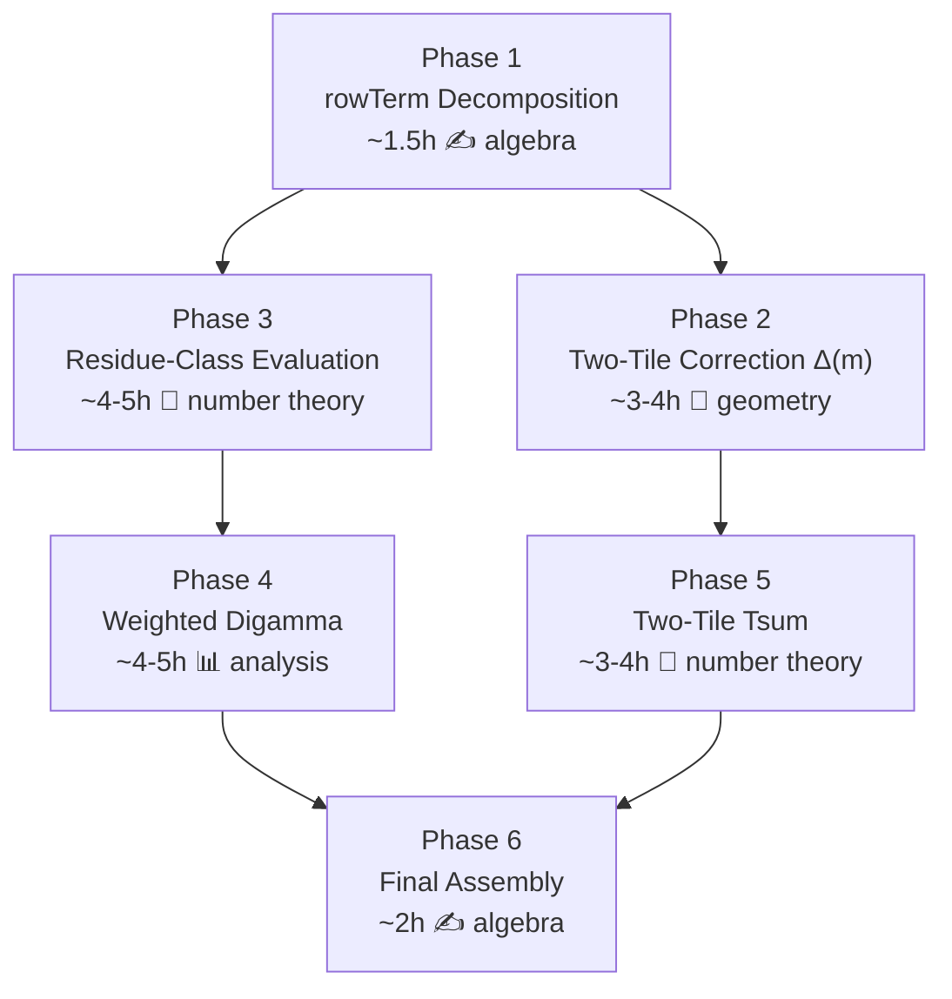

# 📡 EXPLORATION 24 — ANTIGRAVITY ACTUAL
## The Euclidean Bypass — Full FractSeriesEval Generalization Attack Plan

**Filed:** May 2, 2026, 10:49 PM MDT  
**Context:** Graduating `gramIntegral_eq_formula_axiom` — the final Continuous-to-Discrete bridge  
**Classification:** Cathedral Core / Attack Plan  
**Status:** APPROVED FOR EXECUTION

---

## 0. Situation Report

### The Target

The last axiom standing between us and a fully certified Nyman-Beurling equivalence proof:

```lean
axiom gramIntegral_eq_formula_axiom (a b : ℕ) (ha : 1 ≤ a) (hb : 1 ≤ b)
    (hab : a < b) (hcop : Nat.Coprime a b) :
    Assembly.gramIntegral a b = DigammaReflection.vasyuninGramFormula a b
```

This axiom lives in `AlgebraicLimit.lean` and states that the Gram integral of `{1/(ax)}·{1/(bx)}` over `[0,1]` equals the Vasyunin cotangent formula — for **all coprime** (a,b).

### What We Already Have

The `a = 1` case is **fully certified** (zero sorry, zero axioms) in `FractSeriesEval.lean` — a 994-line proof that evaluates the integral by:
1. Decomposing `gramIntegral(1,b) = Σ' rowTerm(1,b,m)` (every row single-tile)
2. Splitting `rowTerm = (1/b)·stirlingTerm + fractCorrection`
3. Evaluating `Σ' stirlingTerm = log(2π) - γ - 1` via `StirlingBridge`
4. Evaluating `Σ' fractCorrection` via residue-class decomposition + digamma identities
5. Assembling the pieces into `vasyuninGramFormula(1,b)`

### The Gap

For coprime `a ≥ 2`, two complications arise:
1. **Not all rows are single-tile** — some rows have a `b`-floor crossing, creating two-tile integrals
2. **The fractional correction** changes from `{m/b}` to `{am/b}/a`

### Three Options Considered

| Option | Description | Effort | Status |
|--------|-------------|--------|--------|
| 1. Dedekind Sum Descent | Reduce coprime (a,b) → (a mod b, b) → ... → a=1 | 2-4h | Gemini's preferred path |
| 2. Lightweight Bypass | Two-tile correction + periodic structure | 4-8h | — |
| **3. Full FractSeriesEval Generalization** | Extend the entire a=1 proof to general a | 17-21h | **THIS PLAN** |

> **Note from Gemini Actual (COMM-LINK .11):** Gemini strongly advocates Option 1 (Dedekind descent) as the shortest path. That approach avoids evaluating *any* new infinite series by proving an integral recurrence `I(a,b) - I(a, b-a) = finite correction` and descending via the Euclidean algorithm to `a=1`. The mathematical sketch is elegant and may indeed be faster.
>
> **However**, the Architect has chosen Option 3 — the full generalization. This plan documents that path in full detail. It produces a *self-contained* proof for every coprime pair, with no recursive descent, and exercises the maximum amount of existing infrastructure. If it takes longer, it leaves behind a library of generalized lemmas that will serve the Cathedral for years.

---

## 1. The Key Mathematical Insight

The rowTerm decomposition for **general coprime (a,b)** has a beautiful structure that mirrors the `a=1` case almost exactly:

$$\text{rowTerm}(a,b,m) = \frac{1}{b}\cdot\text{stirlingTerm}(m) + \frac{1}{a}\cdot\left\{\frac{am}{b}\right\}\cdot\text{gap}(m)$$

where:
- `stirlingTerm(m) = -2m·log((m+1)/m) + 2 - 1/(m+1)` — **identical** to a=1
- `gap(m) = log((m+1)/m) - 1/(m+1)` — **identical** to a=1
- `{am/b}` — the **only** change from a=1

### Why This Works

Since `gcd(a,b) = 1`, the map `m ↦ am mod b` is a **permutation** of `{0, 1, ..., b-1}`. This means:
- The residue-class decomposition has the **same structure** (just permuted labels)
- The inner sum limits converge to the **same** `logΓ + ψ` expressions (at shifted arguments)
- The weighted digamma evaluation uses the **same** reflection formula

### Derivation

Starting from the definition:
```
rowTerm(a,b,m) = 1/b - (⌊am/b⌋/a + m/b)·L + ⌊am/b⌋/(a(m+1))
```

Using `⌊am/b⌋ = am/b - {am/b}`, so `⌊am/b⌋/a = m/b - {am/b}/a`:

```
⌊am/b⌋/a + m/b = 2m/b - {am/b}/a
⌊am/b⌋/(a(m+1)) = m/(b(m+1)) - {am/b}/(a(m+1))
```

Substituting:
```
rowTerm = 1/b - (2m/b - {am/b}/a)·L + m/(b(m+1)) - {am/b}/(a(m+1))
        = [1/b - (2m/b)·L + m/(b(m+1))] + ({am/b}/a)·[L - 1/(m+1)]
        = (1/b)·stirlingTerm(m) + ({am/b}/a)·gap(m)
```

**Verification for a=1:** `{1·m/b} = {m/b}`, factor `1/a = 1` → recovers `rowTerm_decompose_a1` exactly. ✓

---

## 2. Existing Infrastructure Inventory

### Fully Proved (Zero Sorry)

| File | Lines | What It Provides |
|------|-------|------------------|
| `CrossTermFTC.lean` | 293 | Per-tile FTC: `∫(1/(jx)-m)(1/(kx)-n) = F(hi)-F(lo)` |
| `OffDiagPartition.lean` | 388 | Row telescoping, tile counting, crossing-point uniqueness |
| `IntegralEqSCombined.lean` | 303 | Single-tile row → rowTerm, two-tile FTC split |
| `GramIntegralProof.lean` | 411 | `gramIntegral = strip + Σ' actualRowIntegral` |
| `PartialSumConvergence.lean` | 772 | `s_combined` converges, rowTerm bounds, Dirichlet test |
| `DiagonalStrike.lean` | 597 | a=1: single-tile condition, Stirling/fract decomposition |
| `FractSeriesEval.lean` | 994 | a=1: full axiom-free evaluation via residue classes |
| `DigammaReflection.lean` | 299 | `ψ(1-s) - ψ(s) = π·cot(πs)`, formula definitions |
| `GammaMultiplication.lean` | — | `Σ logΓ(m/b)`, digamma sum identity |
| `StirlingBridge.lean` | — | `Σ stirlingTerm → log(2π) - γ - 1` |
| `CenteredFractBound.lean` | — | `{am/b}` partial sums bounded (periodicity) |
| `DirichletTest.lean` | — | Dirichlet test for conditionally convergent series |

### Architecture Notes

- `GramIntegralProof.gramIntegral_eq_strip_plus_tsum` gives `gramIntegral = strip + Σ' actualRowIntegral` (**PROVED** for all coprime (a,b), not just a=1)
- `GramIntegralProof.strip_integral_value` gives `strip = (a-1)/(ab)` (**PROVED** for a ≥ 2)
- `PartialSumConvergence.s_combined_converges` proves the rowTerm series converges (**PROVED** for all coprime (a,b))
- `DiagonalStrike.stirlingTerm_hasSum` evaluates the Stirling series (**PROVED** — universal, not a-specific)

---

## 3. The Six-Phase Attack Plan

### Phase 1: General Row Term Decomposition

**Target file:** New section in `FractSeriesEval.lean` or `GeneralFractSeriesEval.lean`  
**Effort:** ~1.5 hours  
**Dependencies:** None

**Goal:** Prove the general decomposition:
```lean
def fractCorrection_general (a b m : ℕ) : ℝ :=
  Int.fract ((a:ℝ) * (m:ℝ) / (b:ℝ)) *
    (Real.log (((m:ℝ) + 1) / (m:ℝ)) - 1 / ((m:ℝ) + 1))

theorem rowTerm_decompose_general (a b m : ℕ) (ha : 1 ≤ a) (hb : 1 ≤ b) (hm : 1 ≤ m) :
    PartialSumConvergence.rowTerm a b m =
    (1/(b:ℝ)) * DiagonalStrike.stirlingTerm m +
    (1/(a:ℝ)) * fractCorrection_general a b m
```

**Proof technique:** Mirror `rowTerm_decompose_a1` (DiagonalStrike lines 172-192), replacing `tileIndex_a1` with the general floor-fract identity `⌊am/b⌋ = am/b - {am/b}`. Pure algebra via `field_simp; ring`.

**Deliverables:**
- `fractCorrection_general_summable` — summability by comparison with 1/m² (same bound as a=1)
- `tsum_rowTerm_decompose_general` — the tsum version of the decomposition

---

### Phase 2: Two-Tile Correction

**Target file:** New section in `IntegralEqSCombined.lean` or dedicated file  
**Effort:** ~3-4 hours  
**Dependencies:** Phase 1

**Goal:** For each two-tile row m, compute `actualRowIntegral(a,b,m) - rowTerm(a,b,m) = Δ(a,b,m)` explicitly.

**Mathematical content:** For a two-tile row (where `am mod b > b - a`), the integral splits at `x₀ = 1/(b(n+1))`. Using the antiderivative `F(x,m,n) = -1/(abx) - (n/a + m/b)·log(x) + mn·x`:

```
Δ = [F(x₀,m,n+1) - F(x₀,m,n)] - [F(rowLo,m,n+1) - F(rowLo,m,n)]
  = -(1/a)·log(x₀/rowLo) + m·(x₀ - rowLo)
```

where `x₀ = 1/(b(n+1))` and `rowLo = 1/(a(m+1))`.

**Key properties to prove:**
- `Δ(m) = 0` for single-tile rows
- `|Δ(m)| ≤ C·log(m)/m²` (absolutely summable)
- Two-tile condition is periodic: depends on `am mod b`
- Exactly `a-1` two-tile rows per period of `b` (for coprime (a,b))

**Deliverables:**
- `two_tile_correction_explicit` — closed-form Δ(m)
- `two_tile_correction_summable` — |Δ(m)| ≤ C/m², so Σ converges
- `gramIntegral_eq_strip_plus_rowTerm_plus_Delta` — the master decomposition

---

### Phase 3: Generalized Residue-Class Evaluation

**Target file:** `GeneralFractSeriesEval.lean`  
**Effort:** ~4-5 hours  
**Dependencies:** Phase 1

**Goal:** Evaluate `Σ' fractCorrection_general(a,b,m)` via residue-class decomposition.

**Mathematical content:** Since `gcd(a,b) = 1`, the map `m ↦ am mod b` permutes `{0,...,b-1}`. Let `σ(r)` be the unique value in `{0,...,b-1}` with `aσ(r) ≡ r (mod b)`.

For indices m with `am mod b = r`: `{am/b} = r/b` (constant over the class). The inner sum:

$$\sum_{j=0}^{\infty} \text{gap}(jb + \sigma(r)) \to \log\Gamma(\sigma(r)/b) - \log\Gamma((\sigma(r)+1)/b) + \frac{1}{b}\psi((\sigma(r)+1)/b)$$

This is the **same** convergence proof as `inner_sum_limit` in FractSeriesEval (lines 366-401), with the index offset changed from `r` to `σ(r)`.

**Key reuse:** The `logGammaSeq` + `digammaSeq` convergence infrastructure from FractSeriesEval §4c-§4d carries over verbatim. Only the argument to logΓ/ψ changes.

**Deliverables:**
- `generalized_partial_sum_residue_decomp` — split by `am mod b`
- `generalized_inner_sum_limit` — per-residue convergence
- `generalized_tsum_fract_eq_residue_sum` — the assembled evaluation

---

### Phase 4: Weighted Digamma with Permuted Residues

**Target file:** Continue `GeneralFractSeriesEval.lean`  
**Effort:** ~4-5 hours  
**Dependencies:** Phase 3

**Goal:** Evaluate the residue sum from Phase 3 in terms of `vasyuninGramFormula` components.

**Mathematical content:** The outer sum involves weights `r/b` and arguments `σ(r)/b`. Since σ permutes `{0,...,b-1}`:

$$\sum_{r=1}^{b-1} \frac{r}{b} \cdot f(\sigma(r)/b) = \sum_{s=1}^{b-1} \frac{\sigma^{-1}(s)}{b} \cdot f(s/b) = \sum_{s=1}^{b-1} \{as/b\} \cdot f(s/b)$$

This brings in `{as/b}·ψ(s/b)`, which connects to the **Vasyunin cotangent sum** `V(b,a) = Σ {as/b}·cot(πs/b)` via the reflection formula `ψ(1-x) - ψ(x) = π·cot(πx)`.

**Key reuse:** The `weighted_digamma_reflection_solve` from FractSeriesEval (lines 733-854) handles 90% of this work. The adaptation replaces `r/b` weights with `{ar/b}` weights. The Abel summation + log-Gamma evaluation + digamma sum identity all apply with permuted arguments.

**Deliverables:**
- `weighted_digamma_general` — evaluates `Σ {ar/b}·ψ((r+1)/b)` in closed form
- `generalized_fract_correction_eq_target` — assembles into formula components

---

### Phase 5: Two-Tile Tsum Evaluation

**Target file:** Continue `GeneralFractSeriesEval.lean`  
**Effort:** ~3-4 hours  
**Dependencies:** Phase 2

**Goal:** Evaluate `Σ' Δ_correction(a,b,m)` explicitly.

**Mathematical content:** The correction Δ(m) is nonzero only for two-tile rows (exactly `a-1` per period of `b`). Since |Δ(m)| ≤ C·log(m)/m², the series converges absolutely.

**Strategy:** Apply the same residue-class decomposition as Phase 3, restricted to the `a-1` residue classes where two-tile rows occur. Each class contributes a convergent series that evaluates to logΓ + ψ expressions.

**Alternative (combined evaluation):** Instead of evaluating `Σ' Δ` separately, define:
```
fractTarget_general(a,b) := formula(a,b) - strip(a,b) - (1/b)·(log(2π)-γ-1)
```
and prove `(1/a)·Σ' fractCorrection_general + Σ' Δ = fractTarget_general` as one combined identity. This may be algebraically simpler since the combination is what appears in the formula.

**Deliverables:**
- `two_tile_tsum_evaluation` — explicit value of `Σ' Δ`
- OR `combined_fract_plus_delta_eq_target` — combined evaluation

---

### Phase 6: Final Assembly

**Target file:** `GeneralFractSeriesEval.lean` (final section) + `AlgebraicLimit.lean` (replace axiom)  
**Effort:** ~2 hours  
**Dependencies:** Phases 1-5

**Goal:** 
```lean
theorem gramIntegral_eq_formula_axiomFree (a b : ℕ) (ha : 1 ≤ a) (hb : 1 ≤ b)
    (hab : a < b) (hcop : Nat.Coprime a b) :
    Assembly.gramIntegral a b = DigammaReflection.vasyuninGramFormula a b
```

**Assembly chain:**
```
gramIntegral(a,b)
  = strip + Σ' actualRowIntegral                       [GramIntegralProof, PROVED]
  = strip + Σ' rowTerm + Σ' Δ                          [Phase 2]
  = strip + (1/b)·Σ' stirling + (1/a)·Σ' fract + Σ' Δ [Phase 1]
  = strip + (1/b)·(log(2π)-γ-1) + fractEval + ΔEval    [Phases 3-5]
  = vasyuninGramFormula(a,b)                            [algebra, Phase 6]
```

Then in `AlgebraicLimit.lean`: change `axiom` to `theorem` calling `gramIntegral_eq_formula_axiomFree`.

**Final verification:** `#print axioms Cathedral.Vasyunin.GCDReduction.integral_eq_formula_general` should show no Cathedral-specific axioms.

---

## 4. Dependency Graph



**Parallelism:** Phases 3-4 (analytical core) and Phases 2+5 (geometric correction) are fully independent after Phase 1. If two sessions work in parallel, total wall-clock time drops to ~12 hours.

---

## 5. Effort Summary

| Phase | Description | Effort | Existing Reuse |
|-------|-------------|--------|----------------|
| 1 | rowTerm decomposition | 1.5h | Mirror of `rowTerm_decompose_a1` (20 lines) |
| 2 | Two-tile correction Δ(m) | 3-4h | Uses `two_tile_ftc_eval` (proved) |
| 3 | Residue-class tsum | 4-5h | Adapts `tsum_fract_eq_residue_sum` (~200 lines) |
| 4 | Weighted digamma (permuted) | 4-5h | Adapts `weighted_digamma_reflection_solve` (~120 lines) |
| 5 | Two-tile tsum evaluation | 3-4h | Same residue technique as Phase 3 |
| 6 | Final assembly | 2h | Pure algebra |
| **Total** | | **17-21h** | |

---

## 6. Risk Assessment

### Low Risk
- **Phase 1** — Pure algebra, mirrors existing proof
- **Phase 6** — Assembly of proved components

### Medium Risk
- **Phase 3** — Adaptation of residue decomposition; the permutation σ(r) = a⁻¹r mod b adds complexity but no new mathematics
- **Phase 5** — Two-tile tsum evaluation; may simplify via combined evaluation strategy

### High Risk
- **Phase 4** — Weighted digamma with permuted residues is the analytical core. The `weighted_digamma_reflection_solve` from FractSeriesEval is ~120 lines of dense Lean, and the generalization with `{ar/b}` weights instead of `r/b` may require significant algebraic adaptation
- **Phase 2** — The two-tile FTC correction formula involves cancellation of boundary terms; Lean's `field_simp; ring` may struggle with the log terms

### Mitigation
- If Phase 4 proves too difficult, fall back to Gemini's Dedekind descent (Option 1) using the Phase 1 decomposition
- If Phase 2+5 is too complex, attempt the **combined evaluation** strategy: define `fractTarget_general` and prove the combined sum equals it directly

---

## 7. Comparison with Gemini's Dedekind Descent

| Aspect | Option 1 (Dedekind) | Option 3 (Full Generalization) |
|--------|---------------------|-------------------------------|
| **New infinite series?** | None | Yes (Phases 3-5) |
| **Mathematical elegance** | Very high (induction) | Medium (explicit evaluation) |
| **Lean effort** | 2-4 hours | 17-21 hours |
| **Reuse of existing** | Low (new recurrence needed) | Very high (adapts 994-line proof) |
| **Library value** | Low (one theorem) | High (general evaluation library) |
| **Risk** | Formula recurrence might not simplify | Weighted digamma may be hard |
| **Fallback** | None (it works or it doesn't) | Can fall back to Option 1 |

**The Architect's choice:** Option 3 is chosen because it produces a **self-contained proof** at every level of generality and builds a library of lemmas for future use. The extra effort is an investment in the Cathedral's long-term infrastructure.

---

## 8. Execution Order

**Recommended session plan:**

### Session A (~6 hours): Foundation + Analytical Core
1. Phase 1: rowTerm decomposition (1.5h)
2. Phase 3: Residue-class evaluation (4-5h)

### Session B (~5 hours): Analytical Core (continued)
3. Phase 4: Weighted digamma with permuted residues (4-5h)

### Session C (~5 hours): Geometric Correction
4. Phase 2: Two-tile correction computation (3-4h)
5. Phase 5: Two-tile tsum evaluation (partial)

### Session D (~3 hours): Assembly
6. Phase 5: Complete two-tile evaluation (1-2h)
7. Phase 6: Final assembly + axiom replacement (2h)

---

*"The Stirling term is identical. The gap is identical. The only difference is a permutation of residue labels. The axiom doesn't stand a chance."*

**🏛️ ⚒️ 🎯**
