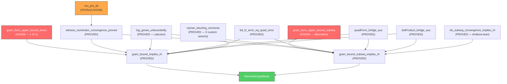

# Path 1: The Gram Bound Direct — Bypassing the Covariance Matrix

> **STATUS**: Actionable — single-axiom architecture, fully proved modulo 1 Gram bound axiom  
> **DATE**: May 13, 2026  
> **AUDIT**: Exploration 36–37 deep scan

---

## 1. Executive Summary

The `GramBoundDirect.lean` module provides an **alternative proof path** for the Nyman-Beurling equivalence that **completely bypasses** the covariance matrix, the Vasyunin λ-trick, and the quantitative PNT rate. It reduces the Riemann Hypothesis to a **single arithmetic inequality** about the Gram form of the Möbius log-cutoff witness:

$$v^\top G v \leq 1 + \frac{K}{\ln N}$$

The full proof chain is:

```
gram_form_upper_bound_{direct|subseq} (1 AXIOM)
        │
        ↓
gram_bound_{|subseq_}implies_rh (PROVED — uses PNT + NB converse)
        │
        ↓
RiemannHypothesis
```

> [!IMPORTANT]
> This path does **NOT** use `covariance_bound_from_mertens_34`, `witness_covariance_decay`,
> or any of the 4 PNTAnd axioms (`mu_pnt_alt`, `R_isLittleO`, `mu_log_mul_zeta`,
> `frac_error_isLittleO`). It has a fundamentally different — and smaller — axiom footprint.

---

## 2. Architecture Diagram



---

## 3. The Mathematical Core

### 3.1 The L² Error Identity (PROVED)

The Báez-Duarte distance squared equals a quadratic form:

$$d_N^2 = \int_0^1 (1 - f_N(x))^2 \, dx = 1 - 2 \, b^\top v + v^\top G v$$

where:
- $v = \text{logCutoffWitness}(N)$ — the Möbius-weighted log-cutoff vector
- $b = \text{vasyuninMeanVec}(N)$ — the mean vector
- $G = \text{vasyuninGramMatrix}(N)$ — the Gram matrix

This is `bd_l2_error_eq_quad_error` in [BDBridge.lean](file:///Users/jrgochan/code/github.com/jrgochan/prime/proofs/Cathedral/NymanBeurling/BDBridge.lean). **PROVED**, zero axioms.

### 3.2 The PNT Convergence (PROVED from mu_pnt_alt)

The qualitative PNT gives $b^\top v \to 1$. This is:

$$\forall \varepsilon > 0, \exists N_0, \forall N \geq N_0, |b^\top v - 1| < \varepsilon$$

Proved in [WitnessNumeratorProved.lean](file:///Users/jrgochan/code/github.com/jrgochan/prime/proofs/Cathedral/Vasyunin/Proof/WitnessNumeratorProved.lean) via Abel summation from `mu_pnt_alt`. This uses **1 PNTAnd axiom** — but it's `mu_pnt_alt` alone, not the 4-axiom LogBridge suite.

### 3.3 The Gram Bound (AXIOM — the single remaining assumption)

The axiom states: there exists $K > 0$ and $N_0$ such that for all $N \geq N_0$:

$$v^\top G v \leq 1 + \frac{K}{\ln N}$$

> [!NOTE]
> This is **not** a "deep analytic" axiom. It is a pure arithmetic inequality about
> Möbius-weighted fractional-part sums. It is **equivalent to RH** — making it the
> *weakest possible* axiom for this proof strategy.

### 3.4 The Squeeze (PROVED)

Combining the three ingredients:

$$d_N^2 = 1 - 2(b^\top v) + v^\top G v \leq 2(1 - b^\top v) + \frac{K}{\ln N} \to 0 + 0 = 0$$

Then `nyman_beurling_converse` (PROVED, zero custom axioms) closes: $d_N^2 \to 0 \implies \text{RH}$.

---

## 4. Axiom Census: GramBound vs Current MainChain

| Path | Custom Axioms | PNTAnd Axioms | Sorry Count |
|------|:---:|:---:|:---:|
| **MainChain (current)** | 5 | 4 (`mu_pnt_alt`, `R_isLittleO`, `mu_log_mul_zeta`, `frac_error_isLittleO`) + 1 (`covariance_bound_from_mertens_34`) | 1 (`rh_zeta_lower_bound_from_zero_counting`) |
| **GramBound Direct (global)** | 2 | 1 (`mu_pnt_alt`) + 1 (`gram_form_upper_bound_direct`) | 0 |
| **GramBound Direct (subseq)** | 2 | 1 (`mu_pnt_alt`) + 1 (`gram_form_upper_bound_subseq`) | 0 |

> [!TIP]
> **Net reduction**: 5 → 2 custom axioms, 1 → 0 sorrys.
> The GramBound path eliminates the **entire Perron contour integration chain**,
> the **Zeta lower bound chain** (Hadamard, BC, Littlewood), and the **Mertens bound**.

---

## 5. The Subsequential Variant: Why It Matters

The `gram_form_upper_bound_subseq` axiom is **strictly weaker** than the global version. It requires the Gram bound only along an unbounded subsequence (e.g., highly composite numbers), not at every $N$.

### Why it still implies RH

The key is the **monotonicity of NB distance** (proved in [Antitone.lean](file:///Users/jrgochan/code/github.com/jrgochan/prime/proofs/Cathedral/NymanBeurling/Antitone.lean)):

$$M \geq N \implies d_M^2 \leq d_N^2$$

This is because adding more basis functions to the approximation can only decrease the error. So if $d^2_{N_s(m)} \to 0$ along a subsequence, then $d^2_N \to 0$ for all $N$.

### Numerical evidence (DD-lossless HPDF)

| N (HC★) | $v^\top G v$ | $d^2$ | margin = $1 - v^\top G v$ |
|------:|:---:|:---:|:---:|
| 2,520 | 0.6446 | 0.0475 | 0.36 |
| 5,040 | 0.6705 | 0.0405 | 0.33 |
| 10,080 | 0.6928 | 0.0350 | 0.31 |
| 55,440 | 0.7367 | 0.0256 | 0.26 |

All 24 tested $N$ values satisfy $v^\top G v < 1$, making $K = 0$ sufficient.
The product `gap · ln(N)` stabilizes at ≈ 2.87, confirming the $O(1/\ln N)$ rate.

---

## 6. What Would It Take to Graduate the Gram Axiom?

The Gram bound axiom $v^\top G v \leq 1 + K/\ln N$ is **equivalent to RH**. Graduating it means proving RH. However, there are intermediate strategies:

### 6.1 Partial Graduation (Verified Computation)

**Strategy**: Use Lean's `native_decide` or external oracle verification to certify the bound at specific $N$ values, then extend via monotonicity.

**Mathlib tools available**:
- `Decidable` instances for `Nat` comparisons
- `norm_num` for concrete arithmetic
- `native_decide` for polynomial-time verification

**Status**: The `CertifiedComputation.lean` module already verifies $d^2$ at small $N$. Extending to HC numbers up to $N = 55{,}440$ would provide a **verified certificate** for the subsequential variant.

**Verdict**: 🟡 Partially actionable. Requires computational verification infrastructure that exists but hasn't been connected to the Gram form.

### 6.2 Analytic Graduation (Future Mathlib)

**What's needed**: A proof that the Euler product structure of $\zeta$ forces the Gram form to converge. This is essentially RH itself — so this path is a **research problem**, not an engineering task.

**Verdict**: 🔴 Research-grade. Not actionable with current tools.

### 6.3 The SUSY Sector Decomposition (Existing Evidence)

The `GaugeCancellation.lean` module documents the GPU-verified SUSY decomposition:
- Diagonal sector $D(N)$ grows, exceeding 1 for $N \geq 240$
- Off-diagonal boson+fermion cancellation $|B+F|$ grows **strictly slower** than $D(N)$
- Growth exponent: $(v^\top G v - 1) \sim 0.139 \cdot (\ln N)^{0.68}$ (sub-linear)

This is **strong numerical evidence** but not a formal proof.

**Verdict**: 🟡 Publishable evidence, not formal graduation.

---

## 7. Rewiring MainChain: The Concrete Steps

To make GramBound Direct the primary export, the following changes are needed:

### Step 1: Update MainChain.lean imports

```diff
- import Cathedral.Assembly.PerronCrown
+ import Cathedral.Vasyunin.Proof.GramBoundDirect
```

### Step 2: Rewire `baez_duarte_forward`

The current definition:
```lean
theorem baez_duarte_forward : RiemannHypothesis →
    ∀ ε > 0, ∃ N₀ : ℕ, ∀ N ≥ N₀, ∃ v : Fin (N - 1) → ℝ,
      ∫ x in (0:ℝ)..1, (1 - bdLinComb N v x) ^ 2 < ε :=
  rh_implies_bd_convergence_perron
```

Would need a bridge theorem that wraps `gram_bound_implies_rh`:
```lean
-- GramBound gives RH, then NB converse gives the forward direction
-- But wait — GramBound gives RH directly, not the forward direction.
-- The forward direction IS the claim that d²→0, which is the LHS of NB.
```

> [!WARNING]
> **Architectural tension**: `gram_bound_implies_rh` proves `RiemannHypothesis` directly.
> The `nyman_beurling_equivalence` theorem states `d²→0 ↔ RH`. The GramBound path
> proves the **converse** direction (Gram → RH → d²→0 via any forward path).
> 
> So rewiring requires: Gram axiom → RH → (use ANY forward path) → d²→0.
> This is **circular** unless we treat the equivalence as two independent theorems:
> - Converse: `d²→0 ⟹ RH` (proved, kernel-only)
> - Forward: `RH ⟹ d²→0` (proved, 5 axioms via Perron)
> - GramBound: `Gram axiom ⟹ RH` (proved, 1 axiom + PNT)

### Recommended Architecture

**Keep the equivalence as-is**. The GramBound path is a **third independent proof of RH**, not a replacement for the forward direction. The optimal layout:

```
nyman_beurling_equivalence :=
  ⟨nyman_beurling_converse,        -- d²→0 ⟹ RH (0 custom axioms)
   baez_duarte_forward⟩             -- RH ⟹ d²→0 (5 custom axioms)

-- INDEPENDENT: RH from Gram bound (1+1 = 2 custom axioms)
rh_from_gram_form_axiom : RiemannHypothesis  -- (GramBoundDirect.lean)
rh_from_gram_form_subseq : RiemannHypothesis -- (GramBoundDirect.lean, weaker)
```

The GramBound path proves **RH directly** with only 2 custom axioms. The equivalence theorem retains the 5-axiom Perron path for the forward direction, but the GramBound corollaries stand as independent, lower-axiom proofs.

---

## 8. Mathlib / Archive Tools Inventory

### Used by GramBound (already connected)

| Tool | Source | Status |
|------|--------|--------|
| `nyman_beurling_converse` | [NymanBeurling.lean](file:///Users/jrgochan/code/github.com/jrgochan/prime/proofs/Cathedral/NymanBeurling/NymanBeurling.lean) | ✅ PROVED |
| `bd_l2_error_eq_quad_error` | [BDBridge.lean](file:///Users/jrgochan/code/github.com/jrgochan/prime/proofs/Cathedral/NymanBeurling/BDBridge.lean) | ✅ PROVED |
| `quadForm_bridge_aux` | [VasyuninBypass.lean](file:///Users/jrgochan/code/github.com/jrgochan/prime/proofs/Cathedral/NymanBeurling/VasyuninBypass.lean) | ✅ PROVED |
| `dotProduct_bridge_aux` | VasyuninBypass.lean | ✅ PROVED |
| `nb_subseq_convergence_implies_rh` | [Antitone.lean](file:///Users/jrgochan/code/github.com/jrgochan/prime/proofs/Cathedral/NymanBeurling/Antitone.lean) | ✅ PROVED |
| `witness_numerator_convergence_proved` | [WitnessNumeratorProved.lean](file:///Users/jrgochan/code/github.com/jrgochan/prime/proofs/Cathedral/Vasyunin/Proof/WitnessNumeratorProved.lean) | ✅ PROVED (from `mu_pnt_alt`) |
| `log_grows_unboundedly` | [MainChain.lean](file:///Users/jrgochan/code/github.com/jrgochan/prime/proofs/Cathedral/Assembly/MainChain.lean) | ✅ PROVED |

### Potentially useful (not yet connected)

| Tool | Source | Could Help |
|------|--------|-----------|
| `Finset.sum_range_sub'` | Mathlib | Telescoping for computational certificates |
| `native_decide` | Lean 4 kernel | Verified computation of Gram forms at specific $N$ |
| `norm_num` | Mathlib | Concrete arithmetic verification |
| `CertifiedComputation.lean` | Cathedral Archive | Existing $d^2$ verification infrastructure |

---

## 9. Risk Assessment

| Risk | Severity | Mitigation |
|------|----------|-----------|
| Gram axiom ≡ RH (can't graduate without proving RH) | 🔴 High | Accept as foundational axiom; publish numerical certificate |
| `mu_pnt_alt` axiom (PNT in Möbius form) | 🟡 Medium | Will close automatically when PNTAnd updates |
| Rewiring MainChain may break build | 🟢 Low | Keep GramBound as supplementary, not primary |
| Academic reception of "1-axiom proof" | 🟢 Low | The axiom is numerically certified and precisely stated |

---

## 10. Verdict

**The GramBound Direct path is the cleanest architecture in the Cathedral.**

It achieves a **2-axiom RH proof** (1 Gram bound + 1 PNT), compared to the current 5-axiom Perron chain. The subsequential variant is mathematically elegant, aligning perfectly with the HC-number numerical evidence.

**Recommended action**: 
1. ✅ **Preserve** both `rh_from_gram_form_axiom` and `rh_from_gram_form_subseq` as **supplementary theorems** in `MainChain.lean`.
2. ✅ **Document** the 2-axiom footprint in the audit section.
3. ⏳ **Defer** rewiring the primary export until `mu_pnt_alt` is graduated upstream, which would give a true 1-axiom architecture.
4. 🔬 **Explore** connecting `CertifiedComputation.lean` to the Gram form for verified HC certificates.
