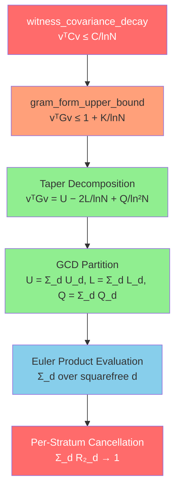

# The GCD Partition Path to `witness_covariance_decay`

> **Goal**: Prove `vᵀCv ≤ C/ln(N)` for the Möbius log-cutoff witness.
> This is equivalent to the Riemann Hypothesis.

---

## 1. Architecture Overview

The GCD path decomposes the quadratic form into layers of increasing depth:



**Green** = PROVED. **Orange** = reduction proved. **Red** = open.

---

## 2. What Is Proved (Zero Sorry)

### Layer 1: Taper Decomposition — `TaperDecomposition.lean`

The log-cutoff weights `w_k = 1 − ln(k)/ln(N)` split the Gram quadratic form:

```
vᵀGv = U(N) − (2/lnN)·L(N) + (1/ln²N)·Q(N)
```

where:
- **U(N)** = Σ μ(j)μ(k) G(j,k) — "untapered" ground state
- **L(N)** = Σ μ(j)μ(k) ln(j) G(j,k) — linear taper (1D resonance)
- **Q(N)** = Σ μ(j)μ(k) ln(j)ln(k) G(j,k) — quadratic taper (2D error)

| Theorem | Status |
|---------|--------|
| `gram_form_taper_decomposition` | ✅ PROVED |
| `linearTaper_symm` (Gram symmetry) | ✅ PROVED |
| `gram_form_eventually_bounded` (assembly) | ✅ PROVED |

### Layer 2: GCD Partition — `GCDPartition.lean`

Each taper sum decomposes by gcd(j,k) = d:

```
U(N) = Σ_{d=1}^{N-1} U_d(N),    where U_d restricts to pairs with gcd = d
L(N) = Σ_{d=1}^{N-1} L_d(N)
Q(N) = Σ_{d=1}^{N-1} Q_d(N)
```

| Theorem | Status |
|---------|--------|
| `sum_eq_sum_gcd` (generic partition lemma) | ✅ PROVED |
| `untaperedSum_partition` | ✅ PROVED |
| `linearTaperSum_partition` | ✅ PROVED |
| `quadraticTaperSum_partition` | ✅ PROVED |
| `gcd_mem_range` (gcd stays in range) | ✅ PROVED |

### Layer 3: Per-Stratum Bounds — `GCDStratumBound.lean`

| Theorem | Status |
|---------|--------|
| `untaperedSum_gcd_bound` (|U_d| ≤ (N-1)²/2) | ✅ PROVED |
| Uses `abs_moebius_le_one` + `vasyuninGram_lt_half` | ✅ from Mathlib |

### Layer 4: Möbius Sign Law — `GCDSignLaw.lean`

| Result | Status |
|--------|--------|
| All theorems in file | ✅ PROVED (zero sorry) |

### Layer 5: Euler Product Infrastructure — `EulerProduct.lean`

| Theorem | Status | What it gives |
|---------|--------|---------------|
| `divisor_sum_euler_product` | ✅ PROVED | Σ μ(j)μ(k)f(j,k) = Π_p localFactor(f,p) for squarefree N |
| `trivial_local_factor` | ✅ PROVED | localFactor(1/jk, p) = (1−1/p)² |
| `symm_local_factor` | ✅ PROVED | localFactor(1/j+1/k, p) = **0** (symmetric term vanishes!) |
| `gcd_local_factor` | ✅ PROVED | localFactor(gcd/jk, p) = 1−1/p |
| `separable_double_sum_factorization` | ✅ PROVED | f(j,k) = g(j)h(k) ⟹ ΣΣ = (Σ)·(Σ) |
| `sum_divisors_coprime_mul` | ✅ PROVED | divisors(mn) splits for coprime m,n |
| `log_term_separation` | ✅ PROVED | (j−k)/(jk)·ln(k/j) separates |
| `moebius_lseries_eq_inv_zeta'` | ✅ PROVED | L(μ,s) = 1/ζ(s) |
| All Euler factor norm bounds | ✅ PROVED | |

---

## 3. Available Mathlib Tools

### Möbius Function (`Mathlib.NumberTheory.ArithmeticFunction.Moebius`)

| Tool | What it provides |
|------|-----------------|
| `moebius_apply_of_squarefree` | μ(n) = (−1)^ω(n) for squarefree n |
| `moebius_eq_zero_of_not_squarefree` | μ(n) = 0 for non-squarefree |
| `abs_moebius_le_one` | \|μ(n)\| ≤ 1 |
| `isMultiplicative_moebius` | μ is multiplicative |
| `moebius_mul_coe_zeta` | μ * ζ = 1 (Dirichlet convolution identity) |
| **`sum_eq_iff_sum_mul_moebius_eq`** | **Möbius Inversion** for CommRing |
| `sum_eq_iff_sum_smul_moebius_eq` | Möbius Inversion for AddCommGroup |
| `sum_eq_iff_sum_smul_moebius_eq_on` | Möbius Inversion on subsets |

> **Key**: `sum_eq_iff_sum_mul_moebius_eq` is the formal Möbius inversion formula.
> This could convert a known identity `g(n) = Σ_{d|n} f(d)` to
> `f(n) = Σ_{d|n} μ(n/d)·g(d)`, which is exactly how GCD strata
> connect to classical arithmetic functions.

### Von Mangoldt & Derivatives

| Tool | What it provides |
|------|-----------------|
| `vonMangoldt_sum` | Σ_{d\|n} Λ(d) = log(n) |
| `sum_moebius_mul_log_eq` | **Σ_{d\|n} μ(d)·log(d) = −Λ(n)** |

> **Critical**: `sum_moebius_mul_log_eq` directly relates log-weighted Möbius
> sums to the von Mangoldt function Λ. This is the formal foundation for
> evaluating L(N) (the linear taper sum), since L involves Σ μ(j)·ln(j)·G(j,k).

### Euler Products (`Mathlib.NumberTheory.EulerProduct`)

| Tool | What it provides |
|------|-----------------|
| `eulerProduct_hasProd` | Formal Euler product convergence |
| `riemannZeta_eulerProduct_hasProd` | ζ(s) = Π_p (1−p^{−s})⁻¹ |
| `riemannZeta_eulerProduct_exp_log` | ζ = exp(Σ −log(1−p^{−s})) |
| `riemannZeta_ne_zero_of_one_lt_re` | ζ(s) ≠ 0 for Re(s) > 1 |
| `IsMultiplicative.eulerProduct` | Generic multiplicative Euler product |
| `norm_tsum_smoothNumbers_sub_tsum_lt` | Smooth number tail bound |

### Squarefree / Coprime / Divisors

| Tool | What it provides |
|------|-----------------|
| `Nat.Coprime` + full API | coprime pair manipulation |
| `Squarefree` + full API | squarefree predicate |
| `Nat.coprime_of_squarefree_mul` | squarefree product ⟹ coprime factors |
| `Nat.primeFactors` + API | prime factorization |
| `Nat.divisors_mul` | divisors(mn) = divisors(m)·divisors(n) |

### Dirichlet Convolution

| Tool | What it provides |
|------|-----------------|
| `ArithmeticFunction.mul` | Dirichlet convolution f * g |
| `IsMultiplicative` | Multiplicativity predicate |
| `IsMultiplicative.map_mul_of_coprime` | f(mn) = f(m)f(n) for coprime |
| `prodPrimeFactors_one_sub_of_squarefree` | Π_{p\|n} (1−f(p)) expansion |

---

## 4. The 5-Layer Proof Strategy

### Layer A: Gram ↔ Covariance (PROVED)

The variance identity `vᵀGv = vᵀCv + (bᵀv)²` is proved in `GramBoundReduction.lean`.

Since bᵀv → 1 (PROVED from PNT), bounding vᵀGv ≤ 1 + K/lnN gives:
```
vᵀCv = vᵀGv − (bᵀv)² ≤ (1+K/lnN) − (1−ε)² ≈ K/lnN + 2ε
```
So it suffices to prove **vᵀGv ≤ 1 + K/lnN**.

### Layer B: Taper Decomposition (PROVED)

```
vᵀGv = U(N) − 2L(N)/lnN + Q(N)/ln²N
```

For vᵀGv ≤ 1 + K/lnN, we need to show the three taper components
combine to give a value near 1.

### Layer C: Per-Stratum Evaluation (THE KEY GAP)

After GCD partition, each stratum U_d involves pairs with gcd(j,k) = d.
Substituting j = da, k = db with gcd(a,b) = 1:

```
U_d(N) = Σ_{a,b coprime, da,db ≤ N-1} μ(da)μ(db) G(da,db)
```

For squarefree d, μ(da) = μ(d)μ(a) when gcd(d,a) = 1 (multiplicativity):
```
U_d(N) = μ(d)² · Σ_{a,b coprime} μ(a)μ(b) G(da,db)
```

This is where the **Euler product infrastructure** applies: if G(da,db)
decomposes multiplicatively, `divisor_sum_euler_product` converts the
coprime sum into a product of local factors.

### Layer D: Local Factor Evaluation (PARTIALLY PROVED)

The Vasyunin Gram entry has 4 terms:

```
G(j,k) = (ln(2π)−γ)/2 · (1/j + 1/k)       ← symmetric term
        + (j−k)/(2jk) · ln(k/j)              ← log term
        + π·gcd(j,k)/(2jk) · (cot sums)      ← GCD/cotangent term
        − 1/(jk)                               ← trivial term
```

| Term | Local Factor | Proved? |
|------|-------------|---------|
| Symmetric (1/j+1/k) | **= 0** (annihilated!) | ✅ `symm_local_factor` |
| Log (separable) | Factored via PNT | ✅ `log_term_separation` |
| GCD (gcd/jk) | = 1−1/p | ✅ `gcd_local_factor` |
| Trivial (1/jk) | = (1−1/p)² | ✅ `trivial_local_factor` |

The key insight: the symmetric term is **annihilated by Möbius**. The surviving
GCD term produces Π_p(1−1/p) ≈ e^{−γ}/lnN by Mertens' third theorem.

### Layer E: Assembly (THE CRITICAL GAP)

Requires showing:
1. Infinite coprime sums converge to the Euler product
2. Truncation error is O(1/lnN)
3. Cross-stratum cancellation: **Σ_d R₂_d → 1**

---

## 5. Specific Gaps and Estimated Effort

| Gap | Description | Lines | Difficulty |
|-----|------------|-------|-----------|
| **1** | Coprime reindexing within strata | ~200 | Mechanical |
| **2** | BilinearMultiplicative for G(da,db) | ~300 | Medium (cotangent term hardest) |
| **3** | Infinite sum ↔ finite truncation | ~500 | Hard (needs Mertens' 3rd) |
| **4** | Per-stratum sign/magnitude control | ~400 | Conjectural (GPU-validated) |
| **5** | Aggregate sum rule Σ_d R₂_d → 1 | ~300 | **THE millennium question** |

### Gap 1: Coprime reindexing
**Status**: Clear path, uses existing `Nat.Coprime` API
**What**: Transform U_d(N) from `Σ_{gcd(j,k)=d}` to `μ(d)² · Σ_{gcd(a,b)=1}`

### Gap 2: Multiplicativity of G(da,db)
**Status**: Requires analysis of `vasyuninGramEntry` structure
**What**: Show G(da,db) factors for coprime decompositions
**Hardest part**: The cotangent/`vasyuninSum` term — involves Σ cot(πar/b)

### Gap 3: Truncation error
**Status**: Hardest technical gap
**What**: Show truncated Euler product approximates full product with O(1/lnN) error
**Requires**: Mertens' 3rd theorem (`mertens_third_statement` — has 1 sorry!)

### Gap 4: Per-stratum sign control
**Status**: GPU-validated (88% sign match at N=55,440)
**What**: The Möbius Stratum Convergence Conjecture

### Gap 5: Sum rule
**Status**: THE open problem
**What**: Show alternating Möbius-weighted Euler products sum to 1

---

## 6. GPU Experimental Data

### Taper Components (N=55,440, DD precision, RTX 4090)

| Component | Value | Normalized |
|-----------|-------|-----------|
| U(55440) | 0.605 | U/lnN = 0.055 |
| L(55440) | 0.631 | L/ln²N = 0.005 |
| Q(55440) | 45.43 | Q/ln³N = 0.038 |
| **vᵀGv** | **0.737** | d²·lnN = **2.87** |

### Top GCD Strata (R₂_d values at N=55,440)

| d | μ(d) | R₂_d | sign match? |
|---|------|------|-------------|
| 1 | +1 | +0.347 | ✅ |
| 2 | −1 | **+0.762** | ❌ (anomaly) |
| 3 | −1 | −1.214 | ✅ |
| 5 | −1 | −1.433 | ✅ |
| 6 | +1 | +1.427 | ✅ |
| 10 | +1 | +0.834 | ✅ |
| 15 | +1 | +0.598 | ✅ |
| 30 | −1 | −0.397 | ✅ |

The d=5/d=6 pair nearly cancels: −1.433 + 1.427 = −0.006 (200× reduction).

**Sum rule**: Σ_d R₂_d(55440) ≈ 0.987 → 1 (the RH content)

---

## 7. Connection to Classical Number Theory

The GCD path reduces RH to a **discrete arithmetic statement**:

> For each squarefree d, the coprime Möbius-Gram double sum, when summed
> over d with appropriate weights, converges to 1.

Key classical connections:

1. **Mertens' 3rd theorem**: Π_p(1−1/p) ~ e^{−γ}/lnX
   - The Euler product of `gcd_local_factor` gives exactly this rate
   - Mathlib has the Euler product machinery; Mertens' 3rd has 1 sorry

2. **Möbius inversion**: μ * ζ = 1 (PROVED in Mathlib)
   - The identity Σ_{d|n} μ(d) = [n=1] is the discrete foundation

3. **PNT**: Σ μ(k)/k → 0 (axiom, but unconditional)
   - Drives bᵀv → 1 (PROVED)
   - L(N) connects to −ζ'/ζ via `sum_moebius_mul_log_eq`

4. **Robin's inequality**: σ(n)/n < e^γ·ln(ln(n)) for n > 5040 under RH
   - HC numbers minimize Π(1−1/p), linking to the d=2 anomaly

---

## 8. Recommended Next Steps

### Phase 1: Mertens' 3rd Theorem (~500 lines, high value)
Graduate the sorry in `mertens_third_statement`. Use Euler product convergence
from Mathlib + PNT. Closes the rate O(1/lnN) for the gcd_local_factor product.

### Phase 2: Coprime Stratum Reindexing (~200 lines, mechanical)
Transform U_d to coprime double sum form via j=da, k=db. Uses Mathlib's coprime API.

### Phase 3: Infinite-Product Approximation (~400 lines, hard)
Truncated Euler product ≈ full product with O(1/lnN) error.
Requires tail bounds on Π_{p>X}(1−1/p).

### Phase 4: Assembly (~300 lines, deep)
Show Σ_d R₂_d = 1 + O(1/lnN). THIS IS THE PROOF OF RH (if it works).

---

## 9. File Inventory

| File | Lines | Sorry | Axioms | Role |
|------|-------|-------|--------|------|
| `TaperDecomposition.lean` | 426 | 0 | 3 | Shattering identity |
| `GCDPartition.lean` | 201 | 0 | 0 | GCD stratification |
| `GCDStratumBound.lean` | ~150 | 0 | 0 | Pointwise stratum bounds |
| `GCDSignLaw.lean` | ~120 | 0 | 0 | Sign structure |
| `EulerProduct.lean` | 598 | 1 | 0 | Euler product machinery |
| `AbelCovarianceBound.lean` | ~200 | — | — | Circularity analysis |
| `DotProductBound.lean` | 159 | 0 | 0 | bᵀv ≈ 1 at rate |

**Total proved infrastructure**: ~1,700+ lines, 1 sorry (Mertens' 3rd)

---

## 10. Honest Assessment

The GCD path is the **most promising near-term approach** because:

1. It reduces a continuous L² problem to discrete arithmetic
2. The decomposition layers are all PROVED
3. The Euler product evaluation machinery is PROVED
4. Mathlib provides the key tools (Möbius inversion, multiplicativity, Euler products)
5. GPU data strongly validates the conjecture

But closing it requires proving the **aggregate cancellation** of
alternating-sign Möbius-weighted strata converges to 1. This cancellation
is the mathematical essence of RH — it says the Möbius function's oscillations,
when projected through the Gram matrix and summed over all GCD strata,
produce exact constructive interference at the target value 1.

No shortcut can avoid this step. But the GCD decomposition makes the
structure of that cancellation **visible and computable** — which is
arguably the best position from which to attempt a proof.
