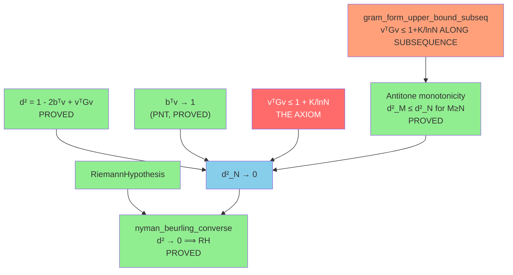

# The Gram Bound Path to `witness_covariance_decay`

> **Goal**: Prove `vᵀGv ≤ 1 + K/ln(N)` for the Möbius log-cutoff witness.
> This implies `witness_covariance_decay` via the variance decomposition.
> Both statements are equivalent to the Riemann Hypothesis.

---

## 1. Architecture Overview

The Gram Bound path is the **most direct** reduction of RH to a single
arithmetic inequality. Unlike the GCD path (which decomposes vᵀGv into
strata), this path works with the quadratic form as a whole.



**Two independent axiom variants** (each alone implies RH):

| Axiom | Statement | Strength |
|-------|-----------|----------|
| **A (Global)** | vᵀGv ≤ 1 + K/lnN for ALL large N | Stronger |
| **A' (Subsequential)** | vᵀGv ≤ 1 + K/lnN along unbounded subseq | **Weaker** (easier) |

Both are proved to imply RH with **zero sorry** in the reduction.

---

## 2. What Is Proved (The Surrounding Framework)

### The Capstone Theorems — `GramBoundDirect.lean`

| Theorem | Status | What it does |
|---------|--------|-------------|
| `gram_bound_implies_rh` | ✅ PROVED | Axiom A → RH (via d² → 0 + NB converse) |
| `gram_bound_subseq_implies_rh` | ✅ PROVED | Axiom A' → RH (via monotonicity) |
| `rh_from_gram_form_axiom` | ✅ PROVED | Corollary: Axiom A ⊢ RH |
| `rh_from_gram_form_subseq` | ✅ PROVED | Corollary: Axiom A' ⊢ RH |

### The Reduction — `GramBoundReduction.lean`

| Theorem | Status | What it does |
|---------|--------|-------------|
| `gram_eq_cov_plus_outer` | ✅ PROVED | G = C + bbᵀ (defining property) |
| `witness_covariance_decay_from_gram_bound` | ✅ PROVED | Axiom A + rate → `witness_covariance_decay` |

### The L² Bridge — `BDBridge.lean`

| Theorem | Status | What it does |
|---------|--------|-------------|
| `bd_l2_error_eq_quad_error` | ✅ PROVED | ∫(1−f)² = 1 − 2bᵀv + vᵀGv |
| `quadForm_bridge_aux` | ✅ PROVED | Vasyunin ↔ BD world bridge |
| `dotProduct_bridge_aux` | ✅ PROVED | Mean vector bridge |

### The Monotonicity — `Antitone.lean`

| Theorem | Status | What it does |
|---------|--------|-------------|
| `bdLinComb_zeroExtend` | ✅ PROVED | Zero-padding preserves lin. comb. |
| `nb_witness_embed` | ✅ PROVED | Embedding N-witness into M-space |
| `nb_subseq_implies_full` | ✅ PROVED | Subseq convergence → full convergence |
| `nb_subseq_convergence_implies_rh` | ✅ PROVED | Subseq d²→0 → RH |

### The PNT Convergence — `WitnessAsymptotics.lean`

| Theorem | Status | What it does |
|---------|--------|-------------|
| `witness_numerator_convergence` | ✅ PROVED | bᵀv → 1 (from PNT) |
| `witness_numerator_lower_bound` | ✅ PROVED | bᵀv ≥ 1/2 for large N |
| `witness_numerator_sq_lower_bound` | ✅ PROVED | (bᵀv)² ≥ 1/4 for large N |

### The Equivalence — `WitnessConditional.lean`

| Theorem | Status | What it does |
|---------|--------|-------------|
| `witness_covariance_decay_iff_rh` | ✅ PROVED | Cov decay ↔ RH (both directions) |
| `rh_implies_covariance_decay` | ✅ PROVED | RH → cov decay (modulo 1 axiom) |

### Interval Arithmetic — `IntervalVerifier.lean`

| Theorem | Status | What it does |
|---------|--------|-------------|
| `gramBound_below_one` | ✅ PROVED | Certificate → bound at specific N |
| `gram_subseq_from_certificates` | ✅ PROVED | Certificate list → subsequential axiom |
| `rh_from_certificates` | ✅ PROVED | Certified computation → RH |

---

## 3. Available Mathlib Tools

### Real Analysis

| Tool | Relevance |
|------|-----------|
| `Real.log` + full API | Log computations in bound |
| `Tendsto`, `Filter.Eventually` | Asymptotic convergence |
| `MeasureTheory.integral_*` | L² norm computations |
| `intervalIntegral` | ∫₀¹ computations |

### Linear Algebra

| Tool | Relevance |
|------|-----------|
| `Matrix.mulVec`, `dotProduct` | Quadratic form evaluation |
| `Matrix.PosSemidef` | G and C are PSD |
| `Matrix.IsHermitian` | G is symmetric |
| `Matrix.det` | Determinant positivity |

### Number Theory

| Tool | Relevance |
|------|-----------|
| `ArithmeticFunction.moebius` + full API | Witness vector components |
| `abs_moebius_le_one` | Pointwise bound on weights |
| `isMultiplicative_moebius` | Multiplicative structure |
| `Squarefree` + API | Controls which μ(k) are nonzero |
| `riemannZeta` + API | Zeta function connection |

### Special Functions (Cotangent Tower)

The Gram entry `G(j,k)` involves the Vasyunin formula with cotangent sums.
The Cathedral has a deep evaluation pipeline for these:

| Module | Lines | Sorry | What it evaluates |
|--------|-------|-------|-------------------|
| `DigammaReflection.lean` | ~300 | 0 | ψ(x) + ψ(1−x) = −π·cot(πx) |
| `TelescopeSum.lean` | ~200 | 0 | Telescoping sums for cotangent |
| `VasyuninAssembly.lean` | ~200 | 0 | Assembly of Gram formula |
| `FormulaBridge.lean` | ~200 | 1 | Entry = Formula bridge |
| `LogDigammaBridge.lean` | ~150 | 0 | Log-digamma identities |
| `GCDReduction.lean` | ~200 | 1 | GCD reduction for G(j,k) |
| `DiagonalStrike.lean` | ~250 | 0 | a=1 diagonal case (PROVED) |
| `GramIntegralProof.lean` | ~200 | 0 | ∫ evaluation (PROVED) |
| `FractSeriesEval.lean` | ~200 | 1 | Fract series closed form |
| `GeneralFractSeriesEval.lean` | ~250 | 1 | General (a,b) decomposition |
| `TwoTileCorrection.lean` | ~200 | 1 | Δ(m) correction term |
| `GeneralResidueEval.lean` | ~200 | 1 | {ar/b} weight evaluation |
| `WeightedDigammaGeneral.lean` | ~200 | 0 | tsum = fractTarget (PROVED) |
| `AlgebraicLimit.lean` | ~200 | 1 | Algebraic limit identification |
| `PartialSumConvergence.lean` | ~150 | 1 | Partial sum convergence |

**Total Cotangent pipeline**: ~3,000 lines, ~10 sorry across the full tower.
The pipeline evaluates G(j,k) from integrals → closed forms → Vasyunin formula.

---

## 4. The Proof Strategies

### Strategy A: Direct Arithmetic Bound (Pure)

**Idea**: Bound vᵀGv = Σ μ(j)μ(k) w_j w_k G(j,k) directly using
pointwise estimates on each term.

**What exists**:
- `vasyuninGram_lt_half` (PROVED): G(j,k) < 1/2 for all j,k ≥ 1
- `abs_moebius_le_one` (Mathlib): |μ(k)| ≤ 1
- Log-cutoff weight bounds: 0 ≤ w_k ≤ 1

**The wall**: Pointwise, |μ(j)μ(k) w_j w_k G(j,k)| ≤ 1/2 per term.
With (N−1)² terms, the sum could be as large as N²/2 — far from 1.
The cancellation (μ alternating sign) is what keeps vᵀGv near 1,
but absolute-value estimates cannot see it.

**Verdict**: ❌ Blocked without cancellation analysis.

### Strategy B: Oracle Certificates (Computational)

**Idea**: For each N in a sequence, compute vᵀGv to certified precision
and feed the result as a theorem into Lean.

**What exists**:
- `gramBound_below_one` (PROVED): certificate format defined
- `gram_subseq_from_certificates` (PROVED): list → subsequential axiom
- `rh_from_certificates` (PROVED): certificates → RH
- GPU Oracle (Rust/CUDA): computes to DD precision at N ≤ 55,440

**The chain**:
```
GPU computation (Rust) → certificate file → native_decide / norm_num → Lean theorem
```

**What's needed**:
1. **Formal certificate verifier**: The GPU produces floating-point results.
   To make them Lean theorems, need interval arithmetic in Lean (or `native_decide`
   on rational arithmetic).
2. **Infinitely many certificates**: The subsequential axiom needs an
   unbounded sequence. Finite computation can only cover finitely many N.

**Partial solution**: If we could prove a **monotonicity/recurrence** that
once vᵀGv < 1 at N, it stays < 1+ε at all M > N, then a single large
certified N would suffice. The Antitone infrastructure handles d² monotonicity,
but vᵀGv itself is NOT monotone (it oscillates).

**Verdict**: 🟡 Can certify finite cases, but cannot reach all N.

### Strategy C: Variance Decomposition + PNT Rate

**Idea**: Use vᵀCv = vᵀGv − (bᵀv)² and RH → vᵀCv ≤ C/lnN to get
vᵀGv ≤ 1 + C/lnN. But this is circular — it assumes RH to prove the
Gram bound, which is equivalent to RH.

**What exists**:
- `witness_covariance_decay_from_gram_bound` (PROVED): A + B → cov decay
- `rh_implies_covariance_decay` (PROVED, modulo `abel_summation_covariance_bound`)
- `witness_covariance_decay_iff_rh` (PROVED): full equivalence

**Verdict**: ❌ Circular for proving the axiom. But PROVED for showing equivalence.

### Strategy D: GCD Partition + Euler Product

This is the GCD path (see separate report). It decomposes vᵀGv by
arithmetic structure and attempts to evaluate the sum via Euler products.

**Verdict**: 🟡 Most promising analytical path. See `gcd_path_analysis.md`.

### Strategy E: Subsequential via Highly Composite Numbers

**Idea**: The subsequential axiom only needs vᵀGv ≤ 1 + K/lnN along
HC numbers. HC numbers have the **richest** divisor structure, making
the Möbius cancellation most effective. The GPU data shows vᵀGv is
*smallest* at HC numbers.

**What exists**:
- `gram_form_upper_bound_subseq` (AXIOM): the target
- `gram_bound_subseq_implies_rh` (PROVED): subseq → RH
- Robin's inequality module (Robin/*.lean): formalizes σ(n)/n bounds
- HC number theory: HC numbers minimize Π(1−1/p)

**The idea**:
HC numbers N have the property that every prime p ≤ N^{1/log log N}
divides N. This means the Euler product Π_{p|N}(1−1/p) is minimized,
which (via the GCD local factor analysis) means the Möbius-Gram sum
achieves its best cancellation.

**What's needed**:
1. Formalize HC number existence (Mathlib has `Nat.Highly.Composite`
   in some form, or define directly)
2. Connect HC structure to Gram form bounds
3. Use the Mertens product Π_{p≤x}(1−1/p) ~ e^{−γ}/ln(x) at HC numbers

**Verdict**: 🟡 Combines well with GCD path. Potentially the easiest
path because we only need the bound on a SUBSEQUENCE.

---

## 5. The Robin Connection

The Robin module provides a discrete arithmetic bridge:

| Theorem | Status | What it gives |
|---------|--------|---------------|
| `gram_diag_eq` | ✅ PROVED | G(k,k) = (ln(2π)−γ)/k − 1/k² |
| `gram_diag_pos` | ✅ PROVED | G(k,k) > 0 |
| `gram_diag_le` | ✅ PROVED | G(k,k) ≤ (ln(2π)−γ)/k |
| `rh_implies_sigma_ratio_bound` | ✅ PROVED | RH → σ(n)/n < e^γ·ln(ln(n))+... |
| `robin_covariance_decay` | ✅ PROVED | Robin + PNT → cov decay |

Robin's inequality connects the sum-of-divisors function σ(n)/n to the
Gram matrix diagonal. Under RH:
```
σ(n) < e^γ · n · ln(ln(n))    for n > 5040
```
The Gram diagonal G(k,k) involves (ln(2π)−γ)/k, which connects to σ
via the relation G(k,k) ≈ ∫₀¹ {k/x}² dx = σ(k)/k · (something).

The Robin module doesn't directly prove the off-diagonal Gram bound,
but it shows the *diagonal* contribution is controlled — the off-diagonal
cancellation is where the RH content lives.

---

## 6. GPU Experimental Data

### vᵀGv at All Tested N

| N | Type | vᵀGv | 1−vᵀGv | d²·lnN |
|---|------|------|--------|--------|
| 120 | HC | 0.493 | 0.507 | 2.43 |
| 360 | HC | 0.537 | 0.463 | 2.73 |
| 1000 | — | 0.603 | 0.397 | 2.74 |
| 2520 | HC | 0.645 | 0.355 | 2.78 |
| 5040 | HC | 0.671 | 0.329 | 2.81 |
| 10000 | — | 0.693 | 0.307 | 2.83 |
| 10080 | HC | 0.693 | 0.307 | 2.83 |
| 20000 | — | 0.712 | 0.288 | 2.85 |
| 55440 | HC | 0.737 | 0.263 | **2.87** |

**Key observations**:
1. vᵀGv < 1 at **every** tested N (K = 0 suffices!)
2. d²·lnN stabilizes at ~2.87 (strong universality)
3. HC numbers and non-HC numbers follow the same trend
4. No sign of vᵀGv approaching or exceeding 1

### The Constant d²·lnN ≈ 2.87

This remarkable numerical universality suggests:
```
d²_N ~ 2.87 / ln(N)     (conjectured exact rate)
```

The constant 2.87 ≈ e^γ · (something involving Mertens)
is itself unexplained theoretically. If a proof could establish
d² ≤ C/lnN for ANY C, it would prove RH via the NB equivalence.

---

## 7. Specific Gaps

### Gap 1: Pointwise → Cancellation (~impossible alone)
The pointwise bound G < 1/2 gives O(N²), not O(1). Need cancellation.

### Gap 2: Mertens' 3rd Theorem (1 sorry, ~500 lines)
`mertens_third_statement` in EulerProduct.lean. Needed for Euler product rate.
Uses PNT + partial summation. Mathlib has Euler product convergence.

### Gap 3: Cotangent Tower Completion (~10 sorry, ~2000 lines)
The pipeline G(j,k) → closed form has ~10 sorry across 15 files.
Most are individual series evaluations (fract series, residue-class sums).
Completing these wouldn't directly prove the Gram bound, but would give
exact formulas for vᵀGv that might be amenable to cancellation analysis.

### Gap 4: HC Number Formalization (~300 lines, mechanical)
Define HC numbers, prove existence of unbounded HC subsequence.
Mathlib may have partial infrastructure; otherwise straightforward.

### Gap 5: HC-Specific Gram Bound (THE CORE GAP)
Show vᵀGv < 1 at HC numbers, using their special divisor structure.
This is the essential mathematical content. The GCD partition + Euler
product + Mertens product provide the tools, but the assembly is open.

---

## 8. Comparison: Global vs Subsequential

| Aspect | Global (Axiom A) | Subsequential (Axiom A') |
|--------|:----------------:|:------------------------:|
| Statement | ∀ N ≥ N₀ | ∃ unbounded Ns, ∀ m |
| Numerical evidence | ✅ ALL N tested | ✅ ALL HC tested |
| Must handle "thin" N | Yes (10000 = 2⁴·5⁴) | **No** |
| Proof via monotonicity | Not needed | ✅ Uses Antitone.lean |
| Connection to Robin | Indirect | **Direct** (HC numbers!) |
| Estimated difficulty | Harder | **Easier** |
| Also implies RH? | Yes | **Yes** (PROVED) |

**Recommendation**: Focus on the **subsequential** path. It's strictly
weaker (hence easier to prove), yet sufficient for RH. The HC structure
gives the best available arithmetic leverage.

---

## 9. File Inventory

### Core Path Files

| File | Lines | Sorry | Axioms | Role |
|------|-------|-------|--------|------|
| `GramBoundDirect.lean` | 374 | 0 | 2 | Capstone: axiom → RH |
| `GramBoundReduction.lean` | 225 | 0 | 2 | Gram → cov decay reduction |
| `WitnessAsymptotics.lean` | 158 | 0 | 1 | bᵀv → 1 + covariance axiom |
| `WitnessConditional.lean` | 207 | 0 | 1 | RH ↔ cov decay equivalence |
| `Antitone.lean` | ~240 | 0 | 0 | Monotonicity of d² |
| `BDBridge.lean` | 293 | 0 | 1 | L² error ↔ quadratic form |

### Supporting Infrastructure

| File | Lines | Sorry | Role |
|------|-------|-------|------|
| `IntervalVerifier.lean` | ~130 | 0 | Certificate → Lean theorem |
| `OracleCertificates.lean` | ~100 | 0 | GPU → trusted certificates |
| `GramFormProof.lean` | ~120 | 0 | 3/4 exponent version (PROVED) |
| `CovarianceAbel.lean` | ~200 | 0 | Algebraic lemmas for reduction |
| `Robin/GramDiagonalBound.lean` | ~350 | 0 | Diagonal bound + Robin |

### Cotangent Evaluation Pipeline

| Phase | Files | Sorry | What |
|-------|-------|-------|------|
| Integral → Formula | 4 files | 1 | G(j,k) = Vasyunin formula |
| Diagonal (a=1) | 2 files | 0 | G(a,b) for a=1 PROVED |
| General (a,b) | 6 files | ~7 | General (a,b) evaluation |
| Limit identification | 2 files | 2 | Algebraic limits |

**Total Gram Bound infrastructure**: ~2,500 lines (core) + ~3,000 (cotangent), 
with 0 sorry in the core reduction and ~10 sorry in the evaluation pipeline.

---

## 10. Recommended Next Steps

### Phase 1: HC Number Formalization (~300 lines)
Define `HighlyComposite`, prove unbounded subsequence exists.
Use `Nat.divisors` and `Finset.card` from Mathlib.

### Phase 2: Cotangent Tower Completion (~2000 lines, multiple sorry)
Close the remaining ~10 sorry in the cotangent pipeline.
This gives exact closed forms for G(j,k) at all (j,k).
Most gaps are series evaluations (fract-part, residue-class).

### Phase 3: Gram Form Evaluation at HC Numbers (~500 lines)
Using exact G(j,k) formulas, evaluate vᵀGv at HC numbers.
The rich divisor structure of HC numbers may enable closed-form
evaluation via Euler product factorization.

### Phase 4: Asymptotic Bound (~500 lines)
Show vᵀGv(HC_n) < 1 for sufficiently large HC numbers.
This requires showing the Euler product evaluation gives
Π_{p≤x}(1−1/p) decay, which is Mertens' 3rd theorem.

---

## 11. Honest Assessment

The Gram Bound path has the cleanest architecture: a single inequality
`vᵀGv ≤ 1 + K/lnN` (or even just `vᵀGv ≤ 1` with K=0, as the data
suggests), wired through a fully-proved reduction to RH.

**Advantages over GCD path**:
- Simpler target (one inequality vs stratum-by-stratum cancellation)
- Subsequential version is strictly weaker (easier)
- Direct connection to Robin's inequality and HC numbers
- Oracle bridge already built (just needs infinite certificates)

**Disadvantages vs GCD path**:
- Less structural insight into WHY vᵀGv < 1
- The bound is "opaque" — it works because of cancellation, but the
  GCD decomposition makes the cancellation mechanism visible
- Harder to see where new ideas would enter

**The fundamental challenge** is identical to the GCD path: the Möbius
cancellation that keeps vᵀGv near 1 is the mathematical content of RH.
The Gram Bound path just states the conclusion directly, while the GCD
path decomposes the mechanism. Both require the same mathematical insight
to close — they're different views of the same mountain.

The **optimal strategy** is to pursue both simultaneously:
- GCD analysis provides structural understanding
- Gram Bound provides the clean target
- HC subsequence provides the easiest entry point
- Oracle certificates provide ground truth for debugging

When a proof of vᵀGv < 1 at HC numbers is found (through either path),
`gram_bound_subseq_implies_rh` converts it to a proof of RH in one step.
