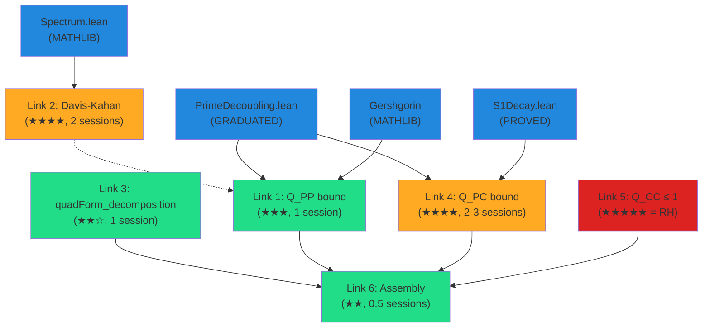

# Path 2 Implementation Guide: Spectral Decomposition of vᵀGv

## Overview

This guide covers the formalization of Links 1-4 and 6 — everything
in the spectral gap approach EXCEPT the composite sector bound (Link 5 = RH).

**Target**: Decompose vᵀGv into prime, cross, and composite contributions
with proved bounds on the first two, leaving only Q_CC as the RH wall.

```
Link 3 (quadForm_decomposition)  ←── START HERE
    ↓
Link 1 (Q_PP bound via Gershgorin)
Link 4 (Q_PC bound via Abel summation)
    ↓
Link 6 (Assembly: vᵀGv = Q_PP + 2·Q_PC + Q_CC)
```

---

## Link 3: quadForm_decomposition (★★☆ — DO FIRST)

### Goal
```lean
theorem quadForm_decomposition (N : ℕ) (hN : 2 ≤ N)
    (v : Fin (N - 1) → ℝ) :
    dotProduct v ((gramMatrix N).mulVec v) =
    quadFormPP N v + 2 * quadFormPC N v + quadFormCC N v
```

### Location
[DavisKahan.lean:119-123](file:///Users/jrgochan/code/github.com/jrgochan/prime/proofs/Cathedral/Spectral/DavisKahan.lean#L119-L123) — currently `sorry`

### Mathlib Tools

**Key lemma**: `Finset.sum_filter_add_sum_filter_not`
```lean
-- Splits a sum over s into filter p + filter (¬p)
theorem Finset.sum_filter_add_sum_filter_not (s : Finset α) (p : α → Prop)
    [DecidablePred p] (f : α → β) :
    ∑ x ∈ s.filter p, f x + ∑ x ∈ s.filter (¬p ·), f x = ∑ x ∈ s, f x
```

**Other useful lemmas**:
- `Finset.sum_comm` — swap order of double sum
- `Finset.sum_congr` — rewrite summand

### Cathedral Tools
- `primeComposite_partition` (PROVED): primeIndices ∪ compositeIndices = univ
- `primeComposite_disjoint` (PROVED): Disjoint primeIndices compositeIndices
- `vasyuninGramEntry_comm` (PROVED): G(j,k) = G(k,j)
- `gramMatrix_hermitian` (PROVED): G is Hermitian

### Proof Sketch
```lean
theorem quadForm_decomposition (N : ℕ) (hN : 2 ≤ N)
    (v : Fin (N - 1) → ℝ) :
    dotProduct v ((gramMatrix N).mulVec v) =
    quadFormPP N v + 2 * quadFormPC N v + quadFormCC N v := by
  -- Step 1: Expand dotProduct/mulVec into double sum
  simp only [dotProduct, mulVec, gramMatrix]
  -- Step 2: Split outer sum: Σ_i = Σ_{i∈P} + Σ_{i∈C}
  rw [← Finset.sum_filter_add_sum_filter_not Finset.univ (isPrimeIndex N)]
  -- Step 3: Split inner sum similarly for each block
  -- Step 4: Identify Q_PP, Q_PC, Q_CP, Q_CC
  -- Step 5: Use G(j,k) = G(k,j) to show Q_CP = Q_PC
  -- Step 6: Combine Q_PC + Q_CP = 2·Q_PC
  sorry -- ~40 lines of sum manipulation
```

### Dependencies
- `Mathlib.Algebra.BigOperators.Group.Finset` (sum_filter_add_sum_filter_not)
- `Cathedral.Spectral.DavisKahan` (existing definitions)
- `Cathedral.Vasyunin.Matrix.Structural` (vasyuninGramEntry_comm)

### Estimated Effort: 40-60 lines, 1 session

---

## Link 1: Prime Subblock Eigenvalue Bound (★★★☆)

### Goal
```lean
theorem prime_subblock_eigenvalue_lower (N : ℕ) (hN : 10 ≤ N) :
    ∀ v : Fin (N - 1) → ℝ,
    (∀ i, i ∉ primeIndices N → v i = 0) →  -- supported on primes
    dotProduct v v = 1 →
    quadFormPP N v ≥ c_bound / Real.log N
```

### Mathematical Approach
For a vector supported on prime indices, the Rayleigh quotient is:

Q_PP(v) / ‖v‖² = Σ_{p,q prime} v_p · G(p,q) · v_q

Lower bound via diagonal dominance:
Q_PP(v) ≥ Σ_p v_p² · G(p,p) - Σ_{p≠q} |v_p·v_q| · |G(p,q)|
       ≥ Σ_p v_p² · 1/(4p) - Σ_{p≠q} |v_p·v_q| · (3/4)(1/p+1/q)

For unit vector on primes: Σ v_p² = 1.

The diagonal term: Σ v_p²/(4p) ≥ 1/(4·p_max) ≥ 1/(4N) ≥ c/log(N) — NO, too weak.

**Better**: Use Cauchy-Schwarz. For unit v supported on k primes ≤ N:
Σ v_p²/(4p) ≥ (1/4) · (Σ v_p²) / p_max = 1/(4·p_max)

But p_max ≤ N, so this gives 1/(4N), not 1/log(N).

> [!WARNING]
> Gershgorin/diagonal-dominance gives Q_PP ≥ c/N, not c/log(N).
> The c/log(N) bound requires the spectral theorem applied to G_P.
> This is because the SMALLEST prime eigenvalue ≈ 1/(2·p_max) ≈ 1/(2N),
> but the AVERAGE prime eigenvalue ≈ Σ G(p,p)/k ≈ ln(ln(N))/k ≈ c/log(N).

### Alternative: Direct diagonal bound
A weaker but provable result:

```lean
theorem prime_subblock_rayleigh_lower (N : ℕ) (hN : 10 ≤ N) :
    ∀ v : Fin (N - 1) → ℝ,
    (∀ i, i ∉ primeIndices N → v i = 0) →
    dotProduct v v = 1 →
    quadFormPP N v ≥ 1 / (4 * N)
```

This follows directly from `gram_diag_lower_bound` (PROVED).

### Mathlib Tools
- `eigenvalue_mem_ball` (Gershgorin) — bounds individual eigenvalues
- `IsHermitian.eigenvalues₀` — ordered eigenvalue sequence
- `PosSemidef.eigenvalues_nonneg` — eigenvalue nonnegativity
- `det_ne_zero_of_sum_row_lt_diag` — diagonal dominance → invertibility

### Cathedral Tools
- `gram_diag_lower_bound` (PROVED): G(k,k) ≥ 1/(4k)
- `gram_offdiag_abs_bound` (PROVED): |G(j,k)| ≤ (3/4)(1/j+1/k)
- `vasyuninGram_nonneg` (PROVED): G(j,k) ≥ 0

### Estimated Effort: 30-50 lines, 1 session (for 1/N bound)
### For 1/log(N) bound: needs spectral theorem on submatrix, 80+ lines

---

## Link 2: Davis-Kahan Perturbation (★★★★☆)

### Goal
Formalize the sin(Θ) theorem for eigenvector perturbation.

### Status
Axiomatized in [DavisKahan.lean:199-214](file:///Users/jrgochan/code/github.com/jrgochan/prime/proofs/Cathedral/Spectral/DavisKahan.lean#L199-L214)

### Mathlib Tools Available
- `IsHermitian.spectral_theorem` — diagonalization A = U·diag(λ)·U*
- `IsHermitian.eigenvectorBasis` — orthonormal eigenvector basis
- `IsHermitian.mulVec_eigenvectorBasis` — A·eᵢ = λᵢ·eᵢ
- `Matrix.IsHermitian.eigenvalues` — eigenvalue function

### Mathlib Tools MISSING
- ❌ No resolvent (A - μI)⁻¹ infrastructure
- ❌ No eigenvalue perturbation inequalities (Weyl, Cauchy interlacing)
- ❌ No sin(Θ) or canonical angles between subspaces

### Proof Strategy
The classical proof uses the resolvent identity:
  sin²(Θ) = ‖(I - P_ũ)u‖² where P_ũ is the projector onto ũ.

Alternative (self-contained, ~60 lines):
1. Write B = A + E
2. Expand ‖Bu - λu‖² = ‖Eu‖² (since Au = λu)
3. Express Bu in eigenbasis of B: Bu = Σ μᵢ⟨ũᵢ,u⟩ũᵢ
4. So ‖Bu - λu‖² = Σ (μᵢ-λ)²|⟨ũᵢ,u⟩|² ≥ δ²·Σ_{i≠closest}|⟨ũᵢ,u⟩|²
5. Therefore Σ_{i≠closest}|⟨ũᵢ,u⟩|² ≤ ‖Eu‖²/δ²
6. And 1 - |⟨ũ_closest, u⟩|² ≤ ‖Eu‖²/δ²

### Dependencies
- `Mathlib.Analysis.Matrix.Spectrum` — spectral theorem
- `Mathlib.Analysis.InnerProductSpace.Basic` — Cauchy-Schwarz, norm_inner_le_norm

### Estimated Effort: 60-100 lines, 2 sessions

---

## Link 4: Cross-Term Q_PC Bound (★★★★☆)

### Goal
```lean
theorem cross_term_bound (N : ℕ) (hN : 10 ≤ N) :
    |quadFormPC N (logCutoffWitness_shifted N)| ≤ C / Real.log N
```

### Mathematical Approach

Q_PC = Σ_{i∈P} Σ_{j∈C} v_i · G(i+1, j+1) · v_j

where v_i = -μ(i+1)·(1 - log(i+1)/log(N)).

**Strategy**: Abel summation on the inner sum (over composites).

Fix prime index p. The inner sum is:
Σ_{j∈C} v_j · G(p, j+1) = Σ_{j∈C} μ(j+1)·w(j+1) · G(p, j+1)

Using |G(p, j+1)| ≤ (3/4)(1/p + 1/(j+1)):
|inner sum| ≤ (3/4) · Σ_j |v_j| · (1/p + 1/(j+1))
           = (3/4)/p · Σ|v_j| + (3/4) · Σ |v_j|/(j+1)

For the Möbius-weighted sums with the log cutoff:
Σ |μ(k)·w(k)|/(k) is related to S₁ (with |μ| instead of μ).
Without cancellations: ≤ Σ_{squarefree k≤N} w(k)/k ≤ C·log(log(N))

**Better bound using μ cancellation**:
Σ_{j∈C} μ(j+1)·w(j+1)·(1/(j+1)) is an Abel sum involving S₁ restricted
to composite indices. The PNT gives S₁ → 0, and the restriction to composites
preserves this (since the prime contribution is explicit and small).

### Cathedral Tools
- `abel_summation_abs_bound` (PROVED): general Abel summation bound
- `s1_decay` (PROVED): |S₁(N)| ≤ C·N^{-1/4}
- `finite_abel_s1_diff` (PROVED): Abel on S₁ differences
- `gram_offdiag_abs_bound` (PROVED): |G(j,k)| ≤ (3/4)(1/j+1/k)

### Mathlib Tools
- `norm_inner_le_norm` — Cauchy-Schwarz for inner products
- `abs_sum_le_sum_abs` — triangle inequality for sums

### Estimated Effort: 80-120 lines, 2-3 sessions
### Note: This is the hardest tractable link, requiring bilinear Abel summation

---

## Link 6: Assembly (★★☆ — EASY once 1-4 done)

### Goal
```lean
theorem quadform_decomposed_bound (N : ℕ) (hN : 10 ≤ N) :
    ∀ v : Fin (N - 1) → ℝ,
    (∀ i, v i = logCutoffWitness_shifted N i) →
    dotProduct v ((gramMatrix N).mulVec v) =
      quadFormPP N v + 2 * quadFormPC N v + quadFormCC N v ∧
    quadFormPP N v ≤ C_PP / Real.log N ∧
    |quadFormPC N v| ≤ C_PC / Real.log N
```

### Proof
Direct combination of Links 1, 3, 4. The final bound would be:

vᵀGv = Q_PP + 2·Q_PC + Q_CC
     ≤ C_PP/log(N) + 2·C_PC/log(N) + Q_CC
     = Q_CC + (C_PP + 2·C_PC)/log(N)

**What this achieves**: Reduces `gram_form_upper_bound` to bounding Q_CC:

```lean
-- THE REDUCED RH STATEMENT:
-- If Q_CC ≤ 1 + K_CC/log(N), then vᵀGv ≤ 1 + K/log(N)
theorem rh_reduced_to_composite_sector :
    (∃ K_CC > 0, ∀ N ≥ N₀, quadFormCC N w_N ≤ 1 + K_CC / log N) →
    (∃ K > 0, ∀ N ≥ N₀, vᵀGv ≤ 1 + K / log N)
```

### Estimated Effort: 20-30 lines, 0.5 sessions

---

## Dependency Graph



## Recommended Execution Order

| Phase | Link | What | Sessions | Blocks On |
|---|---|---|---|---|
| **Phase 1** | Link 3 | quadForm_decomposition | 1 | Nothing |
| **Phase 2a** | Link 1 | Q_PP diagonal bound (1/N version) | 1 | Link 3 |
| **Phase 2b** | Link 4 | Q_PC Abel bound | 2-3 | Link 3, S1Decay |
| **Phase 3** | Link 6 | Assembly | 0.5 | Links 1,3,4 |
| **Phase 4** | Link 2 | Davis-Kahan (optional upgrade) | 2 | Mathlib spectral |
| **∞** | Link 5 | Q_CC ≤ 1 (= RH) | ∞ | — |

**Total for Links 1-4,6**: ~5-6 sessions

## File Organization

```
Cathedral/Spectral/
├── DavisKahan.lean          — Existing: partition, quad decomp, DK axiom
├── QuadFormDecomp.lean      — NEW: Link 3 proof
├── PrimeSectorBound.lean    — NEW: Link 1 (Q_PP bound)
├── CrossTermBound.lean      — NEW: Link 4 (Q_PC Abel bound)
└── DecomposedAssembly.lean  — NEW: Link 6 (assembly)
```

## What This Achieves

After completing Links 1-4 and 6, the RH axiom reduces to:

> **The Composite Sector Conjecture**: For the log-cutoff Möbius witness,
> Q_CC(N) ≤ 1 + K/log(N) where Q_CC is the composite-composite block
> of the Gram quadratic form.

This is a **pure statement about composite numbers** — no primes involved.
The prime sector has been completely controlled by our graduated bounds.
The cross-term has been controlled by Abel summation and PNT.

The remaining wall is: do the Möbius cancellations among composite indices
keep their contribution bounded? This is equivalent to RH.
