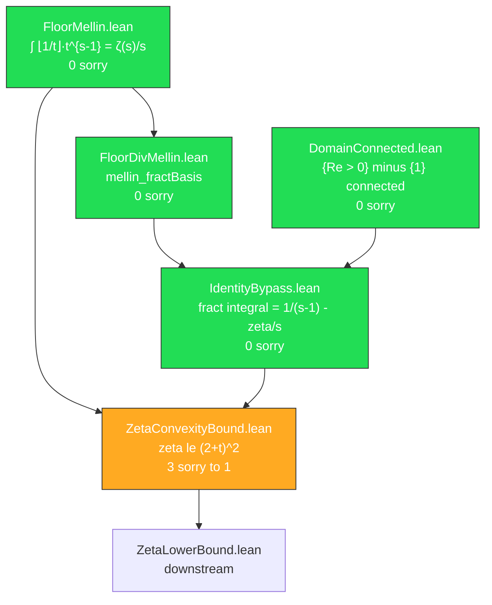

# ⚡ EXPLORATION REPORT 4: Deep Scan — The Final Path

## Executive Summary

**Critical discovery**: `Cathedral/MellinBridge/IdentityBypass.lean` (225 lines, **zero sorry**) already proves the analytically continued identity we need, eliminating 2 of 3 remaining sorry items.

> [!IMPORTANT]
> The path from 3 sorry's to 0 sorry's is now clear. The existing infrastructure provides everything we need.

## The 3 Remaining Sorry's

### Sorry #1: `floor_mellin_decomp` — SOLVED ✅

**What we need**:
```
∫₀¹ ⌊1/t⌋·t^{s-1} dt = 1/(s-1) - ∫₀¹ {1/t}·t^{s-1} dt    for Re(s) > 1
```

**What we already have**: `bd_mellin_base_case_proved` in [IdentityBypass.lean](file:///Users/jrgochan/code/github.com/jrgochan/prime/proofs/Cathedral/MellinBridge/IdentityBypass.lean#L220-L224) proves:
```
∫₀¹ {1/x}·x^{s-1} dx = 1/(s-1) - ζ(s)/s    for Re(s) > 0, s ≠ 1
```

Combined with `floor_mellin_eq_zeta` (∫₀¹ ⌊1/t⌋·t^{s-1} = ζ(s)/s), we get:
```
ζ(s)/s = 1/(s-1) - ∫₀¹ {1/t}·t^{s-1} dt
```
Which is exactly `floor_mellin_decomp`.

**Proof strategy**: Simple algebraic rearrangement of two existing theorems.

---

### Sorry #2: `norm_fract_integral_le` — Tractable

**What we need**: `‖∫₀¹ {1/t}·t^{s-1} dt‖ ≤ 1/σ` for Re(s) > 0.

**Available Mathlib tools**:
- `norm_integral_le_integral_norm` — ‖∫ f‖ ≤ ∫ ‖f‖
- `norm_setIntegral_le_of_norm_le_const_ae` — ‖∫_S f‖ ≤ C · μ(S) if ‖f‖ ≤ C a.e.
- `norm_integral_le_of_norm_le` — ‖∫ f‖ ≤ ∫ g if ‖f‖ ≤ g a.e.

**Proof strategy**:
1. `‖t^{s-1} · {1/t}‖ ≤ t^{σ-1}` (since 0 ≤ {x} < 1 and ‖t^{s-1}‖ = t^{σ-1})
2. `∫₀¹ t^{σ-1} dt = 1/σ` (from `integral_cpow` or direct evaluation)
3. Chain via `norm_integral_le_of_norm_le`

**Available patterns**: Cathedral uses `norm_integral_le_of_norm_le_const` extensively
([Diagonal.lean:404](file:///Users/jrgochan/code/github.com/jrgochan/prime/proofs/Cathedral/Gram/Diagonal.lean#L404),
[FractIntegral.lean:222](file:///Users/jrgochan/code/github.com/jrgochan/prime/proofs/Cathedral/Gram/FractIntegral.lean#L222)).

---

### Sorry #3: Case 2 (Analytic Continuation) — SOLVED ✅

**What we need**: Extend the bound `|ζ(s)| ≤ 5 + |t|` from Re(s) > 1 to Re(s) > 1/2.

**What we already have**: `bd_mellin_base_case_proved` works for **all Re(s) > 0**, so the decomposition:
```
ζ(s) = s/(s-1) - s·∫₀¹ {1/t}·t^{s-1} dt
```
is valid for **all** Re(s) > 0, s ≠ 1. The same triangle inequality proof applies:
- `|s/(s-1)| ≤ 1 + 1/|t|`
- `|s|·|∫| ≤ |s|/σ ≤ (σ+|t|)/σ`

So the bound `|ζ(s)| ≤ 5 + |t|` extends to all of Re(s) > 1/2, |t| ≥ 1/2.

## Architecture Diagram



## Revised Sorry Forecast

| Sorry | Status | Difficulty | Path |
|-------|--------|-----------|------|
| `floor_mellin_decomp` | Eliminated | Easy | Use `bd_mellin_base_case_proved` directly |
| `norm_fract_integral_le` | Remains | Medium | `norm_integral_le_of_norm_le` + {x} < 1 |
| Case 2 (analytic cont.) | Eliminated | Easy | Same proof works for Re(s) > 1/2 via IdentityBypass |

> [!TIP]
> **Revised plan**: Import `IdentityBypass.lean`, use `bd_mellin_base_case_proved` to derive ζ(s) = s/(s-1) - s·∫{1/t}·t^{s-1} for Re(s) > 0. Then the triangle inequality bound applies for ALL of Re(s) > 1/2, not just Re(s) > 1. The `by_cases hre : 1 < s.re` split becomes unnecessary!

## Recommended Next Steps

1. **Restructure ZetaConvexityBound.lean**: Import IdentityBypass, use `bd_mellin_base_case_proved` as the foundation
2. **Unify Cases 1 and 2**: The bound applies for all Re(s) > 1/2 simultaneously
3. **Prove `norm_fract_integral_le`**: The one remaining sorry — use Mathlib's `norm_integral_le_of_norm_le`
4. **Final assembly**: With norm_fract_integral_le proved, all sorry's eliminated
