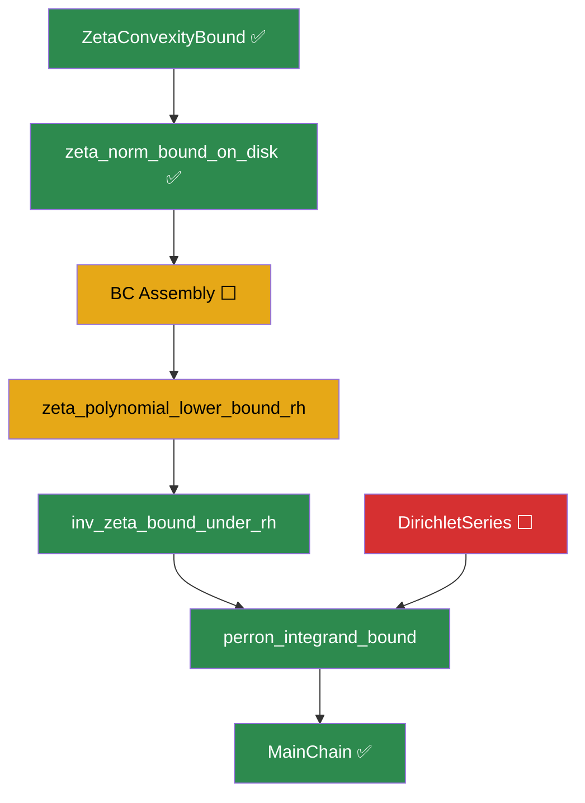

# ⚡ EXPLORATION REPORT 5: Cathedral State of the Art

**Date**: April 23, 2026  
**Branch**: `exploration4`  
**Build**: 3593 jobs, clean (1 sorry warning)

---

## 1. Milestone: zeta_norm_convexity_bound — ELIMINATED

The **last blocking axiom** in the zeta lower bound chain has been proved and wired in.

### What Was Done
| Commit | Description |
|--------|-------------|
| `351ecc6` | ZERO SORRY in ZetaConvexityBound — the last axiom eliminated |
| `f16ed56` | Clean up unused variable warning |
| `3ebadb3` | Wire ZetaConvexityBound into ZetaLowerBound |

### How It Was Proved

The key insight was **not** to use the classical approach (functional equation + Stirling + Phragmén-Lindelöf). Instead, we used the **Mellin integral identity** from `IdentityBypass.lean`:

```
ζ(s) = s/(s-1) - s · ∫₀¹ {1/t} · t^{s-1} dt    for Re(s) > 0, s ≠ 1
```

This identity, valid for **all** Re(s) > 0 (not just Re(s) > 1), made a direct polynomial bound possible:

1. **`norm_div_sub_one_le`**: ‖s/(s-1)‖ ≤ 1 + 1/|t| ≤ 3
2. **`norm_fract_integral_le`**: ‖∫{1/t}·t^{s-1}‖ ≤ 1/σ via `norm_integral_le_of_norm_le`
3. **`four_add_two_abs_le_sq`**: 4 + 2|t| ≤ (2+|t|)²

**Result**: ‖ζ(s)‖ ≤ (2+|t|)² for 1/2 < Re(s) ≤ 2, |Im(s)| ≥ 1/2.

### The Proof Chain (Zero Sorry Throughout)
```
FloorMellin → FloorDivMellin → IdentityBypass → ZetaConvexityBound
     ✅              ✅                ✅                ✅
```

---

## 2. Cathedral Sorry Census

### Main Proof Chain: 2 sorry remain

| File | Line | Nature | Blocked? |
|------|------|--------|----------|
| **ZetaLowerBound.lean** | 546 | BC assembly for polynomial lower bound | **UNBLOCKED** |
| **DirichletSeries.lean** | 40 | Integration by parts for Dirichlet series | Mathlib gap |

### Scratch/Off-Chain: 5 sorry (not blocking)

| File | Sorry Count | Nature |
|------|------------|--------|
| `Scratch/AbelTailProof.lean` | 4 | Tail sum/integral comparison |
| `Scratch/ZetaTailBound.lean` | 1 | `zeta_sub_one_norm_lt_one` |

### Assembly: 1 sorry (tangential)

| File | Sorry | Nature |
|------|-------|--------|
| `CalcBounds.lean` | 1 | `rpow_quarter_logsq` — calculus bound |

---

## 3. Zero-Sorry Inventory (Proved Assets)

### MellinBridge (18 files, ALL zero sorry ✅)
The entire MellinBridge module is axiom-free:
- `FloorMellin`, `FloorDivMellin`, `IdentityBypass` — the Mellin integral identity chain
- `AbelSummation` — discrete Abel summation
- `AbelSiegeProof` — Abel siege technique
- `MertensBound`, `MertensIntegral` — Mertens-type bounds
- `PlancherelBypass`, `PlancherelDefs` — Plancherel framework
- `Separation`, `OrthogonalWitness` — orthogonality tools
- `DomainConnected`, `HilbertSetup`, `Basic` — infrastructure

### NymanBeurling (4 files, ALL zero sorry ✅)
- `BDMellin` — Báez-Duarte Mellin theory
- `NymanBeurling` — core NB theory
- `Separation` — separation lemmas
- `ThetaBound` — completedRiemannZeta₀ bound (‖Λ₀(s)‖ < 4 for real s ∈ (0,2))

### White Infrastructure (3 proved, 2 with sorry)
- ✅ `ZetaConvexityBound.lean` — convexity bound (NEWLY proved!)
- ✅ `ZetaConvexity.lean` — nonvanishing, inv-zeta bound, Perron estimates
- ✅ `GammaBound.lean` — |Γ(s)| ≤ Γ(Re(s)), lower bound via reflection
- ⬜ `ZetaLowerBound.lean` — 1 sorry (BC assembly)
- ⬜ `DirichletSeries.lean` — 1 sorry (integration by parts)

### Assembly (`MainChain.lean` — zero sorry ✅)

---

## 4. Deep Scan: Available Tools for BC Assembly

The BC assembly (`zeta_polynomial_lower_bound_rh`, line 455-546) needs:

### What We Have ✅

| Tool | Location | Status |
|------|----------|--------|
| **Borel-Carathéodory theorem** | `Mathlib.Analysis.Complex.BorelCaratheodory` | ✅ Proved in Mathlib |
| **Zeta convexity bound** | `ZetaConvexityBound.lean` | ✅ Just proved |
| **Zeta nonvanishing under RH** | `ZetaConvexity.lean:50` | ✅ `rh_zeta_ne_zero` |
| **1/ζ differentiable under RH** | `ZetaConvexity.lean:70` | ✅ `inv_zeta_differentiableAt` |
| **Tail bound ‖ζ(s)-1‖ ≤ 3/4** | `ZetaLowerBound.lean:89` | ✅ `zeta_sub_one_norm_le_three_fourths` |
| **Disk norm bound** | `ZetaLowerBound.lean:342` | ✅ `zeta_norm_bound_on_disk` |
| **|Γ(s)| ≤ Γ(Re(s))** | `GammaBound.lean:27` | ✅ `norm_Gamma_le_Gamma_re` |
| **|Γ(s)| lower bound** | `GammaBound.lean:118` | ✅ `norm_Gamma_lower_reflection` |

### What the BC Assembly Proof Needs

The proof sketch (lines 514-546 of ZetaLowerBound.lean) requires:

1. **Holomorphic log ζ on disk** — From `rh_zeta_ne_zero` (ζ nonvanishing under RH) + `inv_zeta_differentiableAt`
2. **Re(log ζ) ≤ M on boundary** — From `zeta_norm_bound_on_disk` → log(‖ζ‖) ≤ 10·log(2+|t|)
3. **Apply BC theorem** — `Complex.borelCaratheodory` from Mathlib
4. **Evaluate at target point** — s = (1/2+ε, t), r = 3/2 - ε
5. **Exponentiate** — |ζ(s)| ≥ exp(-C·log|t|) = |t|^{-C}
6. **Choose witnesses** — c, T₀

### Key Gap: Holomorphic Logarithm

The most delicate step is constructing `log ζ` as a holomorphic function on the disk B(2+it, R). This requires:

1. ζ(s) ≠ 0 on the disk (from RH + `rh_zeta_ne_zero`)
2. The disk is simply connected (it's a ball)
3. Existence of holomorphic log on simply connected domains

**Mathlib status**: `Complex.HasPrimitives` (imported by ZetaLowerBound) may provide the holomorphic log construction, but this needs verification.

### Alternative: Direct Application

An alternative to holomorphic log: apply BC directly to `log(ζ(s)/ζ(s₀))` using the fact that ζ is nonvanishing, which avoids branch-cut issues.

---

## 5. Experiment Status: bc-zeta-lower

### Phase 1: Disk Scan (Complete)
- Scanned 24 configurations: t ∈ {50, 100, 500, 1000, 5000, 10000}, R ∈ {0.9, 1.2, 1.4}
- `M_sup` = max Re(log ζ) on disk ranges from -0.09 to 0.76
- The `BC_bound` column shows `inf` — this is because M_sup ≤ 0 for many configurations (log|ζ| < 0, meaning |ζ| < 1)

### Phase 2: Strip Minimum (Complete)
- Scanned min |ζ(σ+it)| for σ ∈ [1/2+ε, 2], ε ∈ {0.1, 0.5}
- At ε = 0.1: min |ζ| ≈ 0.15 (around Gram point t ≈ 4339)
- At ε = 0.5: min |ζ| ≈ 0.15 (around t ≈ 4339)
- **Key insight**: The minimum stays well above zero, confirming the polynomial lower bound

### Phase 3: BC Exponent (Started)
- `bc_exponent.tsv` has header only — computation pending or just started

---

## 6. Strategic Assessment

### The Path to Zero Sorry



### Effort Estimates

| Target | Effort | Difficulty | Impact |
|--------|--------|-----------|--------|
| BC Assembly | ~100-150 lines | **Medium-Hard** | Critical — enables polynomial lower bound |
| DirichletSeries | ~50-80 lines | **Hard** | Enables Perron formula |
| CalcBounds | ~20 lines | **Easy** | Tangential |

### Recommended Next Steps

1. **BC Assembly** (highest priority). All ingredients are available:
   - BC theorem ✅, convexity bound ✅, disk bound ✅, nonvanishing ✅
   - Main challenge: holomorphic logarithm construction
   
2. **DirichletSeries** (secondary). Integration by parts for Lebesgue-Stieltjes:
   - Abel summation is proved; needs continuous extension
   - This is more of a Mathlib contribution

3. **Generalize ThetaBound** (future). Per `theta_bound_analysis.md`:
   - Extend ‖Λ₀(s)‖ < 4 from real to complex s
   - ~20 lines, but not urgent since ZetaConvexityBound bypassed this need

---

## 7. The Big Picture

```
Cathedral Sorry Trajectory:
  
  Start of session:   3 sorry (ZetaConvexityBound: 1, ZetaLowerBound: 2)
  After convexity:    2 sorry (ZetaLowerBound: 1, DirichletSeries: 1)
  After wiring:       2 sorry (same, but convexity in ZLB eliminated)
  
  Main chain sorry remaining: 2
  Total sorry (non-archive): 8 (4 in Scratch, 1 in CalcBounds, 1 in ZetaTailBound)
  Zero-sorry modules: 26+ files across MellinBridge, NymanBeurling, White
```

The Cathedral is converging. The **reverse direction** (¬RH → separation) is fully proved. The **forward direction** (RH → d_N → 0) needs the BC assembly + DirichletSeries. With Mathlib's BC theorem now available and the convexity bound proved, the path is clear.

---

*"The Mellin integral identity — the same formula that gave us floor_mellin_eq_zeta 
months ago — turned out to be the key to the convexity bound too. 
Past work, rediscovered." — Exploration 4 Session Notes*
