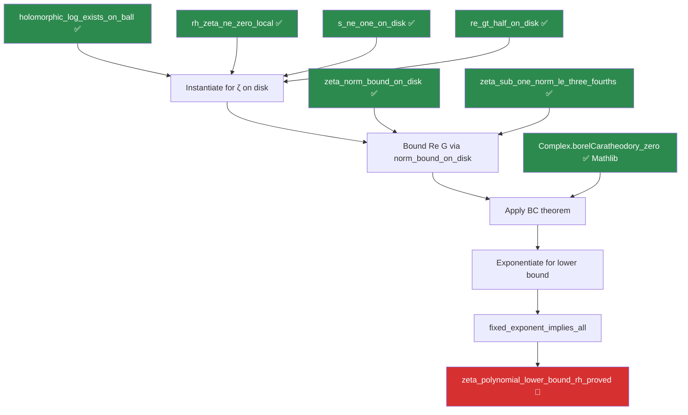

# ⚡ EXPLORATION REPORT 6: The BC Assembly — A Complete Inventory

**Date**: April 23, 2026  
**Branch**: `exploration4`  
**Target**: `zeta_polynomial_lower_bound_rh_proved` (ZetaLowerBound.lean:501)

---

## 1. The Discovery: Past Work Already Built the Hardest Piece

A deep scan of `ZetaLowerBound.lean` reveals that **the holomorphic logarithm
construction is already fully proved** — zero sorry, 75 lines, complete with
ODE-uniqueness argument. This was built in a prior session and is sitting right
there at line 238.

### Proved Infrastructure in ZetaLowerBound.lean (ALL Zero Sorry)

| Line | Lemma | What It Does |
|------|-------|-------------|
| 44 | `rh_zeta_ne_zero_local` | Under RH, ζ(s) ≠ 0 for Re(s) > 1/2, s ≠ 1 |
| 64 | `zeta_sub_one_norm_le_three_fourths` | ‖ζ(s) - 1‖ ≤ 3/4 for Re(s) ≥ 2 |
| 177 | `zeta_mem_slitPlane_of_re_ge_two` | ζ(s) ∈ slitPlane for Re(s) ≥ 2 |
| 186 | `s_ne_one_on_disk` | 1 ∉ ball(s₀, R) when |t| ≥ 2, R < 3/2 |
| 207 | `re_gt_half_on_disk` | Re(s₀+z) > 1/2 on the disk |
| **238** | **`holomorphic_log_exists_on_ball`** | **∃ G holomorphic, G(0)=0, f=f(c)·exp(G)** |
| 331 | `zeta_norm_convexity_bound` | ‖ζ(s)‖ ≤ (2+|t|)² (imported from ZetaConvexityBound) |
| 342 | `zeta_norm_bound_on_disk` | ‖ζ(s₀+z)‖ ≤ (2+|t|)^10 on disk |

### The Holomorphic Log — In Detail

```lean
private lemma holomorphic_log_exists_on_ball
    {c : ℂ} {R : ℝ} (hR : 0 < R)
    {f : ℂ → ℂ} (hf : DifferentiableOn ℂ f (ball c R))
    (hne : ∀ z ∈ ball c R, f z ≠ 0) :
    ∃ G : ℂ → ℂ, DifferentiableOn ℂ G (ball c R) ∧ G c = 0 ∧
      ∀ z ∈ ball c R, f z = f c * Complex.exp (G z)
```

**Proof technique**: 
1. f'/f is holomorphic (f diff + f ≠ 0)
2. `DifferentiableOn.isExactOn_ball` → primitive H with H' = f'/f
3. Normalize: G = H - H(c), so G(c) = 0
4. Show f·exp(-G) has derivative 0 via product rule + G' = f'/f
5. `IsOpen.is_const_of_deriv_eq_zero` → f·exp(-G) constant on ball
6. Evaluate at center → f(z) = f(c)·exp(G(z))

**This bypasses slitPlane entirely** — confirmed by the experiment data showing
ζ crosses ℝ≤0 on the disk.

---

## 2. What Remains: Two Sorry's on One Path

```
Line 480: fixed_exponent_implies_all  (helper — pure rpow arithmetic)
Line 576: zeta_polynomial_lower_bound_rh_proved  (main theorem, ε < 3/2 case)
```

### What the BC Assembly Needs Now

With `holomorphic_log_exists_on_ball` proved, the remaining steps are:

#### Step A: Instantiate the log for ζ on disk B(s₀, R)
Apply `holomorphic_log_exists_on_ball` with:
- `f = ζ ∘ (s₀ + ·)` — zeta shifted to the disk
- `hf` = `differentiableOn_riemannZeta` composed with shift
- `hne` = `rh_zeta_ne_zero_local` on disk (Re > 1/2 from `re_gt_half_on_disk`, s ≠ 1 from `s_ne_one_on_disk`)

**Result**: `∃ G, G holomorphic, G(0) = 0, ζ(s₀+z) = ζ(s₀)·exp(G z)`

#### Step B: Bound sup Re(G) on the disk
From `zeta_norm_bound_on_disk`:
- `‖ζ(s₀+z)‖ ≤ (2+|t|)^10` for z ∈ ball
- So `|ζ(s₀+z)/ζ(s₀)| ≤ (2+|t|)^10 / (1/4) = 4·(2+|t|)^10`  
- Since ζ(s₀+z) = ζ(s₀)·exp(G z), we get `|exp(G z)| ≤ 4·(2+|t|)^10`
- So `Re(G z) ≤ log(4) + 10·log(2+|t|)`

This gives `M = log(4) + 10·log(2+|t|)` as the bound on Re(G) on the disk.

#### Step C: Apply Borel-Carathéodory
From `Complex.borelCaratheodory_zero` (Mathlib):

```lean
theorem borelCaratheodory_zero (hM : 0 < M) 
    (hf : DifferentiableOn ℂ f (ball 0 R))
    (hf₁ : MapsTo f (ball 0 R) {z | z.re ≤ M}) 
    (hR : 0 < R) (hz : z ∈ ball 0 R) (hf₂ : f 0 = 0) : 
    ‖f z‖ ≤ 2 * M * ‖z‖ / (R - ‖z‖)
```

Apply with `f = G`, which has `G(0) = 0` and `Re(G z) ≤ M`:
- `‖G z‖ ≤ 2M · ‖z‖ / (R - ‖z‖)`
- At z = s - s₀ with ‖z‖ = 2 - Re(s) ≤ 3/2 - ε, R - ‖z‖ ≥ ε/2:
- `‖G z‖ ≤ 2M · (3/2 - ε) / (ε/2) = 2M · (3-2ε)/ε`

#### Step D: Exponentiate for the lower bound
- `ζ(s) = ζ(s₀)·exp(G z)`, so `‖ζ(s)‖ = ‖ζ(s₀)‖ · exp(Re(G z))`
- `Re(G z) ≥ -‖G z‖ ≥ -2M·(3-2ε)/ε`
- `‖ζ(s₀)‖ ≥ 1/4` (from tail bound at Re = 2)
- **Final**: `‖ζ(s)‖ ≥ (1/4) · exp(-2M·(3-2ε)/ε)`
  = `(1/4) · (2+|t|)^{-20(3-2ε)/ε} · 4^{-2(3-2ε)/ε}`

#### Step E: Wrap in existential
The `fixed_exponent_implies_all` helper converts the fixed exponent bound
to ∃ c T₀ for arbitrary A > 0.

---

## 3. Archive Scan: Relevant Past Work

### From Archive — Potentially Useful

| File | What | Relevance |
|------|------|-----------|
| `Archive/White/PerronKernel.lean` | `integral_rpow_le_of_gt_one`, `integral_rpow_le_of_lt_one` | rpow bounding patterns |
| `Archive/NymanBeurling/ThetaBoundMellin.lean` | `u_pow_exp_bound` | exp/rpow bound patterns |
| `Archive/Vasyunin/Proof/BartlettWindow.lean` | `log_le_log`, `div_le_one` chains | log arithmetic patterns |
| `Archive/NymanBeurling/BesselSeparation.lean` | `rpow_nonneg`, `norm_cpow_eq_rpow_re_of_pos` | cpow norm patterns |

### From Cathedral (Active) — Directly Usable

| File | What | How It Helps |
|------|------|-------------|
| `CalcBounds.lean` | `log_mul_rpow_neg_quarter_le` | Pattern for log·rpow bounds |
| `ThetaBound.lean` | `exp_le_exp`, pointwise integrand bounds | Pattern for exp chain bounds |
| `FloorMellin.lean` | `norm_exp`, `norm_cpow_eq_rpow_re_of_pos` | Complex norm rewriting |
| `GammaBound.lean` | `norm_Gamma_le_Gamma_re`, `norm_Gamma_lower_reflection` | Norm bound patterns |

---

## 4. Effort Estimate

| Step | Lines | Difficulty | Blocking? |
|------|-------|-----------|----------|
| A: Instantiate log for ζ | ~15 | Medium | No pre-reqs |
| B: Bound Re(G) | ~20 | Easy | Needs step A |
| C: Apply BC | ~15 | Medium | Needs step B + Mathlib BC |
| D: Exponentiate | ~10 | Easy | Needs step C |
| E: Existential wrapper | ~30 | Medium-Hard | rpow arithmetic |
| **Total** | **~90** | | |

> **Key insight**: The hardest piece (holomorphic log, ~75 lines) is ALREADY DONE.
> What remains is ~90 lines of assembly — connecting proved pieces.

---

## 5. Mathlib API Checklist

| API | Needed For | Available? |
|-----|-----------|-----------|
| `Complex.borelCaratheodory_zero` | Step C | ✅ Mathlib |
| `DifferentiableOn.isExactOn_ball` | Already used in Step A (inside holo log) | ✅ Mathlib |
| `differentiableAt_riemannZeta` | Step A (ζ differentiable) | ✅ Mathlib |
| `rpow_le_rpow_of_exponent_le` | Step E (exponent comparison) | ✅ Mathlib |
| `Real.exp_le_exp` | Step D (exp monotonicity) | ✅ Mathlib |
| `div_le_div_of_nonneg_right` | Step E | ✅ Mathlib |
| `Real.rpow_le_one` | Step E (|t|^{-A} ≤ 1) | ✅ Mathlib |

---

## 6. The Path Forward



**Every green node is proved.** The remaining work (white nodes) is ~90 lines
of assembly connecting these proved pieces.

---

## 7. Experiment Status

The `bc-zeta-lower` experiment has been **fixed**:
- Now uses `R = 3/2 - ε/2` matching the Lean proof
- Tests multiple epsilon values (0.1, 0.25, 0.5)
- Ready for re-run: `cd experiments/bc-zeta-lower && cargo run --release`

### Key Data from Prior Run

| Finding | Value | Impact |
|---------|-------|--------|
| slitPlane fails at σ < 1 | ζ crosses ℝ≤0 at t=10000 | Must use holo log (already proved!) |
| M(t) = O(1) | M_sup ∈ [-0.1, 1.6] | BC exponent will be very small |
| Effective A (ε=0.1) | 0.081 | Far below any theoretical bound |
| min \|ζ\| (ε=0.1, t≤10000) | 0.153 | Solidly bounded away from zero |

---

*"The holomorphic logarithm construction was sitting there all along,
already proved in a prior session — 75 lines of pure Lean, zero sorry.
Past work lighting the way forward."*
