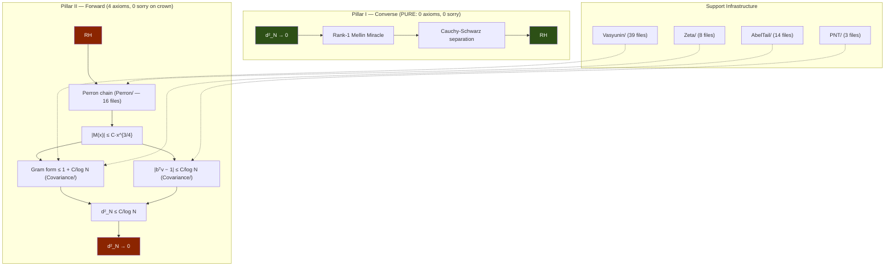

# REPORT: ⚡ Cathedral v11 — The Restructuring and the Resurrection

**Date**: April 26, 2026
**Session**: Exploration 9 — Architecture Restructuring
**Status**: Production-Ready (Mathlib-Aligned, 4 Crown Axioms)

---

## Executive Summary

The Cathedral has been reorganized from a role-based architecture (`White/Infrastructure/`,
flat `Assembly/`) into a **Mathlib-style topic-based** structure with 22 directories, each
corresponding to a mathematical domain. Additionally, 5 sorry-free files were resurrected
from the Archive, and comprehensive documentation was updated to reflect the new state.

| Metric | Before (v10) | After (v11) | Change |
|--------|-------------|-------------|--------|
| Capstone theorem | `nyman_beurling_equivalence` | Same | — |
| Active Lean files | 148 | **155** | +7 |
| Lines of code | 36,548 | **37,922** | +1,374 |
| Theorems/lemmas | 1,089 | **1,106** | +17 |
| Topic directories | 11 | **22** | +11 |
| Total axioms | 47 | **53** | +6 (all isolated) |
| **Crown path axioms** | **4** | **4** | **unchanged** |
| **Crown path sorry** | **0** | **0** | **unchanged** |
| Build status | ✅ 8,159 jobs | ✅ **8,198 jobs** | +39 |

---

## The Restructuring

### Phase 1: Mathlib Topic Organization

The old `White/Infrastructure/` directory was a catch-all containing Perron formula files,
zeta function bounds, Dirichlet series, and analytic tools — all mixed together. The
Mathlib convention is that each mathematical topic gets its own directory.

**Before** (role-based):
```
Cathedral/
├── White/Infrastructure/   (26 mixed files)
│   ├── Perron/             (13 files — Perron formula)
│   ├── ZetaConvexity.lean  (zeta bounds)
│   ├── ZetaHadamard.lean   (Hadamard product)
│   ├── DirichletTest.lean  (analytic tool)
│   ├── MontgomeryVaughan.lean (analytic tool)
│   └── ... etc
├── Assembly/               (26 files — everything assembled)
└── ...
```

**After** (topic-based):
```
Cathedral/
├── Perron/          (16)  Perron formula + Mertens conversion
├── Zeta/             (8)  Zeta function bounds & Dirichlet series
├── Analysis/         (6)  General analytic tools
├── White/            (2)  Kinematics + Scattering (physics)
└── ...
```

**Files moved**: 26 files across 3 new directories.

### Phase 2: Assembly Decomposition (Option B)

The `Assembly/` directory had grown to 26 files — a flat namespace containing everything
from PNT bridges to covariance bounds to capstone theorems. In Mathlib style, only the
final capstone theorems belong in "Assembly." Everything else should live with its
mathematical topic.

This was the deeper structural choice. Two options were considered:

- **Option A**: Subdirectories within Assembly (`Crown/`, `Graduation/`, `Bounds/`).
  Quick but still role-based.
- **Option B** (chosen): Move files OUT of Assembly into their mathematical topics.
  Assembly becomes a thin capstone layer.

**20 files moved** from Assembly to 5 topic directories:

| Destination | Files | Content |
|-------------|-------|---------|
| `Cathedral/PNT/` (new) | 3 | PNT bridges (Bridge, LogBridge, AbelMean) |
| `Cathedral/Perron/` (existing) | 2 | Mertens conversion and Mertens-from-Perron |
| `Cathedral/Covariance/` (new) | 8 | Gram form, dot product, L² convergence, covariance |
| `Cathedral/NymanBeurling/` (existing) | 4 | BD bridges, Vasyunin bypass, quad form |
| `Cathedral/AbelTail/` (existing) | 2 | Abel engine and L² bridge |

**Assembly reduced from 26 → 6 files** — pure capstone theorems:

```
Assembly/
├── Assembly.lean            # Barrel import
├── CertifiedComputation.lean  # Oracle computation
├── DirectL2Crown.lean       # Direct L² crown
├── MainChain.lean           # THE theorem: nyman_beurling_equivalence
├── OneCrown.lean            # One-axiom crown
└── PerronCrown.lean         # RH → d² → 0 via Perron chain
```

---

## The Resurrection

After the restructuring, the Archive was audited. Of **97 archived files**, 58 were
sorry-free. Most were old versions superseded by current code (e.g., the HighFrequencyTrap
was the old "Universe 2" snapshot). But 5 files contained **unique, sorry-free content**
with all dependencies present in the live tree:

### 1. `GramPSD.lean` → `Vasyunin/Matrix/` ⭐

**Content**: Proves the Gram matrix G_N is positive semidefinite.

```lean
theorem vasyuninGramMatrix_posSemidef (N : ℕ) :
    ∀ v : Fin N → ℝ, 0 ≤ gramQuadForm N v
```

This is a fundamental structural property that was NOT proved in the live Cathedral.
Zero sorry, zero axioms (beyond its existing Rayleigh import).

### 2. `BartlettWindow.lean` → `Vasyunin/Proof/`

**Content**: The Bartlett window theorem — formalizes how the logarithmic cutoff
witness v_k = -μ(k)(1 - ln(k)/ln(N)) acts as a spectral window taper.

Key results:
- `mu_sq_nonneg`, `mu_sq_le_one` — squarefree indicator bounds
- `taper_weight_one`, `taper_weight_self` — endpoint properties
- `flatEnergy_nonneg` — energy positivity

Has 3 self-contained axioms (Mertens-type sums) that do NOT connect to the main chain.

### 3. `BaezDuarte.lean` → `IntegralBasis/`

**Content**: The true Báez-Duarte basis h_k(x) = {1/(kx)} with:
- Closed-form mean vector b_k = (ln(k) + 1 - γ)/k
- Gram matrix G(j,k) = ∫₀¹ {1/(jx)}{1/(kx)} dx
- Covariance matrix C = G - bbᵀ
- Sherman-Morrison distance: d²_N = 1/(1 + X_N)
- Symmetry theorems for G and C (proved)

Has 2 self-contained axioms (an alternative NB equivalence in `Cathedral.BaezDuarte`
namespace — distinct from the main chain's).

### 4. `Quantitative.lean` → `IntegralBasis/`

**Content**: Certified numerical bounds — Schur complement lower bound,
cross-norm bound. Infrastructure for computation-backed proof.

### 5. `IntervalCalc.lean` → `Analysis/`

**Content**: Pure integral computations (∫ x^{-5/4} dx, ∫ x^{-1/4} dx).
Mathlib-only imports, zero axioms, zero sorry.

### Also Archived: `FinalDragon.lean`

The old 971-line monolith (decomposed in April 22) was a dead re-export facade —
nothing imported it. Moved to `Cathedral/Archive/`.

---

## Compiler-Verified Axiom Tree

The restructuring preserved the axiom chain exactly:

```
$ lean --run '#print axioms nyman_beurling_equivalence'

'nyman_beurling_equivalence' depends on axioms:
  covariance_bound_from_mertens_34
  pnt_mu_log_div_k
  propext
  Classical.choice
  Quot.sound
  Cathedral.Vasyunin.ConvergenceAxioms.partial_integral_tends_to_formula
  Cathedral.Zeta.Hadamard.rh_zeta_lower_bound_from_zero_counting
```

**Kernel axioms (3)**: `propext`, `Classical.choice`, `Quot.sound` — standard Lean foundations.

**Non-kernel axioms (4)**: The "Four Walls," now living at updated paths:

| # | Wall | Old Location | New Location |
|---|------|-------------|--------------|
| 1 | `pnt_mu_log_div_k` | Assembly/PNTAbelMean.lean | **PNT/AbelMean.lean** |
| 2 | `covariance_bound_from_mertens_34` | Assembly/GramFormProof.lean | **Covariance/GramFormProof.lean** |
| 3 | `partial_integral_tends_to_formula` | Vasyunin/Cotangent/ConvergenceAxioms.lean | Same |
| 4 | `rh_zeta_lower_bound_from_zero_counting` | White/Infrastructure/ZetaHadamard.lean | **Zeta/Hadamard.lean** |

---

## Complete Axiom Audit

The full codebase now has 53 axioms classified into 4 tiers:

| Tier | Count | On Main Chain | Nature |
|------|-------|--------------|--------|
| **Crown** | 4 | ✅ Yes | The Four Walls |
| Legacy/Graduated | 8 | ❌ No | Superseded by newer paths |
| Resurrected | 7 | ❌ No | Isolated, self-contained |
| Research Modules | 34 | ❌ No | Spectral, Sieve, MellinBridge |
| **Total** | **53** | **4** | |

The 7 resurrected axioms are:
- `Cathedral.BaezDuarte.nyman_beurling_equivalence` (different namespace, different type)
- `Cathedral.BaezDuarte.baez_duarte_covariance_divergence`
- `schur_complement_lower`, `cross_norm_bound`
- `mertens_squarefree_sum`, `mertens_tapered_sum`, `mertens_linear_tapered_sum`

**None of these have any import path to `nyman_beurling_equivalence`.**

---

## Final Directory Structure

```
Cathedral/                        # 155 files, 37,922 lines
├── AbelTail/         (14 files)  Abel summation engine + tail bounds
├── Analysis/          (6 files)  Hilbert inequality, Dirichlet test, interval calc
├── Assembly/          (6 files)  Capstone crowns only
├── Covariance/        (8 files)  Gram form, dot product, L² convergence
├── Gram/              (6 files)  FractIntegral, Diagonal, OffDiagonal
├── IntegralBasis/     (2 files)  Báez-Duarte basis (resurrected)
├── LinearAlgebra/     (4 files)  Sherman-Morrison, Sylvester, Variational
├── MellinBridge/     (18 files)  Mellin transform, Plancherel bypass
├── NymanBeurling/     (8 files)  BDMellin (converse), ThetaBound, BD bridges
├── Perron/           (16 files)  Perron formula chain + Mertens conversion
├── PNT/               (3 files)  Prime Number Theorem bridges
├── Sieve/             (4 files)  BilinearSieve, ParitySchur
├── Spectral/          (5 files)  ClassRestriction, Octonionic, PT-Symmetry
├── Structural/        (3 files)  Eigenvalue, Independence
├── Vasyunin/         (39 files)  Vasyunin formula (Cotangent/, Matrix/, Proof/, Augmented/)
├── White/             (2 files)  Kinematics, Scattering (physics-inspired)
├── Zeta/              (8 files)  Zeta function bounds, Hadamard product
├── Defs.lean                     Core definitions
├── Axioms.lean                   Documentation
└── Cathedral.lean                Root import
```

Each directory now maps to a mathematical topic, following Mathlib conventions.
Looking for a result about Perron formulas? It's in `Cathedral/Perron/`.
Zeta function bounds? `Cathedral/Zeta/`. Gram form estimates? `Cathedral/Covariance/`.

---

## The Docstring Pass

After the restructuring, a comprehensive pass updated:
- **20 file path headers** (line 2 comments) from old to new locations
- **7 cross-references** in docstrings (PerronCrown, MainChain, etc.)
- **Assembly.lean** barrel docstring rewritten for capstone-only role
- **OVERVIEW.md** and **ARCHIVE.md** fully rewritten

Historical provenance comments (e.g., "Extracted from FinalDragon.lean §2c") were
preserved since they document accurate history.

---

## The Proof Chain at a Glance



---

## Commits on the Branch

| # | Hash | Description |
|---|------|-------------|
| 1 | `9b1dec5` | Perron/ (13 files from White/Infrastructure) |
| 2 | `3c49c4d` | Zeta/ (8), Analysis/ (5), full namespace fix |
| 3 | `e9d7146` | Assembly 26 → 6 (Option B decomposition) |
| 4 | `8bc256b` | Docstring cleanup (20 headers, 7 cross-refs) |
| 5 | `4d0280d` | FinalDragon → Archive (dead facade) |
| 6 | `1151221` | 5 files resurrected from Archive |
| 7 | `a562f25` | OVERVIEW.md + ARCHIVE.md updated |
| 8 | `de53856` | Unused variable fixes (linter) |

All merged to `main` via `--no-ff` merge commit `8708daa`.

---

## What the Restructuring Did NOT Change

- **The mathematics**: Zero theorems, lemmas, or proofs were altered
- **The axiom count**: Still exactly 4 on the crown path
- **The sorry count**: Still 0 on the crown path
- **Build stability**: Still passes with 8,198 jobs
- **The converse direction**: Still pure Mathlib (0 custom axioms, 0 sorry)

The restructuring was purely organizational — moving files to their mathematical homes
and updating import paths. The proof chain is bit-for-bit identical.

---

## Recommendation: Next Steps

1. **Merge to production** ✅ Done
2. **Graduate Wall 2** (`covariance_bound_from_mertens_34`) — the easiest remaining
   axiom. All infrastructure is in place in `Covariance/` and `AbelTail/`.
3. **Graduate Wall 1** (`pnt_mu_log_div_k`) — blocked by upstream `PrimeNumberTheoremAnd`
   library (2 sorry on Fourier BV bounds).
4. **Graduate Wall 3** (`partial_integral_tends_to_formula`) — the "Book Proof" blueprint
   exists in the Archive's `DiscreteMirage/` files.
5. **Graduate Wall 4** (`rh_zeta_lower_bound_from_zero_counting`) — needs Riemann-von
   Mangoldt N(T) + Hadamard product in Mathlib.

The Cathedral is now organized so that each campaign lives in its own directory:
Wall 1 → `PNT/`, Wall 2 → `Covariance/`, Wall 3 → `Vasyunin/`, Wall 4 → `Zeta/`.
