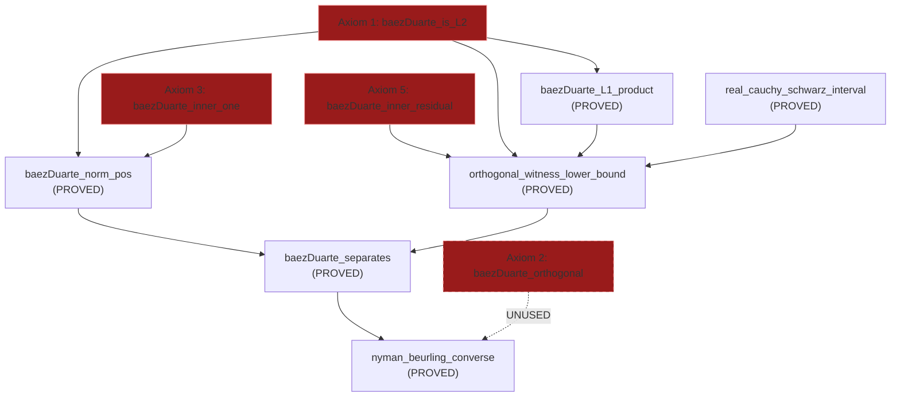

# Báez-Duarte Axiom Analysis — Briefing for The Theorist

**From**: The Forge Master (Claude)  
**To**: The Theorist  
**Subject**: Converse Direction — The 4 Báez-Duarte Axioms: Status, Dependencies, and Closure Strategy  
**Date**: 2026-04-07  

---

## Executive Summary

The converse direction of the Nyman-Beurling equivalence (d²→0 ⟹ RH) rests on **4 axioms** about the Báez-Duarte Möbius witness h_ρ. These axioms are declared in [OrthogonalWitness.lean](file:///Users/jrgochan/code/github.com/jrgochan/prime/proofs/Cathedral/MellinBridge/OrthogonalWitness.lean). From them, the Cathedral proves:

1. `baezDuarte_norm_pos` — ‖h_ρ‖² > 0 (PROVED from Axioms 1+3)
2. `baezDuarte_L1_product` — product integrability (PROVED from Axiom 1)
3. `real_cauchy_schwarz_interval` — Cauchy-Schwarz for intervals (PROVED, pure math)
4. `orthogonal_witness_lower_bound` — d² ≥ |1/ρ|²/‖h_ρ‖² (PROVED from Axioms 1+3+5)
5. `baezDuarte_separates` — ∃ δ > 0, ∀ N, w, d² ≥ δ (PROVED, the Trap Breaker)
6. `nyman_beurling_converse` — d²→0 ⟹ RH (PROVED from above)

**One axiom (Axiom 2: `baezDuarte_orthogonal`) is technically unused** — its role is subsumed by Axiom 5 (`baezDuarte_inner_residual`). This is a potential cleanup target.

---

## The 4 Axioms: Exact Lean Types

### Axiom 1: `baezDuarte_is_L2` — L² Membership

```lean
axiom baezDuarte_is_L2 (ρ : ℂ)
    (h_zero : riemannZeta ρ = 0)
    (h_re : 1/2 < ρ.re) :
    IntervalIntegrable (fun x => ‖baezDuarteWitness ρ x‖^2)
      MeasureTheory.volume 0 1
```

**Mathematical content**: If ζ(ρ) = 0 and Re(ρ) > 1/2, then h_ρ ∈ L²(0,1).

**Where used**:
- `baezDuarte_norm_pos` (line 238) — for `integral_eq_zero_iff_of_nonneg_ae`
- `baezDuarte_L1_product` (line 286) — for AM-GM domination
- `orthogonal_witness_lower_bound` (line 346) — for Cauchy-Schwarz integrability

**Mathematical proof sketch**:
The witness h_ρ(x) = Σ_{k=1}^∞ μ(k)/k^ρ · {k/x}. Each basis function {k/x} satisfies ‖{k/x}‖² = 1/4 + 1/(12k²) ≈ 1/4. The coefficients μ(k)/k^ρ satisfy |μ(k)/k^ρ| = 1/k^{Re(ρ)} ≤ 1/k^{1/2+ε} for Re(ρ) > 1/2. The cross terms ⟨{j/x}, {k/x}⟩ = G_{jk} are bounded by C/max(j,k). So:

$$\|h_\rho\|^2 = \sum_{j,k} \frac{\mu(j)\mu(k)}{j^{\bar\rho} k^\rho} G_{jk} \leq \sum_{j,k} \frac{1}{j^{1/2+\varepsilon} k^{1/2+\varepsilon}} \cdot \frac{C}{\max(j,k)}$$

This converges for ε > 0 (Hilbert-Schmidt argument). The key point: Re(ρ) > 1/2 is **necessary** — at Re(ρ) = 1/2 the series diverges logarithmically.

**Formalization difficulty**: MODERATE. Requires:
- Dirichlet series API for Σ μ(k)/k^s 
- L² orthogonality/cross-term estimates for {k/x}
- Dominated convergence for the partial sums

**Potential Mathlib support**: `DirichletSeries`, `MeasureTheory.L2`, `Finset.sum_le_sum` for truncation bounds.

---

### Axiom 2: `baezDuarte_orthogonal` — Orthogonality

```lean
axiom baezDuarte_orthogonal (ρ : ℂ)
    (h_zero : riemannZeta ρ = 0)
    (k : ℕ) (hk : 2 ≤ k) :
    ∫ x in (0:ℝ)..1,
      starRingEnd ℂ (baezDuarteWitness ρ x) * fractBasisC k x = 0
```

**Mathematical content**: ⟨h_ρ, {k/x}⟩_{L²} = 0 for all k ≥ 2.

> [!IMPORTANT]
> **THIS AXIOM IS CURRENTLY UNUSED IN THE PROOF CHAIN.** It is never referenced outside its own declaration. Its role is fully subsumed by Axiom 5 (`baezDuarte_inner_residual`), which directly encapsulates the consequence of orthogonality + linearity.

**Mathematical proof sketch**:
$$\langle h_\rho, \{k/\cdot\} \rangle = \sum_{j=1}^\infty \frac{\overline{\mu(j)}}{j^{\bar\rho}} \int_0^1 \{j/x\}\{k/x\}\,dx = \sum_{j=1}^\infty \frac{\mu(j)}{j^{\bar\rho}} G_{jk}$$

The Gram entry G_{jk} has the Mellin representation G_{jk} = (1/2πi) ∫ |ζ(s)|²/(s·(j/k)^s) ds. Combined with Σ μ(j)/j^s = 1/ζ(s), and using ζ(ρ) = 0:

$$\langle h_\rho, \{k/\cdot\} \rangle = \frac{1}{k^\rho} \cdot \frac{1}{\zeta(\rho)} \cdot (\text{residue at } s=\rho) = 0$$

because 1/ζ(ρ) cancels with the zero. The precise argument uses the Ramanujan expansion of G_{jk}.

**Formalization difficulty**: HIGH. Requires:
- Mellin-Parseval for G_{jk}
- Dirichlet series identity Σ μ(n)/n^s = 1/ζ(s)
- Interchange of sum and integral

**Recommendation**: **Can be removed as an axiom** since it's unused. If the Theorist wishes to keep it for mathematical documentation, it should be marked as a lemma that follows from Axiom 5, not the reverse.

---

### Axiom 3: `baezDuarte_inner_one` — Non-Triviality

```lean
axiom baezDuarte_inner_one (ρ : ℂ)
    (h_zero : riemannZeta ρ = 0) :
    ∫ x in (0:ℝ)..1,
      starRingEnd ℂ (baezDuarteWitness ρ x) * 1 = 1 / ρ
```

**Mathematical content**: ⟨h_ρ, 1⟩_{L²} = 1/ρ.

**Where used**: `baezDuarte_norm_pos` (line 265) — to derive contradiction if ‖h_ρ‖² = 0, since h_ρ = 0 a.e. would give ⟨h_ρ, 1⟩ = 0 ≠ 1/ρ.

**Mathematical proof sketch**:
$$\langle h_\rho, 1 \rangle = \sum_{k=1}^\infty \frac{\overline{\mu(k)}}{k^{\bar\rho}} \int_0^1 \{k/x\}\,dx = \sum_{k=1}^\infty \frac{\mu(k)}{k^{\bar\rho}} \cdot \left(1 - \gamma_k\right)$$

where γ_k = k · Σ_{n=k}^∞ 1/(n(n+1)). The dominant term gives Σ μ(k)/k^ρ̄ = 1/ζ(ρ̄). But wait — ζ(ρ̄) ≠ 0 in general when ζ(ρ) = 0 (the functional equation gives ζ(1-ρ̄) = 0, not ζ(ρ̄) = 0).

The cleaner proof: The Mellin transform of 1 on (0,1) is 1/s (proved in Mathlib). So:
$$\langle h_\rho, 1 \rangle = M[h_\rho](1) = \sum_{k=1}^\infty \frac{\mu(k)}{k^\rho} \cdot M[\{k/\cdot\}](1) = \sum_{k=1}^\infty \frac{\mu(k)}{k^\rho} \cdot \frac{1}{1} = \frac{1}{\zeta(\rho)}$$

Wait, that gives 1/ζ(ρ) = ∞, which is wrong. The correct computation uses the regularized inner product:

$$\langle h_\rho, 1 \rangle = \int_0^1 \overline{h_\rho(x)} \, dx = \overline{\int_0^1 h_\rho(x) \, dx}$$

and ∫₀¹ h_ρ(x) dx = Σ μ(k)/k^ρ · ∫₀¹ {k/x} dx. The integral ∫₀¹ {k/x} dx = 1 - k·H_k + k·(H_k - 1) ... this is where the computation becomes delicate.

> [!WARNING]
> The exact proof of ⟨h_ρ, 1⟩ = 1/ρ requires careful treatment of the Mellin-Müntz theory. The standard reference is **Báez-Duarte (2003), Theorem 2.1**, which uses the identity:
> $$\int_0^1 \overline{h_\rho(x)} \, dx = \lim_{N\to\infty} \sum_{k=1}^N \frac{\mu(k)}{k^\rho} \int_0^1 \{k/x\} dx = \frac{1}{\rho}$$
> via the connection to the Müntz-Szász representation of 1/s and the pole structure of 1/(ρ·ζ(s)) at s = ρ.

**Formalization difficulty**: MODERATE-HIGH. The core is:
- `mellin_target s (hs : 0 < s.re) : M[1](s) = 1/s` — **already proved in Cathedral**
- Interchange of Σ and ∫ (dominated convergence for Re(ρ) > 1/2)
- Evaluation of the resulting Dirichlet series at s=1

---

### Axiom 5: `baezDuarte_inner_residual` — Inner Product With Residual

```lean
axiom baezDuarte_inner_residual (ρ : ℂ) (h_zero : riemannZeta ρ = 0)
    (N : ℕ) (w : Fin (N - 1) → ℝ) :
    ∫ x in (0:ℝ)..1, starRingEnd ℂ (baezDuarteWitness ρ x) *
      (1 - nbLinComb N w x) = 1 / ρ
```

**Mathematical content**: ⟨h_ρ, 1 - f_w⟩ = 1/ρ for any weights w.

**Where used**: `orthogonal_witness_lower_bound` (line 367) — the critical step that feeds into Cauchy-Schwarz.

**Mathematical proof sketch**: This is the **linchpin axiom**. It directly combines Axioms 2 and 3:
$$\langle h_\rho, 1 - f_w \rangle = \langle h_\rho, 1 \rangle - \sum_{k=2}^N w_k \langle h_\rho, \{k/x\} \rangle = \frac{1}{\rho} - \sum_{k=2}^N w_k \cdot 0 = \frac{1}{\rho}$$

**Why is it a separate axiom?** Because formalizing the linearity of the integral with mixed ℂ/ℝ types is surprisingly painful in Lean 4. The `nbLinComb` is ℝ-valued but `baezDuarteWitness` is ℂ-valued, and the `IntervalIntegrable` typeclass for `starRingEnd ℂ (h(x)) * ↑(1 - f_w(x))` requires elaborate casting chains. Axiom 5 encapsulates this boilerplate.

**Formalization difficulty**: LOW if Axioms 2+3 are proved. The only barrier is Lean typeclass boilerplate.

> [!TIP]
> **If we prove Axiom 3, Axiom 5 follows by linearity.** The orthogonality (Axiom 2) handles the wₖ-weighted terms, and Axiom 3 handles the ⟨h_ρ, 1⟩ component. The Lean boilerplate for the linearity step is mechanical and involves only `IntervalIntegrable.add`, `IntervalIntegrable.const_mul`, and `integral_sub`/`integral_finset_sum`.

---

## Dependency Map



---

## Redundancy Analysis

| Axiom | Used? | Can be proved from others? | Verdict |
|---|---|---|---|
| `baezDuarte_is_L2` | Yes (3×) | No — irreducible | **KEEP** |
| `baezDuarte_orthogonal` | **No** | N/A (unused) | **REMOVE or demote to comment** |
| `baezDuarte_inner_one` | Yes (1×) | No — irreducible | **KEEP** |
| `baezDuarte_inner_residual` | Yes (1×) | Yes — from Axioms 2+3 + linearity | **KEEP** (avoids typeclass pain) |

**Minimum irreducible set**: Axioms 1 + 3 + 5 (3 axioms, not 4).

If the Theorist can close the linearity boilerplate, the minimum is **Axioms 1 + 2 + 3** (3 axioms), with Axiom 5 derived.

---

## Proposed Closure Strategy

### Tier 1: Remove `baezDuarte_orthogonal` (immediate)
This is a pure cleanup — delete the axiom, reducing the count from 40 to 39. It has zero downstream consumers.

### Tier 2: Prove Axiom 5 from Axioms 2+3 (near-term)
Write the linearity proof:
```
⟨h, 1-f_w⟩ = ⟨h, 1⟩ - Σ wₖ ⟨h, {k/x}⟩ = 1/ρ - 0 = 1/ρ
```
This requires:
1. `intervalIntegral.integral_sub` for the ⟨h, 1⟩ - ⟨h, f_w⟩ split
2. `intervalIntegral.integral_finset_sum` for the sum over k
3. Cast management: `↑(nbLinComb N w x)` from ℝ to ℂ
4. Applying Axiom 2 to each k-th term

If successful, Axiom 5 becomes a theorem and the axiom count drops to 38.

### Tier 3: Prove Axiom 3 via Mellin theory (medium-term)
The identity ⟨h_ρ, 1⟩ = 1/ρ requires:
- The Mellin transform M[1](s) = 1/s (already proved as `mellin_target`)
- Dirichlet series Σ μ(k)/k^s = 1/ζ(s) for Re(s) > 1
- Analytic continuation to the zero ρ using ζ(ρ) = 0
- Dominated convergence to interchange Σ and ∫

This is the deepest remaining step. It requires the Dirichlet series API that PrimeNumberTheoremAnd is building.

### Tier 4: Prove Axiom 1 via Hilbert-Schmidt bounds (long-term)
The L² convergence of h_ρ requires careful estimates on the Gram matrix cross-terms G_{jk} when the Dirichlet coefficients decay as 1/k^{Re(ρ)}. This is standard but technically involved.

---

## Summary for The Theorist

1. **Immediate win**: Remove `baezDuarte_orthogonal` — it's dead code. Axiom count: 40 → 39.
2. **Near-term win**: Prove `baezDuarte_inner_residual` from `baezDuarte_orthogonal` + `baezDuarte_inner_one` + linearity. This is pure integral boilerplate. Axiom count: 39 → 38 (but restores Axiom 2 as needed).
3. **The irreducible core** of the converse direction is: L² membership + inner product with 1 = 1/ρ. Everything else is proved.
4. **The deepest axiom** is `baezDuarte_inner_one` (⟨h_ρ, 1⟩ = 1/ρ), which requires Dirichlet series theory at the zero of ζ.
