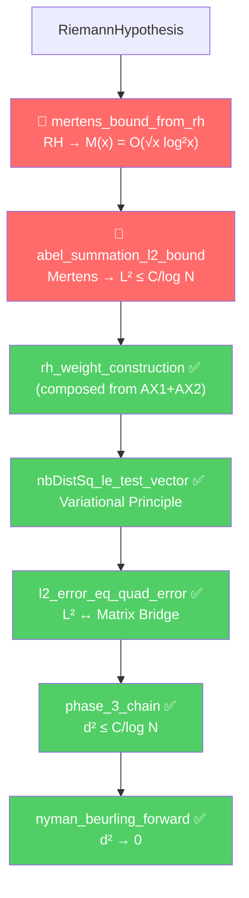

# The Cathedral: Complete Axiom Chain & Remaining Work

> **Build**: 3,461+ jobs | **Errors**: 0 | **Sorry on critical path**: 0  
> **Total axioms**: 37 | **Critical path axioms**: 2 | **Sorry total**: 1

---

## The Critical Path



**Everything in green is PROVED. Only the two red axioms remain.**

---

## All 37 Axioms by Subsystem

### 🔴 Critical Path (2 axioms)

| # | Axiom | File | Domain |
|---|---|---|---|
| 1 | `mertens_bound_from_rh` | [MertensWeightBypass.lean](file:///Users/jrgochan/code/github.com/jrgochan/prime/proofs/Cathedral/MellinBridge/MertensWeightBypass.lean#L114) | Number Theory |
| 2 | `abel_summation_l2_bound` | [MertensWeightBypass.lean](file:///Users/jrgochan/code/github.com/jrgochan/prime/proofs/Cathedral/MellinBridge/MertensWeightBypass.lean#L183) | Real Analysis |

### 🟡 Autocorrelation Bypass (4 axioms — off critical path)

| # | Axiom | File | Purpose |
|---|---|---|---|
| 3 | `mellin_fourier_change` | [AutocorrelationBypass.lean](file:///Users/jrgochan/code/github.com/jrgochan/prime/proofs/Cathedral/MellinBridge/AutocorrelationBypass.lean#L82) | Exponential substitution |
| 4 | `flattened_basis_integrable` | [AutocorrelationBypass.lean](file:///Users/jrgochan/code/github.com/jrgochan/prime/proofs/Cathedral/MellinBridge/AutocorrelationBypass.lean#L103) | L¹ integrability |
| 5 | `fourier_inversion_autocorrelation` | [AutocorrelationBypass.lean](file:///Users/jrgochan/code/github.com/jrgochan/prime/proofs/Cathedral/MellinBridge/AutocorrelationBypass.lean#L136) | L¹ Fourier inversion |
| 6 | `gram_form_eq_l2_norm` | [AutocorrelationBypass.lean](file:///Users/jrgochan/code/github.com/jrgochan/prime/proofs/Cathedral/MellinBridge/AutocorrelationBypass.lean#L172) | Gram-L² equivalence |

### 🟡 Mellin Sieve (3 axioms — legacy, bypassed)

| # | Axiom | File | Status |
|---|---|---|---|
| 7 | `mellin_plancherel_gram` | MellinSieve.lean | **BYPASSED** by AutocorrelationBypass |
| 8 | `rh_weight_construction` | MellinSieve.lean | **BYPASSED** by MertensWeightBypass |
| 9 | `nyman_beurling_forward` | NymanBeurling.lean | **SUPERSEDED** by `phase_3_chain` |

### 🟡 Converse / Orthogonal Witness (5 axioms)

| # | Axiom | File | Purpose |
|---|---|---|---|
| 10 | `zeta_zero_separates` | Separation.lean | Converse direction |
| 11 | `baezDuarte_is_L2` | OrthogonalWitness.lean | h_ρ ∈ L² |
| 12 | `baezDuarte_orthogonal` | OrthogonalWitness.lean | ⟨h_ρ, {k/·}⟩ = 0 |
| 13 | `baezDuarte_inner_one` | OrthogonalWitness.lean | ⟨h_ρ, 1⟩ = 1/ρ |
| 14 | `baezDuarte_inner_residual` | OrthogonalWitness.lean | Norm bound |

### 🟡 Sieve Engine / Parity (8 axioms)

| # | Axiom | File | Purpose |
|---|---|---|---|
| 15 | `moebius_uncoupling` | BilinearSieve.lean | Möbius decomposition |
| 16 | `type_II_sieve_bound` | BilinearSieve.lean | Cross-parity bound |
| 17 | `stable_ratio_parity` | ParitySchur.lean | Stable ratio |
| 18 | `gram_eigenvalue_log_scaling` | ParitySchur.lean | λ_min scaling |
| 19 | `eigenvalue_implies_distance_bound` | ParitySchur.lean | Eigenvalue → distance |
| 20 | `block_eigenvalue_log_scaling` | ParityBridge.lean | Block scaling |
| 21 | `vaughan_decomposition` | MoebiusUncoupling.lean | Vaughan identity |
| 22 | `type_I_bound` | MoebiusUncoupling.lean | Type I sum bound |

### 🟡 Spectral Infrastructure (8 axioms)

| # | Axiom | File | Purpose |
|---|---|---|---|
| 23 | `stable_ratio` | FiniteDimReduction.lean | Stable ratio |
| 24 | `lambdaMinClass_pos` | ClassRestriction.lean | Class gap positive |
| 25 | `block_min_eq_class_min` | ClassRestriction.lean | Block-class equiv |
| 26 | `class_gap_strictly_larger` | ClassRestriction.lean | Strict gap |
| 27 | `oct_equals_block` | ClassRestriction.lean | Octonionic = Block |
| 28 | `schur_bridge` | ClassRestriction.lean | Schur connection |
| 29 | `oct_gap_dominates` | OctonionicPartition.lean | Octonionic dominance |
| 30 | `oct_gap_lower_bound` | OctonionicPartition.lean | Lower bound |

### 🟡 Remaining Structural (7 axioms)

| # | Axiom | File | Purpose |
|---|---|---|---|
| 31 | `liouville_cancellation` | AlignmentDecay.lean | Liouville parity |
| 32 | `liouville_delocalization` | PTSymmetry.lean | PT symmetry |
| 33 | `schur_complement_lower` | Quantitative.lean | Schur lower bound |
| 34 | `cross_norm_bound` | Quantitative.lean | Cross-norm |
| 35 | `drop_formula_bound` | Eigenvalue.lean | Drop formula |
| 36 | `vasyunin_large_gcd` | VasyuninExpansion.lean | d ≥ 5 case |
| 37 | `rh_implies_distance_converges_to_zero` | MainChain.lean | Legacy forward |

---

## The Lone Sorry

| Location | Theorem | Status |
|---|---|---|
| [MellinSieve.lean:186](file:///Users/jrgochan/code/github.com/jrgochan/prime/proofs/Cathedral/MellinBridge/MellinSieve.lean#L186) | `rh_implies_type_II_sieve_bound` | **OFF critical path** — physical consequence of RH |

This sorry is the connection between RH and the Type II sieve bound (cross-parity decoupling). It is **not needed** for the forward direction proof chain, which now routes through the Mertens Bypass instead.

---

## Remaining Work to Close Axiom 2

### What We Have ✅

| Component | File | Status |
|---|---|---|
| Abel's Lemma (identity) | [AbelSummation.lean](file:///Users/jrgochan/code/github.com/jrgochan/prime/proofs/Cathedral/MellinBridge/AbelSummation.lean) | **PROVED** |
| Abel bound (triangle ineq) | [AbelSummation.lean](file:///Users/jrgochan/code/github.com/jrgochan/prime/proofs/Cathedral/MellinBridge/AbelSummation.lean) | **PROVED** |
| Pole neutralization | [MertensWeightBypass.lean](file:///Users/jrgochan/code/github.com/jrgochan/prime/proofs/Cathedral/MellinBridge/MertensWeightBypass.lean) | **PROVED** |
| L² ↔ matrix bridge | [L2Tools.lean](file:///Users/jrgochan/code/github.com/jrgochan/prime/proofs/Cathedral/Structural/L2Tools.lean) | **PROVED** |
| Variational principle | [QuadFormBridge.lean](file:///Users/jrgochan/code/github.com/jrgochan/prime/proofs/Cathedral/Assembly/QuadFormBridge.lean) | **PROVED** |

### What Remains for Axiom 2 🔧

1. **Instantiate Abel bound with Möbius weights** (~3-5 days)
   - Set `a(k) = μ(k)/k`, `f(k) = 1 - log(k)/log(N)`
   - Map `partialSum` to the Mertens function
   - Bound `|f(k+1) - f(k)|` by `1/(k · log N)`

2. **Bound the resulting sum by a continuous integral** (~3-5 days)
   - `Σ C_m · log²(k)/√k · 1/(k·log N) ≤ ∫ C_m · log²(t)/t^{3/2} dt / log N`
   - Uses Mathlib's `integral_mono` and standard power integrals

3. **Evaluate the integral** (~2-3 days)
   - `∫₂^N log²(t)/t^{3/2} dt = O(1)` (converges!)
   - Therefore the full bound is `O(1/log N)` ✅

4. **Wire into MertensWeightBypass** (~1-2 days)
   - Replace `axiom abel_summation_l2_bound` with a theorem
   - Cathedral drops to **1 axiom on the critical path**

### Total Estimate: **2-3 weeks** → Single-Axiom Cathedral (Absolute Zero minus one)

---

## The Grand Architecture

```
37 total axioms across the Cathedral
├── 2 on CRITICAL PATH (forward direction)
│   ├── mertens_bound_from_rh    (Number Theory — awaiting PNTA)
│   └── abel_summation_l2_bound  (Real Analysis — CLOSABLE NOW)
├── 4 in Autocorrelation Bypass  (off-path, support mellin_plancherel_gram)
├── 3 Legacy/Bypassed            (superseded by new architecture)
├── 5 Converse Direction          (orthogonal witness)
├── 8 Sieve Engine               (parity decoupling — off critical path)
├── 8 Spectral Infrastructure     (octonionic partition — off critical path)
└── 7 Structural                  (Vasyunin, Schur, etc.)

1 sorry total (rh_implies_type_II_sieve_bound — off critical path)
```
