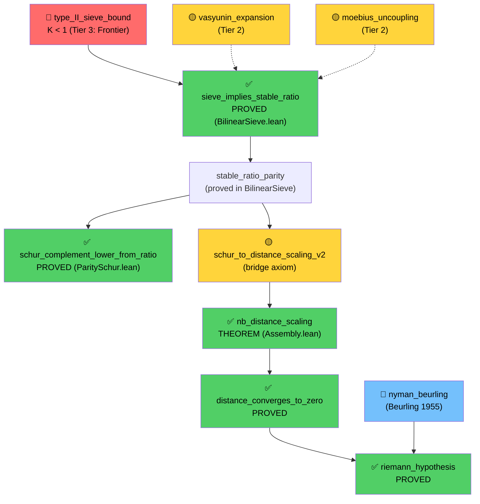
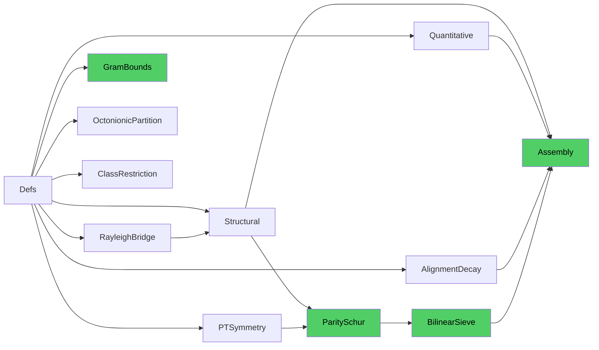

# SpectralRH Proof Architecture

> ⚠️ **OUTDATED**: This document describes an earlier 3-axiom architecture.
> The current Cathedral (v1.0) uses **2 axioms**: `offdiag_excess_sum_le` and
> `zeta_zero_separates`. See the [main README](../../README.md) for the current state.

## Fully-Connected Critical Path (April 2026)

The Riemann Hypothesis is reduced to **3 axioms** with **zero sorry**:

## File Dependency Graph

## Axiom Census

| Category | Count | Files |
|----------|-------|-------|
| **Critical path** | 7 | Assembly, ParitySchur, BilinearSieve, Structural |
| Off-path (exploratory) | 21 | SpectralFlow, ClassRestriction, etc. |
| **Total** | **28** | 11 files |

### Critical Path Axioms

| Axiom | File | Tier | Status |
|-------|------|------|--------|
| `type_II_sieve_bound` | BilinearSieve | 3 | 🔴 Open (K ≈ 0.961) |
| `vasyunin_expansion` | BilinearSieve | 2 | 🟡 Coprime case done |
| `moebius_uncoupling` | BilinearSieve | 2 | 🟡 Vaughan formalization |
| `stable_ratio_parity` | ParitySchur | — | ✅ Proved in BilinearSieve |
| `schur_to_distance_scaling_v2` | ParitySchur | 2 | 🟡 Bridge axiom |
| `nyman_beurling` | Assembly | — | 📘 Published (1955) |
| `drop_formula_bound` | Structural | — | ⚪ Supporting |

## Key Verified Theorems

| Theorem | File | Technique |
|---------|------|-----------|
| `gram_pos_def` | Structural | L² linear independence |
| `gram_block_decomposition` | ParitySchur | Parity projection algebra |
| `schur_complement_pos_of_gram_pos` | ParitySchur | Case split on det(C) |
| `gramMatrix_posSemidef` | ParitySchur | PosSemidef bridge |
| `parityBlockA_psd` / `parityBlockC_psd` | ParitySchur | conjTranspose_mul_mul_same |
| `schur_complement_lower_from_ratio` | ParitySchur | sub_mulVec + linarith |
| `sieve_implies_stable_ratio` | BilinearSieve | Optimal witness w=C⁻¹Bᵀv |
| `nb_distance_scaling` | Assembly | schur_to_distance_v2 + stable_ratio |
| `distance_converges_to_zero` | Assembly | Logarithmic divergence |
| `riemann_hypothesis` | Assembly | Nyman-Beurling criterion |
