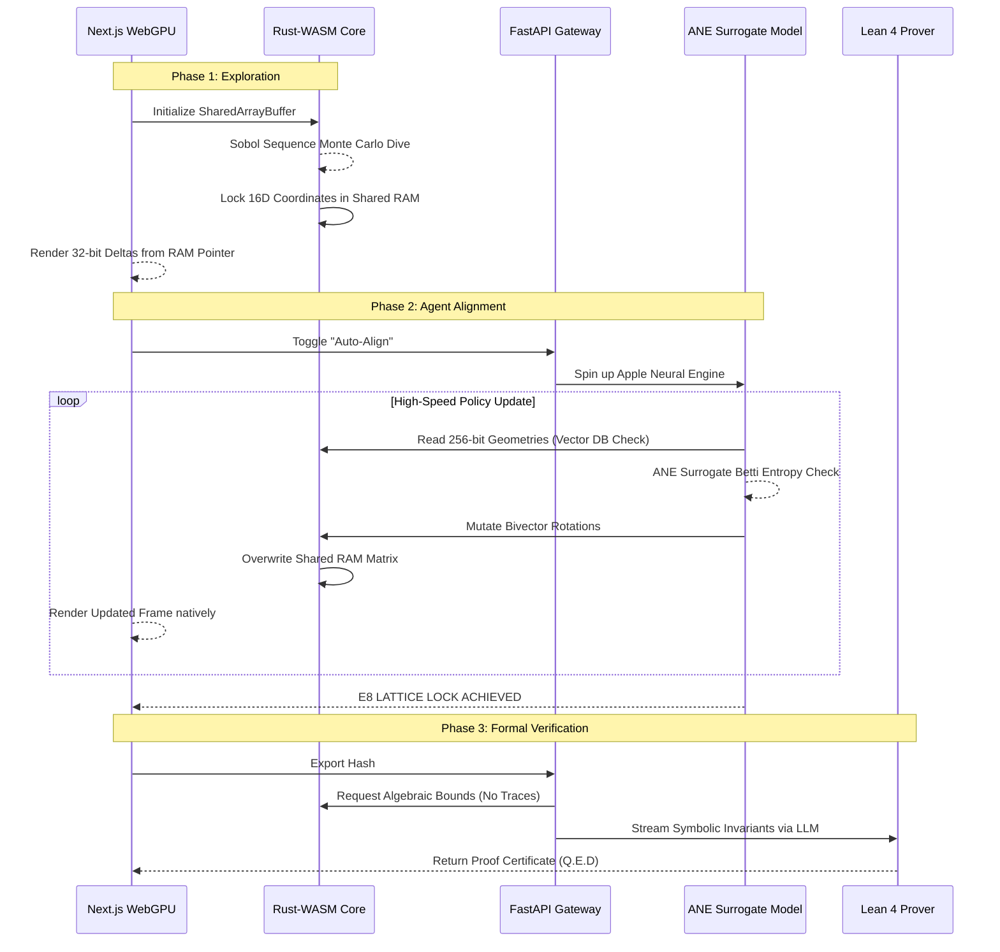

# Project HYPERZETA Data Flow

This diagram illustrates the separation of concerns inside Version 5.0, where heavy UI physics data is mapped instantly across WASM memory walls, while the Python Gateway handles orchestration.

