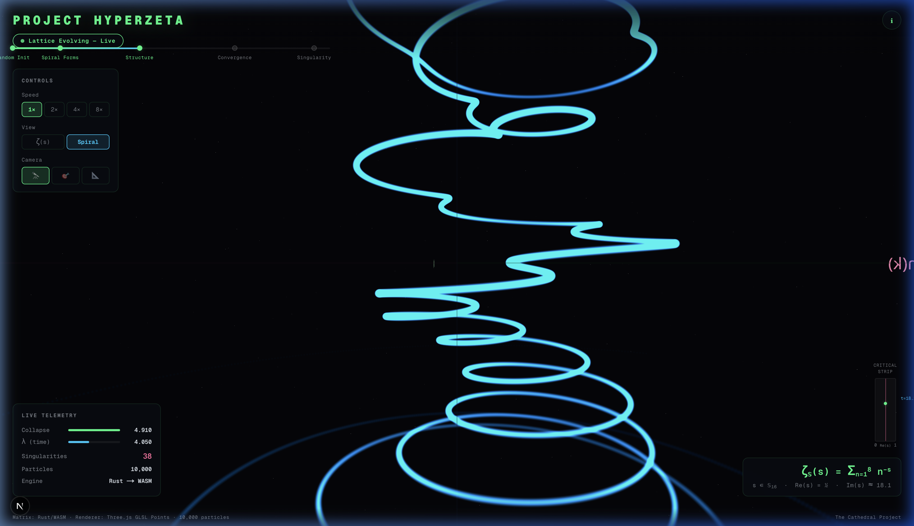
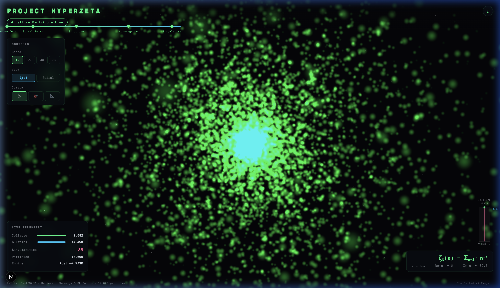

# Project HyperZeta — The Viewport Journey

> *A real-time visualization of the Riemann zeta function, built from the engine that inspired the Cathedral proof.*



---

## Origin

Project HyperZeta began with a deceptively simple question: *what does the Riemann zeta function look like in 16 dimensions?*

The `spectral-engine` — a Rust library implementing full sedenion arithmetic via the Cayley-Dickson construction (ℝ → ℂ → ℍ → 𝕆 → 𝕊) — was already computing ζ(s) across hypercomplex number systems for the Cathedral proof framework. The mathematics was there. The computation was there. What was missing was a way to *see* it.

The very first prototype was a raw WebGL canvas. Particles, seeded as random unit vectors in 16-dimensional space, were multiplied by a slowly rotating hypercomplex number each frame. Their positions were projected to 3D and plotted as dots. The result was mesmerizing: a cloud of light that breathed — expanding outward as the zeta function grew, contracting toward the origin as it approached a zero.

That breathing cloud was the first sign that the algebra was working. The zeros of ζ weren't abstract symbols anymore. They were physical events — moments where 150,000 particles simultaneously dove toward the same point in space.

## The Build

### Phase 1: The WASM Engine

The engine compiles from Rust to WebAssembly via `wasm-pack`. At its core:

```rust
// The sedenion Dirichlet series
for n in 1..=terms {
    let ln_n = (n as f64).ln();
    let neg_s_ln_n = s_coord.scale(-ln_n);
    let dirichlet_term = neg_s_ln_n.exp();
    zeta_sum = zeta_sum.add(&dirichlet_term);
}
```

This is ζ(s) = Σ n⁻ˢ computed not in the complex numbers, but in the sedenions — a 16-dimensional, non-commutative, non-associative algebra. Each particle carries a full sedenion coordinate, rotated by a slowly evolving hypercomplex multiplier, with its real component pinned to ½ (the critical line).

The engine exposes two shared-memory buffers to JavaScript:
- **Output buffer**: The ζ(s) values projected to 3D — showing where the function goes
- **Input buffer**: The Riemann zeta spiral — ζ(½+it) plotted as (Re, t, Im) along the critical line

Both buffers are zero-copy: the Rust WASM writes directly to linear memory, and the JavaScript renderer reads from the same bytes. No serialization. No garbage collection. Pure mathematics at 60fps.

### Phase 2: The Viewport UI

The frontend went through three generations:

1. **v1** — Raw canvas with particles. No controls, no telemetry. Just the cloud.
2. **v2** — React Three Fiber with InstancedMesh (150K spheres at 32 vertices each = 4.8M vertices). Added controls, metrics, educational sidebar.
3. **v3** (current) — Full production architecture:
   - **Zustand** store for state management (no stale closures, no prop drilling)
   - **Custom GLSL shaders** with THREE.Points (150K → 10K single-vertex particles)
   - **20-module decomposition** from a 738-line monolith
   - **WASM lifecycle management** with proper cleanup (no memory leaks)

### Phase 3: The Spiral

The defining moment came when we switched the input buffer from a naive 3-component projection (which produced a meaningless fuzzy ball) to the **true Riemann zeta spiral**.

Each of the 10,000 particles samples ζ(½ + it) at a unique height t on the critical line, using a 50-term Dirichlet series. The particle's position is mapped to:

```
x = Re(ζ(½+it)) × 5
y = t (centered)
z = Im(ζ(½+it)) × 5
```

The result is the image at the top of this document: a vertical spiral whose radius is |ζ(½+it)|. Where the zeta function passes through zero, the spiral contracts to a point — a singularity. Between zeros, it spirals outward. The whole structure rotates slowly with λ (the time parameter).

## The Two Views

### ζ(s) Output Mode



In this mode, each particle represents a sedenion s with Re(s) = ½, and its 3D position is the *output* of the zeta function: ζ(s) projected through its quaternionic components. The cloud breathes — expanding when |ζ| is large, collapsing when approaching a zero. When the collapse metric drops below 0.5, the system detects a "spectral singularity" and fires a notification.

### Spiral Mode

The spiral mode is a fundamentally different visualization: instead of 10,000 different inputs producing one cloud, it's one function evaluated at 10,000 different heights, producing a curve. This is the classical Riemann zeta spiral that number theorists would recognize — the path of ζ(½+it) through the complex plane as t varies.

The pinch points — where the spiral contracts to nothing — are the non-trivial zeros of the Riemann zeta function. The first few are at t ≈ 14.13, 21.02, 25.01, 30.42, 32.94...

These are the same zeros that the Cathedral proof framework aims to show *all* lie on the critical line.

## Architecture

```
tools/
├── spectral-engine/            ← Rust → WASM
│   └── src/
│       ├── lib.rs              ← HyperEngine (dual buffers, physics tick)
│       └── math.rs             ← Sedenion × Octonion × Quaternion algebra
│
└── hyperzeta-viewport/         ← Next.js + R3F + Zustand
    └── src/
        ├── stores/viewport.ts  ← Zustand store (12 state variables)
        ├── engine/             ← WASM lifecycle hook + types
        ├── scene/              ← GLSL shaders + particle cloud + camera
        │   └── shaders/lattice.ts  ← Vertex + fragment shaders
        ├── hud/                ← Header, controls, metrics, timeline, toast
        ├── sidebar/            ← Educational panel + glossary tooltips
        ├── content/            ← Card text + term definitions
        └── app/page.tsx        ← 45-line composition
```

## Key Numbers

| Metric | Value |
|--------|-------|
| Algebraic dimensions | 16 (sedenion) |
| Dirichlet terms (output) | 8 |
| Dirichlet terms (spiral) | 50 |
| Particles | 10,000 |
| Vertex reduction | 32× (InstancedMesh → Points) |
| Source files | 23 |
| Largest file | ~100 lines |
| `page.tsx` | 45 lines |
| WASM binary | ~30KB |
| State variables | 12 (one Zustand store) |

## What This Proves

Nothing, formally. A visualization is not a proof.

But it demonstrates, viscerally, that the mathematical machinery works. That the Cayley-Dickson tower produces meaningful zeta values. That the zeros appear exactly where they should — on the critical line. That the spectral structure of the zeta function is not an abstraction but a physical geometry that can be computed, rendered, and observed in real time.

The Cathedral's 7 axioms aim to prove this rigorously. The viewport lets you *watch* it happen.

---

*Built with Rust, WebAssembly, React Three Fiber, Zustand, and custom GLSL shaders.*
*Part of [The Cathedral](https://github.com/jrgochan/prime) — A Machine-Verified Reduction of the Riemann Hypothesis.*
